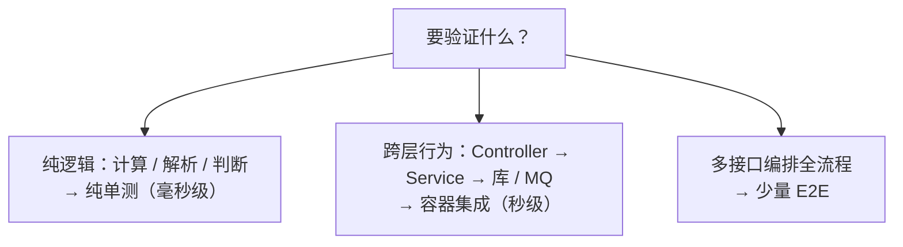
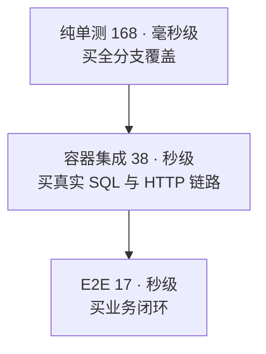
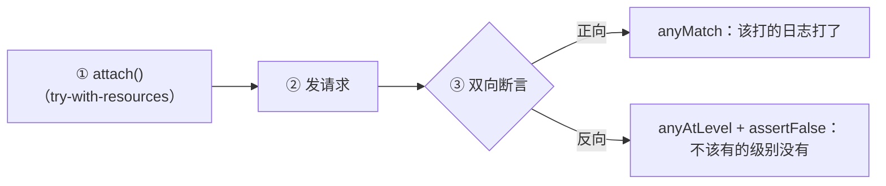

订单模块迁移到新架构——9 状态状态机、金额公式、跨模块联动，业务正确性风险极高。而测试的起点是零：没有单元测试、没有集成测试基座，仅有的自动化测试直连真实测试库——环境不可控、离线跑不了、数据互相污染、CI 接不进来。

我们从零建起了一套测试体系：**168 个单元测试 + 38 个集成测试 + 17 个端到端用例 = 223 个用例**，全部离线可跑、零外部依赖、每次运行结果一致。

但在动手建设之前，得先回答一个问题：为什么「现有的测试」靠不住？答案是三笔学费：

- **9000+ 条**测试残留数据——回滚注解标了，事务却从未开启；
- **717 条** null 单号的脏数据——mock 忘了 stub，业务代码拿着 null 继续跑；
- 全仓库测试零执行，「构建成功」绿得发亮——CI 脚本里带着一行 `-DskipTests`。

三个事故指向同一句话：**测试存在 ≠ 门禁生效**——这是从零建设测试体系的第一原则。

### 先说清楚：单元测试和集成测试，到底值什么

**单元测试的价值**——把业务逻辑的正确性验证压到毫秒级：状态机的合法性、金额公式的每个边界、参数校验的每个分支，改完即验、可无限重复。它还有一个常被低估的收益：**倒逼设计**——依赖能被全部 mock 替换、逻辑能被独立直调，边界就必须清晰。

**集成测试的价值**——守住单元测试够不到的「接缝」：Controller 的认证与参数绑定、Service 到数据库的列映射与事务边界、跨表跨模块的数据联动。这些地方，mock 全宇宙也证明不了「装配是对的」，而它们恰恰是线上事故的高发区。对迁移项目尤为如此：老系统的行为一致性，只有在新架构上以真实落库的用例才能证明。

> **两者叠加，对项目的价值**：把高风险业务——9 状态状态机、金额公式、跨模块联动——锁进回归网：缺陷在合入前拦下、重构有网兜底、用例本身成为可执行的需求文档。
{: .prompt-info }

价值不是口号，我们用五个可验收的目标盯着它：

| 价值目标 | 量化标准 | 验收方式 |
| --- | --- | --- |
| **可信** | 223 用例 Failures=0 且 Errors=0 | 全量回归 |
| **可离线** | 数据库零连接，无需任何外部环境 | 泄漏探测 = 0 |
| **快速** | unit 毫秒级、integration/e2e 秒级 | 单次全量分钟级完成 |
| **可重复** | 任意次运行结果一致 | 连续回归 |
| **可推广** | 新模块替换 11 个改动点即可复用 | 适配清单 |

这五条贯穿全文：后面每一节的设计取舍，都在为兑现它们服务。兑现后的日常体感是：改完代码本机分钟级跑完全量、红了按报告定位、推送后 CI 用同一套测试拦门。

本文复盘这次从零建设的完整过程，回答四个问题：

1. **放哪层**——同样的行为可以有多种写法，成本与守护面完全不同；
2. **怎么搭**——集成测试基座如何一次搭台、全模块复用；
3. **怎么断言**——日志、数据、协议怎么从「肉眼验收」变成机器断言；
4. **怎么守门**——回归纪律如何保证测试真的在 CI 里跑、红了真的拦人。

下面的每一节都给出**可直接套用的完整模板**：单测基座与业务单测、集成测试基座、日志断言写法、报告配置、回归纪律与排查表——替换示例中的占位符即可用在同类 Spring Boot 工程。

## 一、先想清楚放哪层：测试形态的选型

### 1.1 先对照表选型，别默认全写集成测试

| 测试形态 | 验证什么 | 特征 | 成本 | 归属 |
| --- | --- | --- | --- | --- |
| 纯单测 | 一个类/方法的行为（无 Spring 容器） | 毫秒级；`new` 对象直调 | 低 | 与被测类同模块 |
| 容器集成 | Controller → Service → 库/消息全链路行为 | 启动完整容器 + MockMvc；秒～十秒级 | 中 | `integration/`，继承基座 |
| E2E | 真实多接口编排冒烟（如 创建→审核→结算 全流程） | 集成基座 + 顺序断言 | 高（最脆弱） | `e2e/` |

选型的决策路径可以画成一棵树：



**决策心法**：逻辑判断、计算、解析、拼接 → 纯单测（快、稳、好定位）；行为跨 Controller/Service/库/MQ → 容器集成；全流程编排冒烟留少量 E2E。

两类高频反模式，各自对应一种浪费：

- **别用容器集成测纯逻辑**——每次 10 秒起步，测的还是一个 `if`；
- **别用纯单测冒充行为守护**——mock 全宇宙的「假绿」测试，替代不了该做容器集成的行为验证。

### 1.2 从零建成的一个真实分布：168 + 38 + 17

订单模块迁移新架构后的实测分布——正好是金字塔形状：**168 个纯单测 + 38 个容器集成 + 17 个 E2E = 223 个用例**，全量 `mvn test` 分钟级完成：

| 层级 | 容器 | 数据库 | 外部依赖 | 耗时量级 |
| --- | --- | --- | --- | --- |
| 纯单测（168） | 不启动 | 不连库 | 全部 `@Mock` | 毫秒级 |
| 容器集成（38） | 完整启动 | 内存库（真实回滚） | `@MockBean` 隔离 | 秒级 |
| E2E（17） | 完整启动 | 内存库 | `@MockBean` 隔离 | 秒级 |

分层买的是「性价比」：单元层买全分支覆盖，集成层买真实 SQL 与 HTTP 链路的验证，端到端买业务闭环——每层只买自己最擅长的那部分。



## 二、纯单测怎么写（完整模板）

> **何时用**：被测对象不需要 Spring 容器——业务 Service 的纯逻辑（计算 / 状态判定 / 参数校验）、工具类、配置类。特征：依赖全部 mock 可替换，不连库、毫秒级。

### 2.1 单测基座：50 个依赖一处声明

业务单测的第一个问题是「样板淹没」：被测 Service 的依赖很多（实测约 50 个），每个测试类自己声明一遍 mock，子类代码会被样板淹没。所以业务单测同样有基座——**依赖集中声明 + 被测对象装配 + 共性 stub**：

```java
package com.your.module.unit;

import com.baomidou.mybatisplus.core.MybatisConfiguration;
import com.baomidou.mybatisplus.core.metadata.TableInfoHelper;
import org.apache.ibatis.builder.MapperBuilderAssistant;
import org.mockito.InjectMocks;
import org.mockito.Mock;

import static org.mockito.ArgumentMatchers.any;
import static org.mockito.ArgumentMatchers.anyMap;
import static org.mockito.ArgumentMatchers.anyString;
import static org.mockito.Mockito.lenient;

/**
 * 单元测试基座：被测对象装配 + 依赖集中 @Mock + 共性 stub。
 * 业务单测一律 extends 本类；子类标注 @ExtendWith(MockitoExtension.class)，用 @Nested 按功能分组。
 */
public abstract class BaseMockitoTest {

    static {
        // 无 Spring 环境：手动初始化 MyBatis-Plus TableInfo 缓存
        // 否则 new LambdaQueryWrapper<>() 会报错
        TableInfoHelper.initTableInfo(new MapperBuilderAssistant(new MybatisConfiguration(), ""),
                OrderEntity.class);
        // …… 被测模块涉及的所有实体
    }

    @Mock protected OrderMapper orderMapper;                // 依赖约 50 个，全部在基类声明
    @Mock protected UserMapper userMapper;
    @Mock protected SequenceService sequenceService;        // 序列号：真实 HTTP
    @Mock protected CrossModuleService crossModuleService;  // 跨模块调用
    // …… 其余依赖：子类零声明直接使用

    @InjectMocks
    protected OrderService service;                         // 被测对象：自动装配全部 @Mock

    /** 子类 @BeforeEach 调用：共性 stub 一次配好 */
    protected void setupCommonMocks() {
        lenient().when(userMapper.selectById(USER_ID)).thenReturn(user);
        lenient().when(sequenceService.next(anyMap(), anyString())).thenReturn("TST_001");
        lenient().when(orderMapper.insert(any())).thenReturn(1);
        // 跨模块调用返回成功 Result（注意重载坑：必须双参重载，否则 data=null）
        lenient().when(crossModuleService.create(anyString(), any()))
                .thenReturn(Result.success("创建成功", "cross-id-001"));
    }
}
```

三个关键点：

- **`static` 块初始化 TableInfo**：无 Spring 环境下 `new LambdaQueryWrapper<>()` 需要实体元数据缓存，不初始化直接报错——这是 MyBatis-Plus 单测最容易踩的第一个坑；
- **`@InjectMocks` 装配 + 全量 `@Mock`**：约 50 个依赖全部在基类声明，子类零声明直接使用；
- **`lenient()` 声明共性 stub**：可能用不到的 stub（如跨模块返回）必须用 `lenient()`，否则 Mockito 严格模式会报 `PotentialStubbingProblem`。

### 2.2 业务单测：子类三件事

子类只做三件事：`@ExtendWith(MockitoExtension.class)`、`@BeforeEach` 里调用 `setupCommonMocks()`、用 `@Nested` 按功能分组。一个典型用例（省略 import，聚焦结构）：

```java
@ExtendWith(MockitoExtension.class)
class CreateMethodTest extends BaseMockitoTest {     // 业务单测：继承单测基座

    @BeforeEach
    void setUp() {
        setupCommonMocks();                           // 基座共性 stub
    }

    @Test
    @DisplayName("CR-01: 创建最小合法单据 → 落库状态为待确认")
    void create_minimalBo_persistsPendingStatus() {
        service.create(AUTH, buildMinimalBo());       // 毫秒级直调，不启动容器

        // 写入内容断言：无法观测返回值时，用 ArgumentCaptor 捕获入参
        ArgumentCaptor<OrderEntity> captor = ArgumentCaptor.forClass(OrderEntity.class);
        verify(orderMapper).insert(captor.capture());
        assertEquals("PENDING", captor.getValue().getOrderStatus());
    }
}
```

`buildMinimalBo()` 是测试类自备的构造辅助——单测不连库，用默认合法值 + 覆盖必要字段即可；`@DisplayName` 按「编号：场景 → 预期」书写，可直接对需求条目。

**单测的断言对象可以是**：返回值、抛出的异常（`assertThrows`）、副作用（写入内容、日志事件、调用顺序）。

**单测里「不需要」的东西**：`@SpringBootTest`、`@MockBean`、`@Transactional`——出现这些，说明它可能不是单测，回 1.1 的决策表重新选型。没有依赖的简单对象（工具类、配置类）不需要基座，`new` 出来直接调即可。

## 三、集成测试基座怎么搭（完整模板）

> **何时用**：要启动完整 Spring 容器验证 HTTP 全链路。**基座 = 所有集成测试共同继承的抽象类**，把「容器怎么起、外部依赖怎么 mock、事务怎么回滚、公共辅助方法」集中声明一次——业务测试类只写业务，不重复搭台。

### 3.1 完整基座

```java
package com.your.module.integration;

import com.your.framework.test.TestLogs;   // 日志捕获器（公共测试件）
import com.fasterxml.jackson.databind.ObjectMapper;
import org.junit.jupiter.api.BeforeEach;
import org.springframework.boot.test.autoconfigure.web.servlet.AutoConfigureMockMvc;
import org.springframework.boot.test.context.SpringBootTest;
import org.springframework.boot.test.mock.mockito.MockBean;
import org.springframework.http.MediaType;
import org.springframework.test.context.ActiveProfiles;
import org.springframework.test.web.servlet.MockMvc;
import org.springframework.test.web.servlet.MvcResult;
import org.springframework.test.web.servlet.ResultActions;
import org.springframework.transaction.annotation.Transactional;

import javax.annotation.Resource;
import java.nio.charset.StandardCharsets;
import java.util.HashMap;
import java.util.Map;

import static org.mockito.ArgumentMatchers.anyMap;
import static org.mockito.ArgumentMatchers.anyString;
import static org.mockito.Mockito.when;
import static org.springframework.test.web.servlet.request.MockMvcRequestBuilders.post;
import static org.springframework.test.web.servlet.result.MockMvcResultMatchers.jsonPath;
import static org.springframework.test.web.servlet.result.MockMvcResultMatchers.status;

/**
 * 模块集成测试基座：容器 + MockMvc + 内存库 profile + 事务回滚 + 外部依赖 mock + HTTP 辅助方法。
 * 业务集成测试一律 extends 本类；新加外部依赖时在本类补 @MockBean + 原因注释（一处声明全模块受益）。
 */
@SpringBootTest                       // ① 启动完整容器（真实装配，不是切片）
@AutoConfigureMockMvc                 // ② 注入 MockMvc：不经真实端口，直接打 DispatcherServlet
@ActiveProfiles("h2")                 // ③ 内存库 profile：测试数据零残留
@Transactional                        // ④ 测试方法级事务：方法结束自动回滚
public abstract class BaseIntegrationTest {

    /** ⑤ 容器注入的测试客户端与 JSON 工具 */
    @Resource
    protected MockMvc mockMvc;
    @Resource
    protected ObjectMapper objectMapper;

    /** 鉴权凭证与模块基路径（常量集中放这里，子类零声明） */
    protected static final String AUTH_HEADER = "Bearer test-token";
    protected static final String BASE_URL = "/yourOrder";

    @MockBean protected SequenceService sequenceService;   // 序列号生成：真实 HTTP 调用
    @MockBean protected LockClient lockClient;              // 分布式锁：真实 Redis
    @MockBean protected MqProducerBean mqProducerBean;      // 消息生产者：@Bean(initMethod="start") 启动即连接
    // …… 其余外部依赖：每加一个，补 @MockBean + 原因注释

    @BeforeEach
    void setupMocks() {
        when(sequenceService.next(anyMap(), anyString()))
                .thenReturn("TST_" + System.currentTimeMillis());   // 漏 stub = 默认 null（见事故 2）
        // …… 共性 stub 放基座，特化 stub 放测试类
    }

    // ===== 公共辅助：日志捕获器注册（见「断言」一节） =====

    /** 注册日志捕获器（try-with-resources 自动移除），供日志断言使用 */
    protected TestLogs attachLogs() {
        return TestLogs.attach();
    }

    // ===== 公共辅助：HTTP 请求（集成/E2E 全部业务操作复用，杜绝用例内散落样板） =====

    /** POST JSON 并断言 HTTP 200 + success=true，返回 ResultActions（可继续链式断言） */
    protected ResultActions postSuccess(String path, Object body) throws Exception {
        return mockMvc.perform(post(BASE_URL + path)
                        .header("Authorization", AUTH_HEADER)
                        .contentType(MediaType.APPLICATION_JSON)
                        .content(objectMapper.writeValueAsString(body)))
                .andExpect(status().isOk())
                .andExpect(jsonPath("$.success").value(true));
    }

    /** POST JSON 并断言失败 + 精确错误消息（消息即需求约定） */
    protected void postFailure(String path, Object body, String msg) throws Exception {
        mockMvc.perform(post(BASE_URL + path)
                        .header("Authorization", AUTH_HEADER)
                        .contentType(MediaType.APPLICATION_JSON)
                        .content(objectMapper.writeValueAsString(body)))
                .andExpect(status().isOk())
                .andExpect(jsonPath("$.success").value(false))
                .andExpect(jsonPath("$.msg").value(msg));
    }

    /** POST /create → 返回新单据 id（响应 data=id），供后续链路步骤复用 */
    protected String createOrder(Object bo) throws Exception {
        MvcResult result = postSuccess("/create", bo)
                .andExpect(jsonPath("$.msg").value("创建成功"))
                .andReturn();
        // 中文响应必须显式 UTF-8 读取（默认 ISO-8859-1，见事故 5）
        return objectMapper.readTree(
                result.getResponse().getContentAsString(StandardCharsets.UTF_8))
                .get("data").asText();
    }

    /** 供带 Map body 的操作复用（cancel/结算等只传 id 的接口） */
    protected Map<String, String> bodyWithId(String id) {
        Map<String, String> body = new HashMap<>();
        body.put("id", id);
        return body;
    }
}
```

新端点只需在基座追加同名辅助方法，子类零样板。

### 3.2 五个注解逐个讲（理解再抄）

| 注解 | 作用 | 不写的后果 |
| --- | --- | --- |
| `@SpringBootTest` | 启动完整容器（Filter/拦截器/Controller/Service 全部就位） | 没有全链路，测不到装配问题 |
| `@AutoConfigureMockMvc` | 注入 MockMvc——不经真实端口的 HTTP 打到 DispatcherServlet | 要么起真实端口（慢 + 占端口），要么没有 HTTP 层 |
| `@ActiveProfiles("h2")` | 切到内存库 profile | 连了开发库/共享库 = 数据污染 + 无法并发 |
| `@Transactional` | TestContext 框架事务：测试方法结束自动回滚 | 数据残留，用例互相污染（见事故 1） |
| `@MockBean`（字段级） | 用 Mock 替换外部依赖 Bean，容器里「假件替真件」 | 容器启动即连真实中间件（慢/失败/泄凭据） |

两个注入纪律：

- 基座的 `mockMvc`/`objectMapper` 用 **`@Resource`**（按名称注入）；`@MockBean` 只用于**替换外部依赖**，不用于注入被测对象自身；
- 子类需要 mock 某个业务 Service 时，直接在子类字段声明 `@MockBean` 即可——注意 mock 的 Bean 不经过真实实现，别指望它跑真实逻辑。

### 3.3 子类示例：一行 extends 即获得全套能力

```java
class OrderCreateFlowTest extends BaseIntegrationTest {

    @Test
    void create_success_then_queryable() throws Exception {
        String id = createOrder(buildMinimalBo());      // 基座辅助：创建并返回 id
        postSuccess("/getById", bodyWithId(id))         // 建后即查：事务内可见
                .andExpect(jsonPath("$.data.id").value(id));
        // 失败路径同理：postFailure("/cancel", bodyWithId(id), "当前单据已确认，不可取消");
    }
}
```

### 3.4 为什么数据源必须是内存库

基座的第 ③ 个注解藏着一次关键选型。集成测试每次运行都产生数据，数据源有三条路线：

| 方案 | 速度 | 环境依赖 | 残留风险 | 结论 |
| --- | --- | --- | --- | --- |
| 共享测试库 | 中 | 需网络/白名单 | 高（回滚失效即污染） | 排除 |
| H2 内存库（MySQL 兼容模式） | 快 | 无（jar 内嵌） | 无（进程销毁） | **采用** |
| Testcontainers | 慢（容器启动） | 需 Docker 运行时 | 无（容器销毁） | 环境具备时可作方言冒烟补充 |

内存库随进程起灭，测试数据零残留零清理；schema 由 `spring.sql.init` 启动时执行导出快照（实测 209 张表 + 291 条种子数据，15 个测试类共享 1 个 Spring 上下文、只初始化 1 次）。快照滞后于内部模型平台时，MyBatis-Plus 会报 `Unknown column`——**这是快照过期的哨兵信号，重导 DDL 即可，不改代码**。

### 3.5 mock 的边界与规则

边界原则一句话：**任何「测试环境不可控、不可重复、依赖外部资源」的调用一律 mock；测试目标是验证本模块行为，不是验证三方服务。**

不 mock 的后果清单里，最隐蔽的是消息队列：`@Bean(initMethod="start")` 的消费者**容器启动即连接订阅**；异步发送的异常还可能被吞掉——**测试显示绿色，真实网络行为已经发生**。这类「假绿」比失败更危险。

`@MockBean` 的三条硬规则：

1. 每个 `@MockBean` 字段上方**必须写注释说明为什么 mock 它**（哪个真实副作用必须挡掉）；
2. 所有会在测试里被调用的方法**必须在 `@BeforeEach` stub 完整**——Mockito 对未 stub 方法默认返回 null/false，业务代码拿到 null 不会报错而是继续跑（曾因此产生 717 条 null 单号，见事故 2）；
3. 共性 stub 放基座；单测特化的 stub 放测试类自己。

## 四、断言：从「跑了」到「证了」

### 4.1 日志断言：肉眼翻控制台不叫断言

> **何时用**：要断言「这行日志确实打了、级别对不对」。CI 里没人看控制台——日志断言应该走捕获器，而不是肉眼验收。

标准写法是给 Logger 挂一个**编程式日志捕获器**（示意名 `TestLogs`，等价实现如给 Logger 挂一个 ListAppender 封装）。先看核心 API：

| API | 作用 |
| --- | --- |
| `attach()` | 注册捕获器并开始捕获（返回实例） |
| `events()` | 已捕获的全部事件（线程安全快照） |
| `anyMatch(e -> ...)` | 是否存在满足条件的事件（级别 / message / 任意日志字段） |
| `anyAtLevel(Level.ERROR)` | 是否存在某级别事件（常用：断言「不得 ERROR」） |
| `clear()` | 清空已捕获事件（长测试分段断言） |
| `close()` | 停止并移除（`try-with-resources` 自动调用） |

完整示例——三段式：attach → 发请求 → 断言：



```java
@Test
void systemErrorLogsError() throws Exception {
    when(orderService.list(any())).thenThrow(new IllegalStateException("boom"));  // ① 制造系统异常

    try (TestLogs logs = TestLogs.attach()) {           // ② 挂捕获器（try 块作用域，自动移除）
        mockMvc.perform(post(BASE_URL + "/list")
                        .header("Authorization", AUTH_HEADER)
                        .contentType(MediaType.APPLICATION_JSON)
                        .content("{}"))
                .andExpect(status().isOk());

        // ③ 正向断言：系统异常必须 ERROR，且携带结构化错误标记
        assertTrue(logs.anyMatch(e -> Level.ERROR.equals(e.getLevel())
                        && e.getMessage().getFormattedMessage().contains("error_code=500")),
                "系统异常应 ERROR");
    }
}

// 反向断言（放在「业务预期内错误」用例中）：不得出现 ERROR
assertFalse(logs.anyAtLevel(Level.ERROR), "预期输入错误不得 ERROR");
```

两个值得借鉴的细节：

- **正反双向断言**：不仅要证「该打的日志打了」（`anyMatch`），还要证「不该打级别没打」（`anyAtLevel` + `assertFalse`）——业务校验失败用了 ERROR 级别，是告警噪音的典型来源；
- **捕获器作用域即用例边界**：`try-with-resources` 自动注册与移除，不污染其它测试。

### 4.2 业务断言规范

日志之外，业务断言同样有章法可循：

| 场景 | 模式 | 要点 |
| --- | --- | --- |
| 状态流转 | 状态机合法性表 + 枚举交叉验证 | key=当前状态、value=合法后继集合；断言枚举完整性、未知编码抛异常、终态不可达性遍历 |
| 金额计算 | `BigDecimal.compareTo` | 禁止 `assertEquals` 直接比较（数据库 DECIMAL 返回 `8888.00000000`）；边界强制覆盖：零值、null 按 0、末条差额补齐、平进平出、实付==应付 |
| 接口验证 | MockMvc 链式断言 | 成功断言 `$.success=true` + 响应含 data；失败精确匹配 `$.msg`；必测：缺认证头、空参数、不存在单据、最小合法请求 |
| 写入内容 | `ArgumentCaptor` 捕获 | 验证「写入数据库的对象内容」（无法直接观测 insert 实参时） |
| 异常 | 类型 + 精确消息双重断言 | 消息即需求约定 |
| 副作用 | verify 正/负/次数 | 正向、`never()` 负向、`times(n)` 精确次数三类组合 |

## 五、报告与泄漏探测：让事故无法悄悄发生

### 5.1 运行级摘要：跑完测试有一份「驾驶舱」

surefire 产出的是几十个 txt 海洋，没人翻。更友好的做法是实现 JUnit Platform 的 `TestExecutionListener`，每次 `mvn test` 自动产出一份运行级摘要。监听器通过 `META-INF/services/org.junit.platform.launcher.TestExecutionListener` 以 ServiceLoader 机制注册，随公共测试 starter 供给、**零配置激活**（不需要测试类注解，不用改插件）。

三个特化参数（JVM system properties，宿主 surefire 配置或命令行）：

| 参数 | 默认 | 说明 |
| --- | --- | --- |
| `test.report.enabled` | true | false = 关闭报告写盘 |
| `test.report.path` | `logs/test-run-summary.md` | 报告相对路径 |
| `test.report.markers` | 空 | 逗号分隔的泄漏特征清单：失败异常 cause 链中出现该特征即标记 FAIL——防「测试连了真库」悄悄发生 |

报告长这样（示意）：

```markdown
# 测试运行摘要
- 时间: 2026-09-04T10:30:00
- 测试类: 12 | 用例: 346 | 成功: 346 | 失败: 0 | 中止: 0 | 跳过: 0 | 总耗时: 41.2s

## 按类统计（Top）
| 类 | 用例 | 成功 | 失败 | 耗时(s) |
| OrderE2EFlowTest | 17 | 17 | 0 | 12.6 |
```

### 5.2 泄漏探测：把「测试连了真库」变成显式失败

摘要之外，最有洞察的设计是**泄漏特征探测**——宿主在 surefire 配置里照抄即可：

```xml
<plugin>
    <groupId>org.apache.maven.plugins</groupId>
    <artifactId>maven-surefire-plugin</artifactId>
    <configuration>
        <systemPropertyVariables>
            <test.report.path>logs/test-run-summary.md</test.report.path>
            <!-- 泄漏特征：失败异常的 cause 链中出现真实库驱动特征即标记 FAIL -->
            <test.report.markers>com.mysql.cj.jdbc.Driver,com.mysql.jdbc.Driver</test.report.markers>
        </systemPropertyVariables>
    </configuration>
</plugin>
```

这解决了一个隐蔽的管理问题：**「测试应该连内存库」靠约定，约定会失效**——配置回退、profile 忘切、新模块照抄了旧的连接串，任何一天都可能悄悄连上真实库，而测试可能依然全绿。泄漏探测把约定变成**机制**：异常堆栈里出现真实库驱动特征，报告直接标 FAIL。

> **防事故的最高形态，是让事故无法悄悄发生。** 约定写成文档会被遗忘，写成机制才不可绕过——这是测试治理与「多写测试」的根本区别。
{: .prompt-info }

### 5.3 失败快照：数据销毁后仍可追溯

内存库随进程销毁，「这次失败时库里是什么」从数据库里查不到了——必须靠快照兜底：失败用例自动导出**显示名 + 异常类型 + 消息 + 堆栈前 20 行**。追溯闭环由此合拢：**失败用例 → 快照 → 运行摘要 → 对照 surefire 原始报告**。

## 六、回归纪律：测试存在 ≠ 门禁生效

### 6.1 六条纪律

测试写完了，怎么让它真的守门？六条纪律，每条都对应一次真实教训：

1. **CI 必须真跑测试**：`-DskipTests` 只编译不跑——CI 脚本里带着它，全仓库测试形同虚设（见事故 4）；
2. **三级跑法**：日常开发单类快跑 → 提交前模块全量（快慢一起，保证互不干扰）→ 合并前仓库全量回归；
3. **红了先读报告，别急着删测试**：失败快照直接给堆栈；集成测试红了先想「是不是我改了共享基座/配置」，再想「是不是业务真坏了」——**禁止删测试、禁止静默放行失败**；
4. **事务回滚是默认**：需要「真提交」验证的场景（如异步消费后查库）显式说明并独立处理，不要全局放开；
5. **测试数据自包含**：每个测试自己造数据自己用，禁止依赖「上上个测试留下的数据」——顺序耦合的测试必然在某天随机红；
6. **新外部依赖必须同步 mock**：接入 Redis/MQ/外部 HTTP 时，基座同步补 `@MockBean` + stub——漏配的代价是测试连真实中间件（慢/泄凭据/假红）。

### 6.2 规范速览

| 级别 | 规则 |
| --- | --- |
| 必须 | 计算/解析/判断 → 纯单测；跨层行为 → 容器集成；全流程编排 → 少量 E2E |
| 必须 | 测试类必须继承对应基座（单测 → BaseMockitoTest；集成/E2E → BaseIntegrationTest），禁止自行创建独立上下文；新外部依赖在基座补 `@MockBean` + 原因注释 |
| 必须 | `@MockBean` 涉及的方法在 `@BeforeEach` stub 完整（漏 stub = 默认 null = 假数据落库） |
| 必须 | 日志断言用捕获器，禁止靠肉眼翻控制台验收 |
| 必须 | CI 真实执行测试（禁 `-DskipTests`）；红了按报告定位，禁止删测试/静默放行 |
| 必须 | 测试数据自包含，禁止用例间顺序耦合 |
| 禁止 | AOP 语义的回滚注解（不拦 JUnit 直调，回滚从未生效——用 Spring TestContext 的 `@Transactional`） |
| 禁止 | 集成测试连开发库/共享库（用内存库 profile） |

### 6.3 失败排查速查表

| 现象 | 原因 | 处理 |
| --- | --- | --- |
| 测试过了但真实库有残留 | 回滚注解没生效 / 连了真库 | 换 TestContext 的 `@Transactional` + 内存库 profile |
| 一堆 null 单号/空主键数据 | `@MockBean` 漏 stub（默认 null） | 基座 `@BeforeEach` 补全 stub |
| 报告文件没生成 | 依赖不是 test scope / surefire 版本旧 | 确认公共测试件依赖与运行命令 |
| 单测里启动了容器 | 选型错了（真单测不需要 Spring） | 回 1.1 决策表重新选型 |
| 集成测试互相影响 / 顺序红 | 用例间共享数据 | 测试自建数据 + 事务回滚 |
| 中文断言乱码 / 假红 | MockMvc 响应默认 ISO-8859-1 | 响应读取显式 UTF-8（见事故 5） |
| 跑全量比单类慢很多 | 内存库 schema 每次重建 | 正常现象；按类分组跑日常开发 |

## 七、真实事故复盘

五个事故，按「事故 → 根因 → 修复 → 教训」记账：

| # | 事故 | 根因 | 修复与教训 |
| --- | --- | --- | --- |
| 1 | 9000+ 条测试数据残留在真实库 | AOP 语义的回滚注解只拦 Spring 代理调用——JUnit 直调测试方法时切面根本不生效，回滚**从未发生过** | 换 TestContext 框架的 `@Transactional`（编程式事务，与 AOP 无关）。教训：**回滚是机制问题，不是注解拼写问题** |
| 2 | 717 条 null 单号入库 | `@MockBean` 漏 stub——Mockito 未 stub 方法默认返回 null，业务代码不报错继续跑 | 基座统一 stub + 新增依赖必须「用到即配」。教训：**mock 的默认值会静默变成脏数据** |
| 3 | 多个测试类并发建表 `Table already exists` | 多个独立 Spring 上下文同时启动，各自执行 `spring.sql.init` 建同一批表 | 不访问库的测试类显式 `spring.sql.init.mode=never`。教训：**上下文隔离不等于资源隔离** |
| 4 | 测试零执行却「构建成功」 | CI 脚本带着 `-DskipTests`，全仓库测试形同虚设 | 移除 skip 并把测试设为门禁。教训：**测试治理第一步不是写更多测试，是保证现有测试真的在跑** |
| 5 | 中文断言全假红 | MockMvc 响应默认 ISO-8859-1 读取 | 显式 `getContentAsString(StandardCharsets.UTF_8)`。教训：**字符集是断言正确性的一部分** |

事故 1 值得再展开一句：为什么「回滚失效」能悄无声息地攒出 9000+ 条残留？因为**回滚失效不产生失败**——测试依然全绿。这正是「测试存在 ≠ 门禁生效」的第一种形态：你看不见它，直到去数据库数一遍。

## 八、机制对照与总结

从零建成的这套体系，每个构件在成熟工程实践中都有对应物：

| 本方案机制 | 行业对应物 |
| --- | --- |
| 分层选型 | 测试金字塔：单元为主、集成守行为、端到端点睛 |
| 统一基座 | 测试夹具（Test Fixture）：一次搭台、全模块复用 |
| 内存库 + 编程式事务回滚 | 环境即代码 + TestContext 标准事务管理 |
| 编程式日志捕获断言 | 结构化日志断言（等价于给 Logger 挂 ListAppender） |
| 报告监听器 | JUnit Platform 扩展点（`TestExecutionListener`） |
| 泄漏特征探测 | 哨兵守卫（fail-fast）：让违规无法静默存在 |
| 公共测试件随 starter 供给 | 测试基建产品化：基座与断言范式可跨模块复制 |

**价值兑现**（对照开篇的五个目标）——**用例数量不是价值，兑现的确定性才是**：

| 价值目标 | 建成后的实测结果 |
| --- | --- |
| 可信 | 223/223 全绿（168 单测 + 38 集成 + 17 E2E）；逐用例 Rolled back 日志确认 |
| 可离线 | 全模块 `mvn test` 离线可跑；数据库零连接、日志零真实库痕迹；泄漏探测 = 0 |
| 快速 | 55 个集成用例总耗时 63 秒；15 个测试类共享 1 个 Spring 上下文（schema/种子仅初始化 1 次） |
| 可重复 | 连续回归结果一致（事务回滚 + 自建唯一数据），无顺序耦合 |
| 可推广 | 基座骨架、断言范式、pom 配置、内存库基建零改动拷贝；新模块按 11 个改动点清单接入（包路径、被测类、mock 清单、参数构造器、状态机表、种子数据等） |

回到开篇那个问题——**单元测试锁住逻辑、集成测试守住接缝**，223 个用例最终兑现的，是一张「敢改、敢重构、敢发布」的底网。

总结成四句话：

- **分层**决定性价比：逻辑进单测、行为进集成、全流程少量 E2E；
- **基座**决定一致性：容器、mock、事务、辅助方法一处声明，业务测试只写业务；
- **断言**决定说服力：日志、数据、协议都是断言对象，肉眼验收不算验收；
- **纪律**决定生死：测试存在 ≠ 门禁生效——CI 真跑、红了拦人、skip 出局。

> **适用边界**：本文方案适用于 Spring Boot 单应用、需要离线可跑与 CI 门禁的团队。测试体系解决的是「变更质量」问题；运行时的可观测性与接口治理是另外的主题，本文不展开。
{: .prompt-tip }

**明确不做**：不覆盖 UI 自动化与性能测试（另行立项）；不验证三方服务自身行为（一律 mock）；不维护真实测试库基线（内存库为唯一测试数据源）。

**延伸阅读**（本文对照的行业依据）：

- 测试金字塔的经典论述：[martinfowler.com · The Practical Test Pyramid](https://martinfowler.com/articles/practical-test-pyramid.html)
- Spring 测试事务回滚机制（`TransactionalTestExecutionListener`，与 AOP 无关）：[Spring Framework · Test-managed Transactions](https://docs.spring.io/spring-framework/reference/testing/testcontext-framework/tx.html)
- MockMvc 完整 HTTP 栈测试：[Spring Framework · MockMvc](https://docs.spring.io/spring-framework/reference/testing/mockmvc.html)
- Mockito 最佳实践与陷阱：[site.mockito.org · Mockito Framework](https://site.mockito.org/)
- H2 内存模式与 `DB_CLOSE_DELAY` 语义：[H2 Database · Features](https://www.h2database.com/html/features.html)
