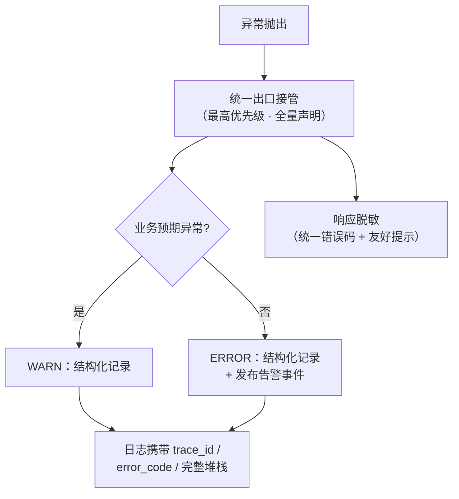
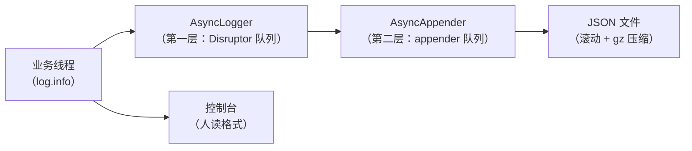
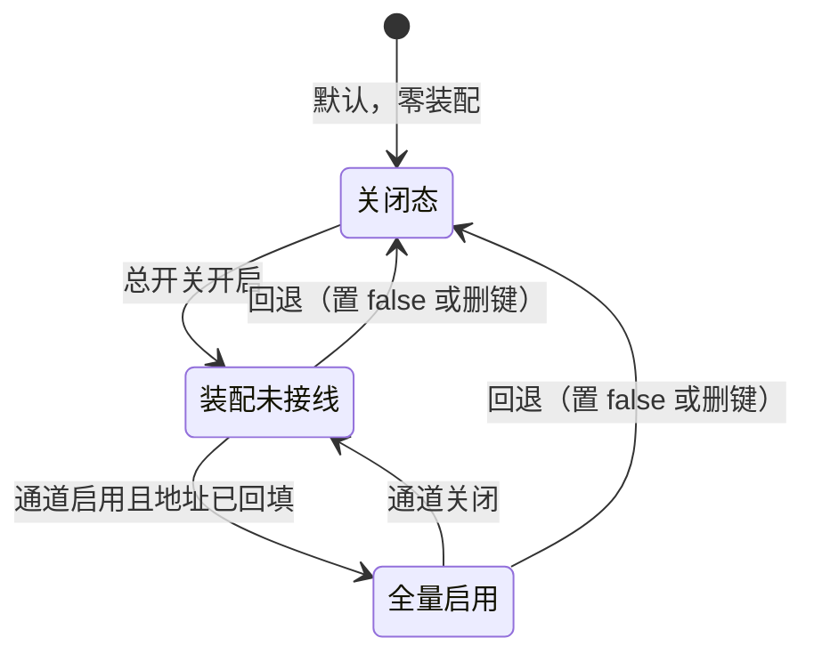

日志治理的起点不是「日志太少」，而是**日志无法回答问题**。

当时的状况摊开是四笔债：

- **异常出口割裂**：9 个接口全部手写 try-catch——`log.error(e.getMessage(), e)` 加上 `Result.failure(e.getMessage())`，全局异常处理器被整体绕过，内部错误消息直出前端；
- **根因堆栈丢在四处**：业务服务里 `log.info("e {}", e)` 只打异常 toString、再二次包装抛出（根因堆栈彻底丢失）；消息消费失败只打一行错误消息没有堆栈；缓存组件六处 `printStackTrace()`——System.err 直出、采集器收不到；异步兜底处理器只打方法名加参数数组，没有任何业务信息；
- **日志本身不可检索**：本地纯文本滚动文件——info/error 混写、时间戳只有时分秒（跨天无法区分）、编码未声明（实测乱码）、没有任何结构化字段；
- **操作不可追溯**：没有访问日志——谁、在什么时候、调用了什么接口、耗时多少、结果如何，全部无从回答。

四笔债的共同点是**都不产生失败**：异常出口被绕过不会让构建变红，堆栈丢了不会让测试挂掉，日志格式糟糕更拦不住任何一次合入。

本文复盘这套日志体系的 0→1 设计——按「出口 → 内容 → 载体 → 契约 → 供应链」的顺序展开，每个设计决策附上踩坑依据。

## 一、统一异常出口：接管、还原与分级

第一件事是「把异常收进一个出口」。设计是一个 **ObservabilityExceptionAdvice**（`@RestControllerAdvice` + 最高 `@Order` + 声明全量异常集）：

- Spring 的多 advice 是「先问先得」——最高优先级 + 全量异常声明，意味着开启即**完全接管**所有异常路径；老异常处理器不需要任何注解、任何改动；
- 出口承担四件事：结构化错误日志（`level` / `trace_id` / `error_code` / `exception_type` / 完整堆栈，字段对齐 OTel 的 `exception.*` 语义约定）、响应脱敏（未知异常不再把内部消息直出前端，返回统一错误码 + 友好提示）、级别分级、以及发布告警事件（见《告警治理》篇）。

异常进入出口后的分流路径：



出口的代码形态很薄——分级判断、响应脱敏、告警发布都在这一处完成：

```java
@RestControllerAdvice
@Order(Ordered.HIGHEST_PRECEDENCE)              // 最高优先级 + 全量异常声明 = 完全接管
public class ObservabilityExceptionAdvice {

    @ExceptionHandler(ServiceException.class)   // 业务预期 → WARN，不触发告警
    public Result<?> onBiz(ServiceException e) {
        log.warn("[业务异常] error_code={} message={}", e.getCode(), e.getMessage());
        return Result.failure(e.getCode(), e.getMessage());
    }

    @ExceptionHandler(Exception.class)          // 未知 / 系统异常 → ERROR + 发布告警事件
    public Result<?> onSystem(Exception e) {
        log.error("[系统异常] error_code=SYS_ERROR exception_type={}", e.getClass().getName(), e);
        alertPublisher.publish(AlertEvent.systemError(e));               // 固定 P1（见《告警治理》篇）
        return Result.failure("SYS_ERROR", "系统繁忙，请稍后重试");           // 响应脱敏：内部细节不出边界
    }
}
```

**关闭态的还原**是这里最有价值的一条决策记录。治理过程中曾对老异常处理器做过两处「顺手优化」：提取私有方法、给 null 消息加兜底。评审时被要求**整体还原**——`git checkout` 零 diff，回到上线前的逐字节形态，连历史缺陷都「勿顺手修复」。理由：

1. 回退基线必须等于**上线前行为**——任何「顺手修复」都会让关闭态与新版本产生行为差异，回退不再干净；
2. null 消息兜底看似无害，但它的实际效果是**响应消息回显差异**（getMessage() 为 null 时回显另一字段）——这超出了「纯日志输出参数变化」的边界，属于行为变更。

由此沉淀出一条可执行的边界判定：**允许保留的修复只有「纯日志输出参数」类**（补堆栈、加定位字段），不改控制流、不改返回值、不改响应结构；越界的改动一律回退。关闭态与新版本的行为差异，要么为零，要么逐项列出理由——**没有「差不多」**。

还有一条架构约束要说明：本系统是「HTTP 恒 200 + 统一响应 code」的架构，这个决策保持不变（前端兼容性），异常治理不引入 `@ResponseStatus`——**出口增强只增强出口，不动协议**。

## 二、四处吞堆栈点：逐点治理与级别纪律

四个丢堆栈的位置，各自的缺陷模式和治理方式都不同——逐点治理，而不是「统一加个切面」：

| # | 位置 | 缺陷模式 | 治理 |
| --- | --- | --- | --- |
| 1 | 业务服务（收款回调链路） | `log.info("e {}", e)` 只打 toString；再 `throw new ServiceException(e.getMessage())` 二次包装——**根因堆栈在包装时彻底丢失** | 双 catch 分级：业务预期异常 → WARN；系统异常 → ERROR 结构化（完整根因堆栈 + 脱敏） |
| 2 | 消息消费 | `log.error("...: " + e.getMessage())`——有错误消息、没有堆栈 | 结构化定位：msgId / topic / tag + 完整堆栈 |
| 3 | 缓存组件 | `e.printStackTrace()` × 6——System.err 直出，无级别、无结构、采集器收不到 | 统一改 `log.error` 结构化输出 |
| 4 | 异步兜底处理器 | `logger.warn(方法名 + params 数组)`——params 无业务信息 | 结构化 ERROR：trace_id + 类名与方法名 + 参数摘要（≤200）+ 完整堆栈 |

四处之外，还有一条贯穿性的**级别纪律**——它决定的不只是日志观感，而是告警的有效性：

- **未知异常 / 系统异常 → ERROR**；
- **业务预期异常（ServiceException / ValidationException 等）→ WARN**——参数校验失败、库存不足这类「业务正常分支」不得打 ERROR。

为什么这条纪律如此重要？因为告警引擎的第一批真实触发点就是「ERROR 级别的异常事件」——如果 ERROR 里混着大量业务预期噪音，告警要么天天误报、要么被迫调低灵敏度而失效。**级别规范是告警信噪比的前置条件**。这条纪律在《告警治理》篇兑现。

验收方式没有靠肉眼：三件专项测试（业务服务 / 消息消费 / 缓存组件）锚定「日志含 trace_id + exception.stacktrace 完整堆栈 + 级别符合规范」，跑进回归。

## 三、新日志文件：JSON 布局、双层异步与滚动的每个参数

日志形态的改造落在一个**新文件**上（log4j2-observability.xml），旧配置零改动：

- `logging.config` 一行指向新文件即生效，回退 = 删这一行——配置级灰度，零代码；
- 一个 log4j2 的机制坑写进了决策记录：新文件若不命名为 `log4j2-spring.xml`，`<springProfile>` 标签不生效——所以分环境能力**不依赖日志文件内部**，由 yml 的 profile + `logging.config` 承担。

**双形态输出**是布局设计的核心决策：文件走 JSON（机读——给采集器）、控制台保留人读 PatternLayout（给人）——两类消费者、两种形态，互不将就。


文件布局的具体设计点：

- **@timestamp 补全日期与时区**（ISO 8601）——旧配置只有 `HH:mm:ss.SSS`，跨天查日志无法区分，这是实测踩出来的参数；
- **trace_id / span_id 从 MDC 落字段**——替换旧前缀输出（旧格式把 spanId/traceId 打成消息前缀，仅自家可解析）；
- **exception.stacktrace 压平转义**——多行堆栈在单行 JSON 里以 `\n` 转义，保证「一行一条事件、逐行可解析」；
- **UTF-8 显式声明**——旧配置未声明、实测乱码。

**双层异步**是性能设计的核心，也是最容易做漏的地方：

```xml
<Configuration>
  <Appenders>
    <!-- 文件：JSON 布局（机读）——JsonTemplateLayout，字段即 13 字段契约 -->
    <RollingFile name="FILE_JSON" fileName="logs/app-json.log"
                 filePattern="logs/app-json-%d{yyyy-MM-dd}-%i.log.gz">
      <JsonTemplateLayout eventTemplateUri="classpath:app-event-template.json" charset="UTF-8"/>
      <TimeBasedTriggeringPolicy/>                 <!-- 按天 -->
      <SizeBasedTriggeringPolicy size="100 MB"/>   <!-- 按大小——双触发 -->
      <DefaultRolloverStrategy max="30"/>          <!-- 显式保留策略 -->
    </RollingFile>
    <Async name="FILE_JSON_ASYNC">                 <!-- 第二层：appender 级异步 -->
      <AppenderRef ref="FILE_JSON"/>
    </Async>
  </Appenders>
  <Loggers>
    <AsyncRoot level="info" includeLocation="false">  <!-- 第一层：logger 级异步（LMAX Disruptor） -->
      <AppenderRef ref="FILE_JSON_ASYNC"/>
      <!-- 控制台 appender（人读 PatternLayout）从略 -->
    </AsyncRoot>
  </Loggers>
</Configuration>
```

双层异步的数据路径：



决策记录里专门写了一句：**AsyncLogger 替换的是 logger、不是 appender，勿按单层实现**——单层异步只能异步化「写盘」这一段，logger 到 appender 之间的上下文复制与格式化仍在业务线程上；双层才是完整的多生产者-消费者管道。LMAX Disruptor 需显式引入依赖（原依赖清单里没有）。

**滚动与保留**：按天 + 100MB 双触发、gz 压缩、显式保留策略。顺带清理了三处冗余/悬空配置——不建与滚动文件重复的固定文件 appender；移除引用**不存在配置 key** 的 springProperty 与未定义变量（悬空引用是日志配置里最隐蔽的慢性病：配置能跑，行为却不按预期）。

还有一条容易被忽略的兼容性结论：代码里**零 log4j 组件类依赖**（JSON 布局类只在 xml 里引用，Java 代码无 import）——旧日志环境下不会因类缺失报错；除 JSON 专项测试外，全量测试本来就跑在旧配置下全绿。**新组件照常生效，差异仅在呈现形态**。

## 四、访问日志：为什么是 Filter，字段怎么建模

「记录每个请求」听起来简单，实现路径却有一次选型：Tomcat AccessLogValve vs Servlet Filter。

| 候选 | 能力 | 判定 |
| --- | --- | --- |
| **Servlet Filter（选）** | 全量字段可控，**能拿到业务身份**（登录态 user.id） | 访问日志的核心价值是「操作可追溯」——没有 user.id，追溯不了 |
| Tomcat AccessLogValve | 容器级配置简单 | 输出字段固定在容器层——拿不到业务身份，只能再补一层，等于没选它 |

字段建模直接对齐 OTel 的 HTTP 语义约定：`http.request.method` / `http.route` / `http.target` / `http.response.status_code` / `client.address` / `user.id`（登录态取值、未登录容错为空）/ 耗时 / `trace_id`。语义约定的意义不止于「好看」——**字段名对齐标准，采集器与平台才能零配置识别**。

三个细节设计：

- **参数摘要 ≤500 字符**：query 与 body 截断后记录；body 必须经 `ContentCachingRequestWrapper` 包装——**直接读流的访问日志会把请求体读空**，下游拿不到 body 是这类日志最经典的翻车方式；
- **脱敏共用一份《敏感字段清单》**：手机号 / 身份证 / 收款账号 / 银行卡，与错误日志、写入侧脱敏共用同一规则来源——脱敏规则不重复定义，就不会出现「这处脱了那处漏了」；
- **header 一律不记录**（含 authorization）：隐私最小化——请求头里什么都可能有；身份统一用 `user.id` 字段表达。响应侧则回传 trace ID——**报障时直接给出这个 32 位 hex**，前端、客服、运维任何一方都能用它换到全链路。

字段拼装像对着语义约定清单做填空题，但两个细节决定成败——body 必须读缓存副本（否则读空下游的流）、输出必须走 finally（异常请求也要留痕）：

```java
long start = System.nanoTime();
ContentCachingRequestWrapper wrapped = new ContentCachingRequestWrapper(request);  // 防「读空 body」
try {
    chain.doFilter(wrapped, response);
} finally {
    long costMs = (System.nanoTime() - start) / 1_000_000;
    byte[] cachedBody = wrapped.getContentAsByteArray();                 // 缓存副本：下游流不受影响
    String userId = LoginContext.currentUserId();                        // 登录态取值；未登录为空
    String summary = mask(truncate(request.getQueryString() + " "
            + new String(cachedBody, StandardCharsets.UTF_8), 500));     // 摘要 ≤500，脱敏后入日志
    log.info("[访问日志] http.request.method={} http.route={} http.target={} param_summary={} "
                    + "http.response.status_code={} client.address={} user.id={} "
                    + "http.request.body.size={} duration_ms={} trace_id={}",
            request.getMethod(), route(request), request.getRequestURI(), summary,
            response.getStatus(), clientIp(request), userId, cachedBody.length,
            costMs, TraceContext.current());
}
```

最后是职责边界：访问日志（请求级：谁、调了什么、耗时、结果）与业务事件埋点（语义级：状态流转、金额、锁）与错误码（异常级，由统一出口承担）**三层不重叠**——访问日志不重复记录业务 errorCode。

## 五、业务事件埋点：命名、口径与存量迁移

排障的最后一段路在业务语义层——请求级信息回答不了「这一步业务为什么失败」。盘点发现两类缺口：

- **6 个核心入口零日志**（草稿、确认、取消、创建结算、直接结算、发货登记）——其中确认流程约 230 行零日志，出问题只能翻数据库倒推；
- **14 处零散的计时日志**（[update计时] 散落在更新链路里）——格式各异、没有统一前缀、无法聚合。

设计先立规范：事件命名 `[业务域].[事件]`（对齐 OTel 事件命名习惯），四类事件各定口径——

| 事件类 | 埋点对象 | 口径设计 |
| --- | --- | --- |
| 状态机流转 | 9 个状态的每次写入 | 以枚举映射清单落表核对写入点——**防条件分支遗漏**（曾经的漏点就是这样逐行对出来的） |
| 金额计算 | 三个金额公式 | 入参、出参全记录——金额类问题不允许「从结果反推」 |
| 外部 RPC | 序列号、外部服务调用 | 耗时 + 结果 |
| 锁获取 | 5 类、8+ 处落点 | 计数口径先定义：**一次获取尝试计 1 次，N 把锁计 N 次**——口径先于埋点，否则统计不可比 |

存量迁移两条：散落的 14 处计时收口为统一的步骤计时方法（单步 >2s 自动升 WARN）；零日志入口补开始/成功两条事件。合计 33 处埋点，全部是**纯日志、不改控制流**。范围边界也写清楚：跨模块的锁获取点不属本次文件范围，留给跨界评审——埋点范围宁可窄一点，也不要「顺手改到别人的链路」。

埋点与指标是「一次改造、双输出」：同一处业务事件同时打结构化日志与 Micrometer 计数（采纳「单一事件多输出」思想在 Boot 2.x 的落地形态）——日志负责排障叙事，指标负责趋势与告警（见《告警治理》篇）。

## 六、字段契约：13 个字段的显式白名单

日志字段治理最贵的债，是「以后接平台时发现字段不能用，全部重来」。所以在收尾时把字段**冻结成契约**——13 个字段的显式白名单：

| 字段 | 来源 | 检索/聚合用途 |
| --- | --- | --- |
| `@timestamp` | 事件时间（ISO 8601 含时区） | 时序基线 |
| `level` / `thread` / `logger` | log4j2 运行时 | 级别过滤 / 线程与组件维度 |
| `message` | 事件正文（单层平铺，禁内嵌无界 JSON） | 人读定位与兜底检索 |
| `trace_id` / `span_id` | MDC（链路注入） | 链路检索主键——与告警消息、本地端点同键 |
| `user_id` / `order_id` / `error_code` | MDC（业务写入） | 操作人 / 单据 / 错误码聚合 |
| `exception.stacktrace` | 异常解析器（压平转义） | 错误聚类与堆栈检索 |
| `host.name` / `service.instance.id` | 系统属性（可被部署参数覆盖） | 多实例来源定位 |

契约落到真实日志里，一行一个 JSON 事件、检索维度一次到位：

```json
{"@timestamp":"2026-09-16T20:15:03.482+08:00","level":"ERROR","thread":"http-nio-8080-exec-3",
 "logger":"com.example.obs.ObservabilityExceptionAdvice",
 "message":"[系统异常] error_code=SYS_ERROR exception_type=java.lang.IllegalStateException",
 "trace_id":"4bf92f3577b34da6a3ce929d0e0e4736","span_id":"00f067aa0ba902b7",
 "user_id":"10086","order_id":"SO20260916001","error_code":"SYS_ERROR",
 "exception.stacktrace":"java.lang.IllegalStateException: ...\n\tat com.example...",
 "host.name":"app-01","service.instance.id":"app-01:8080"}
```

三条纪律随契约冻结：

1. **白名单语义**：模板是显式白名单——**MDC 新增键不落模板就不产生字段**，天然防索引膨胀；单层 snake_case 平铺，`message` 禁止内嵌无界 JSON；
2. **变更纪律**：字段增删改必须走「改模板（唯一源）→ 同步契约表 → 同步采集/索引模板 → 检查消费方（本地端点匹配、告警消息渲染、检索视图）→ 评审」。**消费方不返工，靠的是变更不绕过契约**；
3. **预留位管理**：为 agent 型 APM 试点预留的第二个 trace 键位以「注释级」存在——启用三步同步（解锁模板行、契约表加行、索引模板加字段），未启用前它**不是字段**。

契约的直接回报在采集侧兑现：日志接到集中检索时，索引映射直接以契约表为依据——JSON 行逐条可解析、无需 grok 规则；采集器把非 JSON 行直接丢弃而不是污染索引（灰度期新旧格式并存时尤其重要）。保留策略也一并落成建议：检索侧按 ILM 管理（如热存 7 天、删除 90 天），本地滚动文件保留 30 份——**两者正交**：本地文件是检索平台故障时的兜底数据源，不做长期归档。

## 七、脱敏与供应链：写入侧边界与一次日志栈审计

**脱敏必须在写入侧完成**——数据出了应用，采集侧再补就晚了。盘点出两个真实暴露点：业务服务把整单 JSON 全量落日志（含收款账号、支付交易号）；消息消费把消息体全文落日志。治理为脱敏摘要：收款账号保留后 4 位、交易号整体脱敏，共用统一的脱敏工具（手机号 → `138****8000` 这类规则）。脱敏清单是《敏感字段清单》的第三处（另两处：访问日志参数、错误响应）——**一处定义、三处共用**。

写入侧的改造最终落在日志语句这一层——从「全量落」到「摘要落」：

```java
// 治理前：整单 JSON 全量落日志（含收款账号、支付交易号）
log.info("回执审核 order={}", JSON.toJSONString(order));

// 治理后：脱敏摘要——账号保留后 4 位、交易号整体掩码，共用 SensitiveDataMasker
log.info("[回执审核] 单号={} 收款账号={} 交易号={}", order.getNo(),
        SensitiveDataMasker.mask(order.getReceivingAccount()),
        SensitiveDataMasker.mask(order.getPaymentTransaction()));
```

供应链审计是日志栈升级时顺手做的，但结论值得记录：

- **多版本混装**：治理新增的 log4j 显式版本（2.20.0）与 Boot BOM 默认（2.17.2）形成混装——统一抬到 2.x 线最新版一次性消除（一个版本属性全家覆盖：core / api / JSON 布局 / SLF4J 桥接）；
- **CVE 事实**：命中的安全公告集中在网络 appender 的 TLS 场景——本项目日志全走本地文件、无网络 appender，**实际攻击面为零**；但立场是「可备注豁免、不如一次性清零」——扫描器报红本身就是要消灭的债务；
- **升级回归注意**：该版本线曾出过一次 Boot 日志配置兼容回归（已在次版本修复），升级目标落点避开；
- **升不动的如实记录**：双层异步依赖的 LMAX Disruptor 因 Java 8 下限停在 3.4.x 线（官方 4.x 起要求 Java 11）——原因写清楚，等语言版本升级再跟随，不硬升。

## 八、装配与回退：一个总开关，一行切换

日志侧的三块能力，装配方式各不相同但共享同一套回退哲学：

- **异常出口**：新组件（observability advice）接管 ⇄ 老处理器逐字节还原——总开关控制；
- **日志格式**：新文件（JSON）⇄ 老文件（纯文本）——`logging.config` 一行切换，**与总开关正交**（格式切换管呈现，开关管治理组件）；
- **埋点与访问日志**：埋点为纯日志常开（与既有计时日志同态）；访问日志随总开关装配。

三种装配状态与回退路径：



总开关的设计经过一次评审否决：**多子开关方案被否**——理由三条：开关默认必须关闭（opt-in 灰度）；能力应**整体全有或全无**（组合开关矩阵 = 行为不可预期 + 测试组合爆炸）；治理逻辑必须承载于新增组件，**开关只出现在装配条件上**，老类内零 `if`。由此得到一个干净的回滚模型：关闭 = 老路径逐字节运行；开启 = 新组件整体接管；回退 = 置 `false` 或删键一行，**无代码回滚**。

## 九、验证、边界与对照

验证体系分两层：**JSON 专项集成测试**（每行合法 JSON、字段齐全、trace_id 贯通）；**日志断言化**——日志验证不靠肉眼翻控制台，而是给 Logger 挂可编程捕获器，断言事件级别与字段内容（这套断言基建与测试体系共用）。加上三件专项 LoggingTest 与全量回归零失败，「日志改造引入回归」这个风险项被测试锚定。

生效边界（如实）：

- **集中检索的最后一段是运维动作**：字段与格式已就绪，采集确认与索引配置需运维配合；就绪前本地检索端点兜底；
- **本地 error 独立文件只做测试环境兜底**——生产以集中检索 `level=ERROR` 过滤为准，不开第二条检索路径；
- **新旧格式并存窗口**：滚动发布期间新老实例的日志格式不同（新 JSON / 老文本），采集侧丢弃非 JSON 行；建议同批切换、错峰观察；
- **脱敏清单需要持续维护**：机制已就位，业务字段扩展时清单要同步——机制不会自己知道「新加了什么敏感字段」。

**明确不做**：不为旧文本格式做采集侧解析兼容（旧格式是回退态，不是目标态）；不给采集器写 grok 规则（结构化字段的直接回报就是不需要它）；不改业务逻辑（老红线：埋点只读）。

机制对照（本文设计在行业实践里的坐标）：

| 本方案机制 | 行业对应物 |
| --- | --- |
| 最高优先级 advice 接管 + 老出口逐字节还原 | 横切关注点的优先级接管 + restore-not-modify 回滚 |
| JSON 布局 + 双层异步 + 滚动压缩 | 结构化日志工程化（ECS / OTel 字段对齐） |
| 13 字段显式白名单 + 变更评审 | schema 契约：消费方（采集/索引/检索）不返工 |
| 访问日志字段对齐 OTel HTTP 语义约定 | Semantic Conventions：字段名即接口 |
| 写入侧脱敏 | PII 最小化：数据出应用边界前完成脱敏 |

差异如实标注：日志实现（log4j2 / logback）是宿主的选择——框架只给「结构化 + 字段语义」的约定与参考模板，**随框架供给 ≠ 接管宿主的日志**；本地 error 文件是测试期兜底通道，不承担生产检索职责。

四笔债对应的四份收益：出口收拢后**异常路径可结构化检索**；四处堆栈补齐后**根因不再丢失**；JSON + 字段契约后**日志可被任何标准采集器消费**；访问日志落地后**每个请求可追溯**。日志治理的验收标准可以浓缩成一句话：**任何一条日志，都应该能被字段检索到、被链路关联到、被平台零配置采集到**。

> **适用边界**：适用于 JVM + Spring Boot、日志需要被集中采集与字段检索的团队；日志实现为 log4j2 的工程可直接参考本文的文件与布局设计；使用其他日志实现的工程，本文的出口分级、字段契约与脱敏边界同样成立——它们是约定，不绑定实现。
{: .prompt-tip }

**延伸阅读**（本文对照的行业依据）：

- JSON 布局的官方实现（字段模板机制）：[logging.apache.org · JSON Template Layout](https://logging.apache.org/log4j/2.x/manual/json-template-layout.html)
- 异步日志与吞吐设计：[logging.apache.org · Async Loggers](https://logging.apache.org/log4j/2.x/manual/async.html)
- 日志栈安全公告（供应链审计依据）：[logging.apache.org · Log4j Security](https://logging.apache.org/log4j/2.x/security.html)
- 日志字段语义约定（13 字段契约的依据）：[opentelemetry.io · Logs Data Model](https://opentelemetry.io/docs/specs/otel/logs/data-model/)
- 日志即事件流：[12factor.net · Logs](https://12factor.net/logs)
