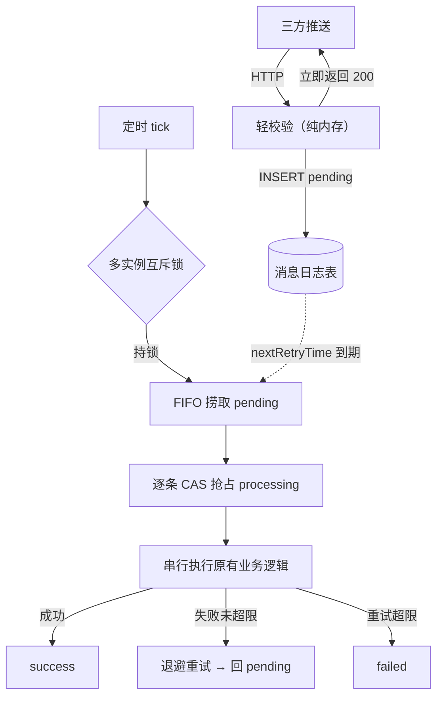
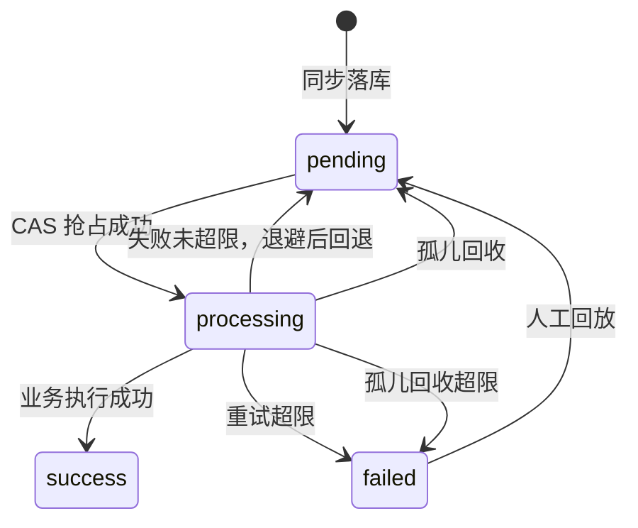

3 秒——这是发信方对推送接口的全部耐心，超时即重推。

早期的实现很直接：推送进来，同步跑完全部建档逻辑——查发信方账号、逐条读写三方用户与客户档案、必要时走合并事务，处理完才返回。当单次处理耗时逼近甚至超过 3 秒，问题开始连环出现：发信方超时重推，同一份数据被并发处理，重复记录开始在库里出现。

本文复盘这次改造的完整设计：如何借助「收件箱模式」，把一条耗时不可控的同步链路，改造成可靠消费链路。

## 一、根因：三个条件同时成立

这条链路出问题，不是单一缺陷，而是三个条件叠加：

| 条件 | 具体表现 |
| --- | --- |
| 投递语义为 at-least-once | 发信方 3 秒超时即重推，同一条消息可能到达多次 |
| 处理耗时不可控 | 同步执行「查库 + 逐条读写 + 可能的合并事务」 |
| 写入无并发保护 | 同一批数据的多次到达并发执行，check-then-insert 之间没有原子性 |

三者缺一，问题都不成立：处理够快就不会超时；消息只到一次就谈不上并发；写入天然幂等就不会出现重复。反过来，改造方向也就清晰了——**回执提速、并发收口、状态可查**，三管齐下。

## 二、设计核心：先应答、后消费

一句话概括：**接收侧只做「轻校验 + 同步落库 + 立即应答」，原有业务逻辑整体迁移到消费侧，由单消费者串行执行。**

四条设计原则：

1. **落库即应答**：接口返回 200 意味着消息已持久化；落库失败必须抛异常让发信方重推，杜绝静默丢消息。
2. **单消费者串行**：同一时刻只有一个执行体在处理消息，重复投递天然被幂等吸收，不需要在业务代码里到处补锁。
3. **三层防重**：调度层防轮次重叠、分布式锁防多实例并发、记录级 CAS 兜底极端情况。
4. **四态最小状态机**：`pending → processing → success / failed`，用最少的状态迁移覆盖全部生命周期。

还要说清一条语义边界：对发信方而言，**200 承诺的是「已可靠接收」，而不是「已处理成功」**——传输确认与处理确认分离，是消息中间件的标准语义（先落盘再确认、SQS 里「接收消息」不等于「消费完成」，都是同一个道理）。由此得到两个保证：一是返回 200 时消息必然已持久化，此后无论发生什么都不会丢；二是处理环节的成与败，全部由消费链路的兜底闭环负责——退避重试、终态 `failed`、积压告警、人工回放（见第五、七节）。

从更大的视角看，这是「收件箱（Inbox）模式」的一次落地：先落库、后应答，再由后台进程从容消费。与 MQ 消费场景的经典实现不同，本场景是发信方直连 HTTP 推送、报文不含消息唯一标识，去重机制也相应调整：不做消息 ID 级落库去重，重复投递由单消费者串行与业务侧幂等（check-then-insert）吸收。



## 三、状态机（四态）



四态里藏着一个架构取舍：**「等待重试」没有独立成状态**，而是由 `pending + retryCount>0 + nextRetryTime` 表达。这个问题没有唯一正解——业界两种做法都常见，各有明确的收益与代价：

| 判断维度 | 显式「重试中」状态（Celery 的 RETRY、pg-boss 的 retry） | 属性表达（Temporal 的尝试次数、本方案） |
| --- | --- | --- |
| 可观测性 | 按状态单值统计与展示，可对「重试中」单独告警 | 重试积压需组合条件查询（`pending + retryCount>0`） |
| 状态自描述 | 生命周期一眼可读（PENDING → STARTED → RETRY → SUCCESS） | `pending` 是复合池（首次等待与重试等待混合），需配合 `retryCount/nextRetryTime` 区分 |
| 状态机复杂度 | 双等待态并存：捞取、积压统计、孤儿回收、人工回放均需覆盖两态，守卫与非法迁移空间更大 | 单等待池：捞取单条件，恢复与回放口径统一（全部回 `pending` + 计数） |
| 调度扩展性 | 为「重试走独立通道/独立优先级」预留扩展点 | 需要时须先升级状态 |

本方案的判定：重试与首次处理共用同一队列、同一路径（FIFO + `nextRetryTime` 到期过滤 + 单消费者串行），独立状态不产生任何行为差异——核心收益「可观测、自描述」已由积压监控与 `errorMessage` 兜底，「独立通道扩展点」当前暂无需求；而双等待态的守卫复杂度与非法迁移空间的增大，是实打实的成本。取舍的本质，是决定复杂度落在哪一侧：放进状态机，还是放进查询与观测。这里选择后者，并保留升级路径——将来需要按「重试中」单独告警或让重试走独立通道时，再引入状态即可。

一个易混点：无论第几次尝试，执行中的状态都是 `processing`；而「等待重试」指失败后交还执行权、静默等待到期的窗口——两者相邻，但不重叠。

## 四、请求侧改造：把 3 秒预算还给自己

接收方法收敛为三步——轻校验（纯内存）、落库、返回。原全部业务逻辑原样迁移为 `executeMessage(PushMessageBo)`，供消费任务与人工补偿入口（`compensation=true`）复用：

```java
public void receiveMessage(PushMessageBo bo, boolean compensation) throws IOException {
    // 1) 轻校验：纯内存判断，不触库
    if (bo.getMsgType() == null || bo.getMsgType() != 1008) return;   // 1008：本链路的消息类型
    if (ObjectUtils.isEmpty(bo.getMsgStr())) return;

    // 2) 人工补偿入口：保持同步执行语义，不重复记日志
    if (compensation) {
        executeMessage(bo);
        return;
    }

    // 3) 正常入口：同步落库后立即返回——返回 200 即代表已持久化
    //    落库失败会抛异常，发信方收到失败/超时后会按其既有语义重推
    messageLogService.insert(bo);
}
```

落库方法有三条纪律：

1. **落库必须同步**。异步落库意味着返回 200 时消息可能还没持久化；且异步线程中的异常无法反馈给调用方——「200 = 已持久化」「失败 = 交还重推」两个承诺会同时失效。
2. **失败必须上抛、绝不静默**。异常若被吞掉，落库失败依然返回 200——发信方当作成功、不再重推，消息就此永久丢失。异常必须如实上抛。
3. **显式初始化 `pending`**。给消费侧一个明确的起点。

```java
// 同步落库；失败直接抛出，绝不静默
public void insert(PushMessageBo bo) {
    MessageLogEntity entity = build(bo);
    entity.setProcessStatus("pending");   // 显式标记：消费侧的明确起点
    messageLogMapper.insert(entity);
}
```

> 纪律 1 与纪律 2 必须**成对实施**：只同步、仍吞异常，失败依然静默；只上抛、却保留异步，异常只会落在异步线程里，调用方永远收不到。只有「同步 + 上抛」的组合，才能闭环成「200 = 已落库、失败 = 等重推」。
{: .prompt-warning }

**为什么「失败就抛」是可靠的？** 因为发信方在超时、收到失败时本来就会重推——这是发信方既有的投递语义；接收侧只需要守住一条底线：**绝不假成功**（200 必须严格等于已持久化）。可靠性不是我们发明的机制，而是接在双方语义的接缝上：对方保证「没收到成功就会再来」，我们保证「成功就是真成功」。

同步 INSERT 的成本约 5~10ms（序列化 + 单条写入），占 3 秒预算不到 0.5%，完全可接受。至于「保留异步、用 `Future.get()` 等结果」——那等价于同步，还多一层线程切换；而接受「200 时可能未落库」，等于主动放弃可靠性。两条替代路径都不成立。

## 五、消费侧：单消费者如何吃掉所有并发

消费侧是一个固定延迟 1 秒的轻量 tick：开关关闭或未到轮次间隔时，不产生任何 DB 操作。核心动作只有三个——捞取、抢占、执行；真正体现设计的，是三层防重与两条失败路径。

**三层防重：**

| 层 | 手段 | 解决的问题 |
| --- | --- | --- |
| 1 | `fixedDelay` 固定延迟 tick | 单实例内轮次不重叠 |
| 2 | Redisson 分布式锁（零等待；看门狗：30s 租约、每 10s 续期） | 多实例互斥，拿不到锁直接跳过本轮 |
| 3 | 记录级 CAS：`WHERE id=? AND processStatus='pending'` | 锁失效、人工重跑等极端情况的最终防线 |

主循环骨架（工程化的超时守护见「生产加固」一节）：

```java
@Scheduled(fixedDelay = 1000L)   // 轻量 tick：未开启消费时零 DB 操作
public void tick() {
    if (!consumeEnabled) return;
    long now = System.currentTimeMillis();
    if (now - lastRoundAt < roundIntervalMs) return;   // 轮次节流
    lastRoundAt = now;

    RLock lock = redissonClient.getLock("message:consume:lock");
    if (!lock.tryLock(0, -1, TimeUnit.SECONDS)) return;   // 多实例互斥，跳过本轮（-1：租约由看门狗托管）
    try {
        mapper.recoverStaleProcessing(orphanMinutes, maxRetry);   // 孤儿恢复
        for (MessageLogEntity msg : mapper.selectPending(batchSize)) {
            if (mapper.casToProcessing(msg.getId()) != 1) continue;   // CAS 抢占
            try {
                thirdPushService.executeMessage(parse(msg));
                mapper.markSuccess(msg.getId());
            } catch (Exception e) {
                int next = (msg.getRetryCount() == null ? 0 : msg.getRetryCount()) + 1;
                if (next <= maxRetry) {
                    mapper.markRetry(msg.getId(), backoffOf(backoffSeconds, next), truncate(e));
                } else {
                    mapper.markFailed(msg.getId(), truncate(e));   // 终态，落 errorMessage
                }
            }
        }
    } finally {
        if (lock.isHeldByCurrentThread()) lock.unlock();
    }
}
```

**为什么是「固定延迟轮询 + 分布式锁」？** 这是几个成熟模式的组合，而非权宜之计：① `fixedDelay` 以上一轮**结束**为基准计时——单实例内无轮次重叠，是「耗时不确定、必须串行」场景的规范选择（`fixedRate` 按固定节奏触发，任务变慢时会追赶堆积）；② 轻量 tick 先做纯内存判断、关闭时零 DB——把轮询成本压到接近零，与 Kafka「拉模式让消费者控制节奏、自带背压」是同一哲学；③ 分布式锁持锁消费、拿不到锁跳过本轮——与 ShedLock（分布式 `@Scheduled` 防重的标准解法）行为一致，多实例收敛为单活消费者（同一时刻至多一个实例在处理）。为什么不上调度平台或 MQ：本场景核心设计恰是**串行**（重复靠串行吸收），竞争消费者与之相悖；零新增中间件是硬约束，现有 Spring + Redisson 已足够。升级路径：量级超出单表串行后，先调 batch / 周期，再上 `SKIP LOCKED` 并行消费，最后换真 MQ。

**看门狗到底怎么续期？30 秒租约、每 10 秒续一次。** `tryLock(0, -1, …)` 的等待 0 表示「拿不到锁就跳过」，租约 `-1` 表示不设固定过期时间、交给看门狗托管：默认租约 `lockWatchdogTimeout = 30s`，持锁期间每 10s（租约的 1/3）由后台定时任务执行一段 Lua 脚本——校验锁仍属于当前持有者后，把 TTL **重置**回 30s。续期只在三种情况下停止：正常解锁、持锁客户端关闭、续期时发现锁已不属于自己（自动终止，无「僵尸续期」）。围绕它，把三个尖锐问题答完：

- **看门狗「坏了」= 续期停止，分两类后果。** 进程死亡（发布重启、OOM、kill）：续期随 JVM 停止，锁在剩余租约（最长 30s）后自然过期，其他实例下一轮自动接管——**锁的恢复靠租约**；DB 里悬空的 `processing` 记录由孤儿回收兜底——**记录的恢复靠 5min 阈值**，两者各管一段。续期失败（Redis 闪断、主从切换、几十秒的 GC 停顿）：租约到期而持有者可能还活着，存在两个实例短暂并行的窗口——这正是第三层 CAS 的存在意义：同一条记录绝不会被双写，锁失效只会退化为「并行处理不同记录」。**分布式锁从来不是绝对可靠的协调机制：锁负责串行形态，CAS 负责正确性底线**，防重必须分层。
- **无限续期是真实风险，靠「有界轮次」收口。** 看门狗只要进程活着就会一直续——若某条业务执行无限卡死且无人叫停，轮次不结束、锁不释放，多实例消费整体饿死。所以轮次时长必须有硬上限：单条超时 60s 判定失败、连续 3 条超时提前收轮（全超时路径约 3 分钟内收尾）、单轮理论最长 = batch × 单条超时（50 × 60s）。看门狗解决「轮次偏长」，超时熔断解决「轮次无界」，两者缺一不可。
- **为什么不直接用固定租约（如 5 分钟）**：留短了，长轮次中途过期、出现双消费者；留长了，进程猝死后要等满租约才恢复。看门狗模式同时拿到「活着就续、死了最长 30s 释放」两端，代价就是轮次必须守住有界性。

关键 SQL：

```sql
-- 捞取候选：FIFO + 重试到期过滤 + 单轮上限
SELECT * FROM message_log
WHERE processStatus = 'pending'
  AND (nextRetryTime IS NULL OR nextRetryTime <= NOW())
ORDER BY createTime ASC LIMIT #{batchSize};

-- CAS 抢占：影响行数 = 1 才继续处理
UPDATE message_log SET processStatus = 'processing', updateTime = NOW()
WHERE id = #{id} AND processStatus = 'pending';

-- 失败回退：退避窗口内该消息不可见，避免失败消息空转重试
UPDATE message_log
SET processStatus = 'pending', retryCount = retryCount + 1,
    nextRetryTime = DATE_ADD(NOW(), INTERVAL #{backoffSec} SECOND),
    errorMessage = #{err}, updateTime = NOW()
WHERE id = #{id} AND processStatus = 'processing';
```

**两条失败路径：**

- **退避重试**：失败且未超限 → `retryCount + 1`、回退 `pending`、`nextRetryTime = NOW() + 退避`（默认 30s / 2min / 10min 三档）。注意：所有状态写入都是带 `processing` 条件的 CAS 更新，不存在覆盖他方结果的窗口。
- **孤儿恢复**：「孤儿」指状态停在 `processing`、但实际已无人处理的悬空记录——CAS 抢占成功之后、结果回写之前，实例被发布重启、OOM 或机器故障 kill 掉，第二阶段的回写永远不会发生，状态就此悬空（这正是消息中间件用「可见性超时」兜底的同类场景，见第八节）。恢复方式：每轮开头把「`processing` 且超过 5 分钟未更新」的记录回退 `pending` 并计数 +1。三个细节：① 阈值必须远大于单条处理时长（5min ≫ 60s 单条超时），否则会误回收仍在执行的消息——这条约束关系写进了配置注释，防止后人调参破坏；② 不做启动时重置——多实例下 A 重启时 B 可能正在处理，重置会误伤；③ 回收计入重试次数并受上限约束，防止「回收 → 重试 → 再死」的无限循环。

**为什么退避是 30s / 2min / 10min，而不是 30s / 60s / 90s？为什么只重试 3 次？**

退避的意义不是「晚点再试」，而是让每次重试落在故障的可能恢复点之后。行业把退避分为固定 / 线性 / 指数三类，指数式是云厂商标配，线性式的公认短板正是「严重故障恢复时间不足」——用总窗口看最直观：

| 退避序列 | 三次重试的总窗口 | 能覆盖的故障尺度 |
| --- | --- | --- |
| 30s / 60s / 90s（线性） | ~3 分钟 | 只够秒级抖动——一次分钟级的下游重启或主从切换，就能让重试在故障窗口内「打光」，假性转 `failed` |
| 30s / 2min / 10min（本方案） | ~12.5 分钟 | 秒级抖动 + 分钟级重启 + 十分钟级长尾故障 |

其中第三次的 10 分钟是「最后一枪」：等的是长尾恢复窗口，失败即转终态交人工，而不是又一次常规重试。不引入抖动（jitter）也顺手说明：它防的是多客户端同步重试风暴，本方案单消费者串行、重试等待期的消息静置不占通道，不存在该问题。

至于只给 3 次：主流框架的默认重试次数普遍就是 3（Spring Retry 的 `maxAttempts`、Celery 的 `max_retries` 默认均为 3），通用工程建议也落在 2~3 次区间。语义上 `max-retry=3` 指首次之外再重试 3 次（共 4 次尝试）。理由：瞬时故障大多在前几次重试内恢复，边际收益随后急剧衰减；超过 10 分钟仍未恢复，基本已是需要人介入的事件——第 4、5 次重试解决不了问题，只会让毒丸更久占用串行通道。`failed` 终态 + 告警 + 回放工具的组合，比「再多试几次」更可控。两个参数（`backoff-seconds`、`max-retry`）都在 yml 里，联调期可依据真实失败分布调整。

**配置与安全默认**：六项核心参数走 yml 注入（`app.message-consume.*`；另有 4 项加固参数见第七节），代码内联默认值兜底：

| 配置项 | 初始值 | 含义 |
| --- | --- | --- |
| enabled | false | 消费总开关（安全默认：先不消费） |
| round-interval-ms | 2000 | 轮次间隔 |
| batch-size | 50 | 单轮捞取上限 |
| max-retry | 3 | 最大重试次数 |
| backoff-seconds | 30,120,600 | 重试退避序列（秒） |
| orphan-minutes | 5 | 孤儿回收阈值（分钟） |

新链路部署后先保持 `enabled=false` 观察落库正常，再开闸消费——上线策略本身就是设计的一部分。

## 六、四个值得记住的取舍

**1. DDL 两段式迁移。** 新增状态列时，默认值必须先设为 `'success'`，否则存量历史行会被消费任务全部重放；随后再改回 `'pending'`，只影响后续新插入的行：

```sql
-- 第 1 步：加列，存量行默认 'success'（防止历史日志被全部重放消费）
ALTER TABLE message_log
  ADD COLUMN processStatus VARCHAR(20) NOT NULL DEFAULT 'success',
  ADD COLUMN retryCount    INT NOT NULL DEFAULT 0,
  ADD COLUMN nextRetryTime DATETIME NULL,
  ADD COLUMN errorMessage  VARCHAR(500) NULL,
  ADD COLUMN updateTime    DATETIME NULL,
  ADD INDEX idx_processStatus_createTime (processStatus, createTime);

-- 第 2 步：默认值改回 'pending'（仅影响后续 INSERT）
ALTER TABLE message_log ALTER COLUMN processStatus SET DEFAULT 'pending';
```

**2. 记录级 CAS 是最终防线。** 分布式锁覆盖「绝大多数情况」，CAS 覆盖「锁失效、人工干预」的极端情况。防御要分层，不要把全部正确性押在单一机制上。

**3. 状态机做减法。** 重试等待用 `pending + retryCount + nextRetryTime` 表达，不新增状态——用一点观测便利换状态机的最小化（完整取舍见第三节）。

**4. 明确「不做」清单。** 这次改造刻意不含：下游业务逻辑的任何修改、另一条手动全量同步入口的收口（仅留 TODO）、以及把消费机制抽象成「通用消费框架」。第一个使用方不抽象——通用化等第二个真实使用方出现，再按「机制下沉 + 策略插拔」抽取。

## 七、生产加固一览

核心链路之上，还有一组针对生产环境做的加固（概要）：

- **调度隔离**：tick 使用独立调度线程，不与既有定时任务互相排队；
- **单条超时 + 连续熔断**：单条处理超时（默认 60 秒）按失败处理；连续 3 条超时则提前结束本轮，防止单条异常消息（毒丸）拖垮整个调度；
- **孤儿回收上限**：回收次数同样受 `max-retry` 约束，进程死亡型消息最终转入 `failed` 闭环；
- **积压可观测**：定期输出 pending 数量与最老积压年龄的告警日志（阈值默认 500 条 / 10 分钟）；
- **failed 批量回放**：提供带时间窗的 SQL 回放模板，先留档、后回放。

## 八、机制对照：消息中间件的成熟构件

这套机制不是自创——每一个组成部分在消息中间件里都有成熟对应物，本质上是一次「数据库作为队列（DB as Queue）」的完整落地：

| 本方案机制 | 中间件对应物 | 参考实现 |
| --- | --- | --- |
| 落库成功才返回 200 | 持久化确认（先落盘、再确认） | RocketMQ 同步刷盘：落盘成功后才向生产者返回成功 |
| `processing` 抢占 + 5 分钟孤儿回收 | 可见性超时（租约） | Amazon SQS Visibility Timeout：超期未确认删除 → 重新可见、可被再次消费 |
| `nextRetryTime` 退避（30s/120s/600s） | 重试队列 + 延迟投递 | RocketMQ `%RETRY%` 重试队列，按延迟级别（1s ~ 2h）重新投递 |
| `failed` 终态 + 人工回放 | 死信队列（DLQ）+ 人工处理 | RocketMQ `%DLQ%`、RabbitMQ DLX、SQS DLQ |
| 快速应答 + 后台从容消费 | 基于队列的负载调节 | Azure Queue-Based Load Leveling 模式 |
| 轮询 tick + 单消费者串行 | 拉取消费、并行度 1 | 拉模式消费者（Polling Consumer）、顺序消费单线程模型 |

broker 侧的持久化确认、可见性租约、延迟重试、死信隔离，在这里被内化到了一张业务表上。代价是吞吐与横向扩展让位于简洁和零中间件依赖；如果未来业务量级超出单表串行的承载力，这套状态机与兜底语义可以一一对应地平移到真正的消息中间件上。

## 九、总结

- **落库即应答**解决「消息不丢」：外部 SLA 与内部耗时的矛盾，用「快速回执 + 持久化队列」拆解，而不是在请求路径上硬扛；
- **单消费者串行**解决「消息不重」：与其在业务代码里到处补幂等，不如把并发收敛为串行；
- **三层防重 + 四态状态机**解决「异常可控、状态可查」：任何一条消息卡在哪、因何失败，都有据可查；
- 可靠性不只体现在代码逻辑里，也体现在**安全默认**与**上线策略**上（`enabled=false`、DDL 两段式）。

> 这套模式的适用边界：接收侧 SLA 紧张、处理耗时不可控、处理可异步完成且失败可重试的场景。若接口必须同步返回处理结果，或处理时延本身也是硬指标，则不应套用。
{: .prompt-tip }

**延伸阅读**（本文对照的行业依据）：

- 收件箱 / 发件箱模式：[Outbox, Inbox patterns and delivery guarantees explained · event-driven.io](https://event-driven.io/en/outbox_inbox_patterns_and_delivery_guarantees_explained/)
- 任务状态机：[Celery · Task States](https://docs.celeryq.dev/en/stable/reference/celery.states.html)
- 数据库任务队列：[pg-boss](https://github.com/timgit/pg-boss)
- 分布式定时任务互斥：[ShedLock](https://github.com/lukas-krecan/ShedLock)
- 可见性超时：[Amazon SQS · Visibility Timeout](https://docs.aws.amazon.com/zh_cn/AWSSimpleQueueService/latest/SQSDeveloperGuide/sqs-visibility-timeout.html)
- 消费重试与死信队列：[云消息队列 RocketMQ · 消息重试](https://help.aliyun.com/document_detail/43490.html)
- 队列负载调节：[Azure Architecture Center · Queue-Based Load Leveling](https://learn.microsoft.com/zh-cn/azure/architecture/patterns/queue-based-load-leveling)
