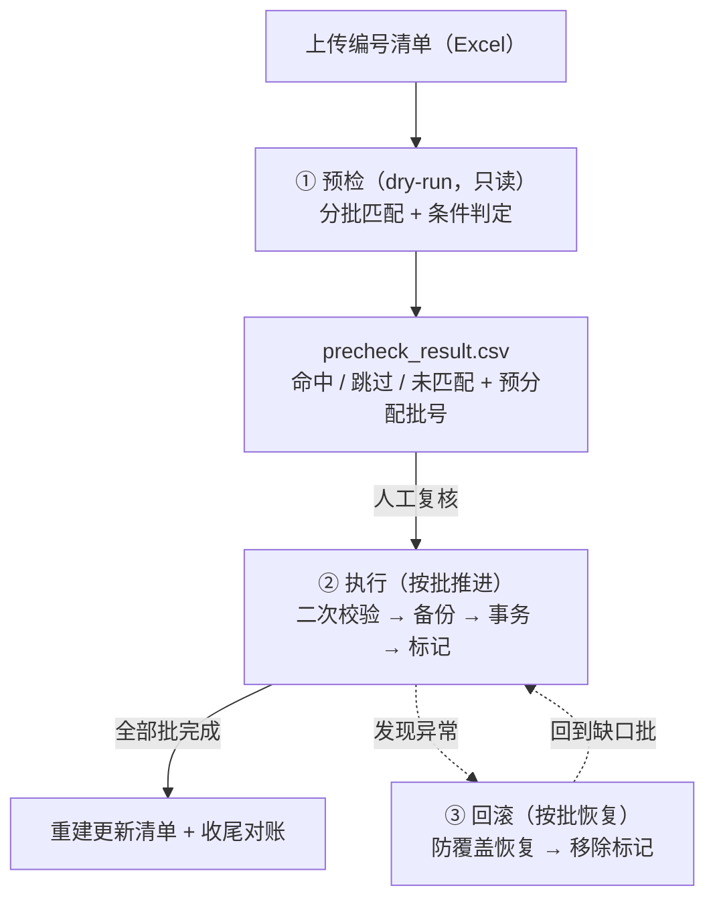

12 万行清单、四张业务表——修正指令逐行扩散后，实际改动约 48 万行数据。任务要求可灰度、可回滚、可降级；唯一的硬约束是：不新增任何数据库表。

矛盾摆在明面上：可回滚的前提，是 48 万行被改列的原始值都被可靠记录；账本不让落库，它放哪？本文复盘这次任务的设计——先与行业四条成熟路线逐一对比，再以本地文件账本与一组顺序契约，把一次性的批量修正做成可回滚、可续跑、可审计的工程任务。

## 一、任务与硬约束

任务的输入很普通：从对账流程导出的一份清单（Excel，约 12 万行），筛出「最终状态 = 已交付」的商品编号；与库中数据匹配后，把仍停留在在售态的数据修正为终态：

| 目标表 | 修正内容 |
| --- | --- |
| `goods`（主表） | `state` → 已关闭（`closed`）；三档数量（总 / 可用 / 锁定）归零 |
| `goods_stock`（存量表） | 三档数量归零 |
| `goods_detail`（明细表） | `qty` → 0 |
| `goods_trace`（追踪表） | `state` → 已结束（`finished`）；存放位置字段清空 |

命中条件同样明确：`goods_trace` 的售出单号为空（尚未售出），且 `goods` 处于在售三态（`pending` / `active` / `paused`）。修正完成后输出更新商品编号清单。

规模还要按「扩散后」算：清单是商品级的（约 12 万行），每个命中编号在四张表中都有待修正的数据行，实际改动约 48 万行——批按清单行切分，而备份、回滚与对账的数据量都是这个量级。

真正把设计难度抬起来的是四条要求：

1. **可回滚**：改错要能恢复原值——不是「大致恢复」，而是精确到被改列、包括 NULL；
2. **可续跑**：中途崩溃、暂停、限流之后，能从断点继续，不重不漏；
3. **可降级**：行级异常与吞吐压力不能把任务打挂；
4. **不建表**：不新增任何账本表、备份表——这是长期治理成本层面的硬约束。

还有一条不提也得守的底线：任何时刻都不许拖垮生产库。

## 二、行业方案对比：undo 放哪

把「约 48 万行修正 + 可回滚」做对，行业里成熟的路线有四条。它们的分歧不在「怎么改数据」，而在 **undo 放哪、原子性边界画在哪**：

| 路线 | 回滚机制 | 优点 | 缺点 |
| --- | --- | --- | --- |
| 审计表（before-image 落库） | 改前镜像写入账本表，与业务更新同一事务；DMS「SQL 备份与回滚」即此形态的产品化 | 原子性最强；可 SQL 审计、多人协作 | 需建表与长期治理；undo 入库带来写放大 |
| binlog 反解 / 数据追踪 | 事后按时间窗解析 binlog 生成回滚脚本（DMS 数据追踪、binlog2sql） | 零侵入；能救没有 undo 的误操作 | 依赖 ROW 格式与 binlog 保留窗口；审批链长；按时间窗检索 48 万行成本高 |
| 影子表 / 双写切换 | 数据写入影子表或新集群，切换后可回退旧表（Stripe 四阶段、gh-ost） | 零停机迁移与结构变更的行业标准；切换即回滚 | 面向搬迁 / 重建 / 结构演进；存储翻倍、周期以天计、需业务双写改造 |
| 文件账本 + 顺序契约（本方案） | 改前镜像逐批落本地文件；顺序契约保证崩溃后可恢复 | 零 DDL；自备 undo、不依赖 binlog 窗口；续跑 / 灰度 / 限速一体化 | undo 与更新不同事务（靠顺序契约补强）；账本在本地磁盘：单实例约定、目录保留成本 |

对照四条硬约束做排除，答案几乎是唯一的：**不建表**直接排除审计表与影子表；**可续跑**排除 binlog 反解——它是「事后找 DBA 生成脚本」的库外通道，既无法内建到任务里，回滚窗口也受 binlog 保留期限制；**可降级**要求任务能隔离问题行、带缺口继续推进——这只有可暂停、可重入的账本执行体才能承载。文件账本由此成为唯一同时满足四项的载体。

选型里最值得说的，是文件账本相对审计表的唯一真实差距：**undo 与更新无法放进同一个数据库事务**。审计表可以在一个事务里同时写 undo、改数据，天然原子；文件账本则存在一个崩溃窗口——更新提交了，undo 还没落盘。这个缺口不补，方案不成立。

补强手段不复杂，但顺序必须严格（下一节展开）：undo 先落盘（tmp → fsync → rename）、写一次不覆盖、顺序契约兜底。补上之后，两者工程可靠性等价，文件账本即以「零 DDL」胜出。

代价也要诚实标注：账本在应用本地磁盘，需要约定单实例执行、目录保留至回滚窗口结束；目录误删只会丢失回滚能力（更新本身幂等、可重跑），任务收尾时将目录归档到对象存储即可补上灾难副本（可选项，不进主流程）。另外，若这类任务成为常态（周期执行、多人协作审账），账本落库（undo 与更新同事务）反而是更正确的长期形态。

## 三、顺序契约：不建表凭什么可靠

先认清两个崩溃窗口：

- **窗口 A：更新已提交、undo 未落盘** → 任务不可回滚。必须消灭。
- **窗口 B：undo 已落盘、事务未提交** → 整批失败本就回滚；undo 与现状一致，无害。

消灭窗口 A 靠三件套：

1. **备份先行**：undo 只记被改列的改前镜像（before-image），在事务提交之前写入；
2. **原子写入**：临时文件 → `fsync` → `rename` 原子替换（同一文件系统），杜绝「半个 undo 文件」；
3. **写一次不覆盖**：重跑不重写 undo——始终保住最初的改前镜像。

这本质上是把数据库引擎的预写日志（WAL）思想搬到应用层：**先写日志、再改数据**；只不过这里写的是逐批的撤销镜像，落在文件系统上，数据库自身的日志机制仍照常工作。

与之对称的第二条契约：**done 标记只在事务提交成功之后写**。于是崩溃恢复的判定变得极简：

- 有 done 标记 ⇒ 该批已完成（事务提交已发生过）；
- 无 done 标记 ⇒ 重跑该批，重跑即自愈（幂等收敛见第五节）。

> **fsync 顺序契约是「不建表」成立的关键**：实现中必须保证 undo 落盘先于事务提交。这条不变量一旦被破坏，可回滚性就无从谈起。
{: .prompt-warning }

再补上第三条：**更新清单不做增量追加**。最终清单在收尾时由「预检快照 + done 标记」重建——任何时刻的账本都是完整且可重现的，不存在「追加了一半」的中间态。

## 四、总体设计：快照驱动三段式

整体是一张三段式流水线：预检（dry-run，只读）→ 执行（分批推进）→ 回滚（分批恢复）。执行与回滚都以预检产出的快照为白名单，任务目录就是全部账本。



**预检**只读、不碰业务数据：解析清单，分批查库完成匹配与条件判定，产出 `precheck_result.csv`（命中 / 跳过 / 未匹配 + 原因 + 配对键 id + 预分配批号），返回统计供人工复核（命中比例异常会显式提示）。命中行在预检时就编好批号——以「命中行数」为单位切批（默认 500 行/批，12 万行约 240 批；每批对应四表约 2000 行修正与备份），之后所有「批」的概念都以此为准。

**执行**按批推进，每批一个短事务；批间可暂停、可限速、可续跑。

**回滚**按批恢复改前镜像，带防覆盖校验；恢复成功后移除 done 标记——被回滚的批成为「缺口批」，重新执行即可处理，形成闭环。

任务目录（账本结构）：

| 文件 | 作用 | 关键约定 |
| --- | --- | --- |
| `codes.csv` | 编号清单（含原始行号） | 预检落盘 |
| `precheck_result.csv` | 判定明细 + 批号 | 执行白名单；清单重建的数据源 |
| `undo/{批号}.jsonl` | 每行被改列的改前镜像（含 NULL） | 原子写入、写一次不覆盖 |
| `done/{批号}.mark` | 批完成标记（提交时间 + 批统计） | 检查点 + 审计 |
| `failed.csv` / `conflict.csv` | 问题行隔离 / 回滚冲突 | 事后重放 / 人工处理 |
| `updated_codes.csv` | 更新商品编号清单 | 收尾时由快照 + 标记重建 |
| `state.json` | 任务状态与参数 | PRECHECKED / RUNNING / PAUSED / FINISHED / ROLLEDBACK… |

对外只是一组任务接口：`precheck`（预检）、`execute`（按批区间执行，带限速与容错开关）、`pause / progress`（批间暂停与进度观测）、`report`（导出清单）、`retryFailed`（失败行重放）、`rollback`（按批区间恢复）。同一任务同时只允许一个执行器——以状态文件校验，天然防并发。

实现结构上分五块：接口层（Controller）、主流程（三段式 Service）、批事务代理（独立 Bean——Spring 同类自调用会让 `@Transactional` 失效，这是经典坑）、账本读写（文件层：CSV / JSONL、fsync、标记、状态）、SQL 集中层（备份查询、条件更新、恢复更新）。

## 五、单批执行：二次校验与备份先行

每批五步，顺序不可颠倒：

1. **取批**：读 `precheck_result.csv` 中该批命中行——快照即白名单，执行范围被「预检时点」钉死；
2. **二次校验**：逐行复核当前状态，分为三类：`needs`（仍满足条件，待更新）、`already`（已处于任务终态）、`drift`（其他漂移，不更新，记差异报告）；
3. **备份先行**：undo 原子写入、写一次不覆盖；
4. **单批事务**：只更新 `needs` 白名单 + 行数核验；
5. **标记**：写 `done/{批号}.mark`。


```java
void runBatch(String jobId, int batchNo, boolean tolerant) {
    List<Row> rows = fileStore.readBatch(jobId, batchNo);    // 快照白名单
    Classified c = revalidate(rows);                         // needs / already / drift
    if (!c.drift.isEmpty()) fileStore.reportDrift(jobId, c);

    fileStore.writeUndoOnce(jobId, batchNo, c.needs);        // tmp → fsync → rename，写一次

    tx {                                                     // 批事务：小、可失败、整批回滚
        int n1 = mapper.closeGoods(c.needs.goodsIds);        // WHERE 条件兜底
        int n2 = mapper.finishTrace(c.needs.traceIds);
        mapper.resetStock(c.needs.goodsIds);                 // 从表按主表 id 集合定位
        mapper.resetDetail(c.needs);
        if (n1 != c.needs.goodsCount || n2 != c.needs.traceCount) {
            if (!tolerant) throw new BatchVerifyException(); // 严格模式：整批回滚 + 任务暂停
            fileStore.isolateDiffRows(jobId, batchNo);       // 行级降级：差异行隔离
        }
    }

    fileStore.markDone(jobId, batchNo, c);                   // done 标记
}
```

三个细节值得展开。

**为什么二次校验要分三类？** `already` 是崩溃重跑的安全网——「提交成功但标记未写」的批重跑时，生效行按幂等成功计数，不会误判、不重复更新；`drift` 是快照漂移的保护——预检时点与执行时点之间数据被业务改动过，条件已不满足的行一律不碰，进入差异报告。此外，所有状态写入都带 `WHERE` 条件兜底，任意重跑都不会重复或越界更新。

**行数核验**：`needs` 行必然至少变更一列，因此主表更新行数可以精确核验（`n1 != needs.goodsCount` 即异常）。核验不通过默认整批回滚 + 任务暂停（严格模式）；打开容错开关时，差异行隔离进 `failed.csv`、其余照常提交（行级降级）。白名单本身（id 集合）就是爆炸半径——越界不可能。

**配对键**：主表与追踪表都存有业务编号，但同一编号可能展开多行——只按业务编号 JOIN 会产生笛卡尔积，把 12 万行的清单放大成百万级误更新。正确做法是商品级配对：主表行的追踪引用键 = 追踪行主键（主），追踪行回指主表行（兜底），且两侧业务编号都必须等于清单编号；配对异常行全部进预检报告，不进入执行。

> **四条实现不变量**（缺一则幂等或回滚失效）：① undo 先于提交、原子写入、写一次不覆盖；② done 只在事务提交成功后写；③ 更新限定白名单并带 WHERE 兜底；④ 回滚恢复带特征校验。
{: .prompt-info }

## 六、回滚：恢复原值，但不覆盖业务改动

回滚不是反向 `UPDATE` 那么简单——任务执行之后、回滚之前，这些行可能已被业务改动。直接写回改前镜像，会把任务后的业务改动一并抹掉。补偿事务（Compensating Transaction）的经典难题正在于此：**不能简单恢复原状，而要智能地处理并发改动产生的差异**——这正是回滚必须带校验的原因。

本方案的守卫是「当前值 = 任务写入特征」的双侧校验：命中才恢复；不命中说明该行已被业务改动，跳过并写入 `conflict.csv` 人工处理。

```sql
-- 恢复改前镜像：仅当当前值仍为任务写入的特征时才恢复
UPDATE goods
SET state = #{before.state}, qty_total = #{before.qty_total},
    qty_available = #{before.qty_available}, qty_locked = #{before.qty_locked}
WHERE id = #{id}
  AND state = 'closed'                                      -- 防覆盖守卫：任务特征
  AND qty_total = 0 AND qty_available = 0 AND qty_locked = 0;
-- 影响行数 = 0 → 该行已被业务改动 → 写 conflict.csv，跳过，不覆盖
```

其余规则：显式列恢复（显式 `SET` 保证 NULL 也能还原）；按批区间灰度（先 1 批验证再继续）；成功后移除 done 标记，该批回到可重跑状态。兜底防线是 MySQL 的时间点恢复（PITR）——前提是 binlog 为 ROW 格式且保留窗口覆盖任务期，需 DBA 侧确认；undo 也支持批量导出为回滚 SQL 文件，DBA 可不依赖程序手工执行。

## 七、降级：正确性不参与降级

降级的原则先行：**数据修正的正确性是红线，不可降级；可降级的是完成范围、时效与吞吐**。

| 降级 | 触发 / 手段 | 恢复路径 |
| --- | --- | --- |
| D1 行级容错 | 打开容错开关：差异行隔离 `failed.csv`，其余提交、任务继续 | `retryFailed` 重放 |
| D2 吞吐降速 | 加大批间 sleep、暂停后低峰续跑（不改代码） | 无需恢复动作 |
| D3 部分回滚 | 冲突行跳过 + 批次区间回滚 | 冲突报告人工处理 |

执行器启动时会先做一次账本自检：`state.json` 与 `done/` 标记逐批核对，缺标记的批即「缺口批」，纳入续跑。三类降级的状态都在 `progress` 接口可见：失败行数、冲突数量、任务状态。

## 八、灰度放量与验证

上线路径本身就是设计的一部分：

1. `precheck` 先传小范围子集 → 双人复核判定清单与统计；
2. `execute` 只跑第 1 批 → 抽查四张表的数据与页面表现；
3. 全量执行（可限速）→ `progress` 轮询；需暂停时 `pause`，修复后从缺口批续跑；
4. `report` 导出更新清单 + 收尾对账（批统计 ↔ 清单行数 ↔ undo 覆盖行数）；
5. 发现异常 → `rollback`（先 1 批验证）→ 核对冲突报告 → 需要时重跑。

验证矩阵覆盖三个方面：端到端样本（含 1 条不命中、1 条配对异常）、崩溃恢复两中断点（undo 已写未提交 / 已提交未标记）、降级与续跑（差异行隔离、中途重启后从首个缺口批继续）。

## 九、机制对照：成熟构件的应用层内化

这套设计没有发明新东西——每一个机制在成熟工具链里都有对应物：

| 本方案机制 | 行业对应物 |
| --- | --- |
| 预检（dry-run）+ 人工复核 | 计划与执行分离、先验证后放行（如 Stripe 在线迁移的分阶段实践） |
| 小批试跑 → 分批放量 | 金丝雀发布（Canary Release）：先小范围、评估后再全量 |
| 快照白名单 + 二次校验 | 乐观校验：防「预检时点」与「执行时点」之间的数据漂移 |
| undo 先落盘（原子替换、写一次） | 预写日志（WAL）思想的应用层实现 |
| done 标记 | 检查点（Checkpoint）：断点续跑的最小持久化单元 |
| `failed.csv` 问题行隔离 | 死信队列（Dead Letter Queue）：隔离问题消息、事后重放 |
| 防覆盖回滚 | 补偿事务（Compensating Transaction）：智能处理并发改动 |
| binlog 时间点恢复 | 最后防线：PITR / 闪回工具 |

一处与经典实现的差异需要如实标注，避免模糊归属：

- **WAL 是应用层实现**：数据库引擎的预写日志由引擎内部保证 redo / undo；这里是应用自行实现的逐批撤销镜像，思想同源、形态不同，不依赖引擎的恢复机制来完成本任务的回滚。

## 十、总结

- **可回滚**靠顺序契约：undo 先落盘、原子替换、写一次不覆盖；
- **可续跑**靠检查点与幂等：done 标记 + 二次校验的 already / drift 分类；
- **可审计**靠账本可重建：清单与进度由「快照 + 标记」完全重建；
- **可降级**靠红线划界：正确性、备份、回滚能力不参与降级。

> **适用边界**：合法但低频、规模可分批、需要可回滚的一次性数据修正。若任务常态化（周期执行、多人审账、多任务并发），账本落库（undo 与更新同事务）是更正确的长期形态。
{: .prompt-tip }

**明确不做**：不新增数据库表；不引入新中间件（现有 Spring + MySQL + Redis 已足够）；不抽象成通用刷数平台——第一个使用方不抽象，等第二个真实使用方出现，再按「机制下沉 + 策略插拔」抽取。

**延伸阅读**（本文对照的行业依据）：

- 在线迁移四阶段与回填：[Stripe · Online migrations at scale](https://stripe.com/blog/online-migrations)
- 影子表与在线变更：[GitHub · gh-ost: online schema migration tool](https://github.blog/news-insights/company-news/gh-ost-github-s-online-migration-tool-for-mysql/)；[martinfowler.com · Parallel Change（扩展-迁移-收缩）](https://martinfowler.com/bliki/ParallelChange.html)
- 审计表形态的产品化：[阿里云 DMS · SQL 备份与回滚](https://help.aliyun.com/zh/dms/sql-backup-and-rollback)
- 预写日志：[PostgreSQL · Write-Ahead Logging (WAL)](https://www.postgresql.org/docs/current/wal-intro.html)
- fsync 与原子文件替换：[LWN · Ensuring data reaches disk](https://lwn.net/Articles/457667/)
- 补偿事务：[Azure Architecture Center · Compensating Transaction](https://learn.microsoft.com/en-us/azure/architecture/patterns/compensating-transaction)
- 死信队列：[Azure Service Bus · Dead-letter queues](https://learn.microsoft.com/en-us/azure/service-bus-messaging/service-bus-dead-letter-queues)
- 时间点恢复：[MySQL 8.0 · Point-in-Time Recovery](https://dev.mysql.com/doc/refman/8.0/en/point-in-time-recovery.html)；闪回工具：[binlog2sql](https://github.com/danfengcao/binlog2sql)
- 灰度放量：[Google SRE Workbook · Canarying Releases](https://sre.google/workbook/canarying-releases/)
