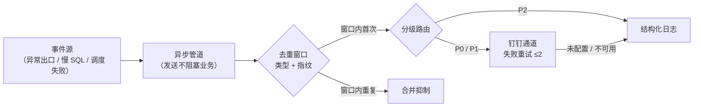
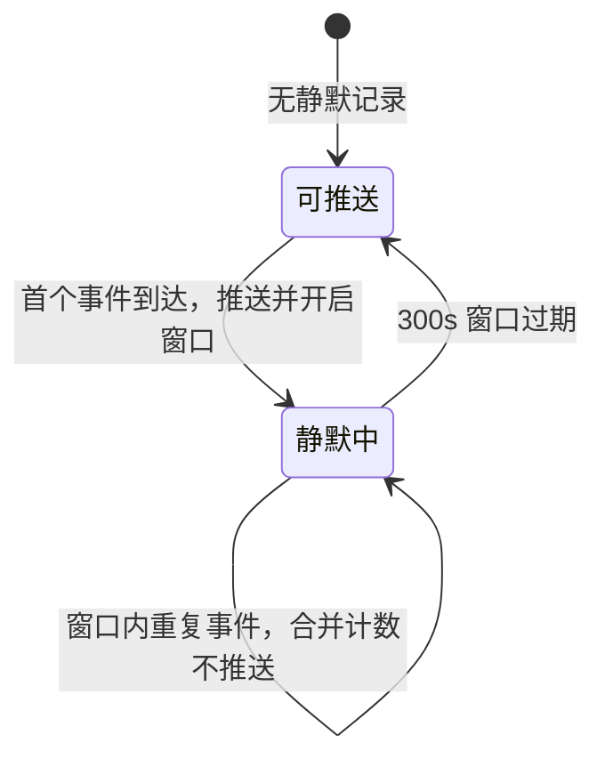
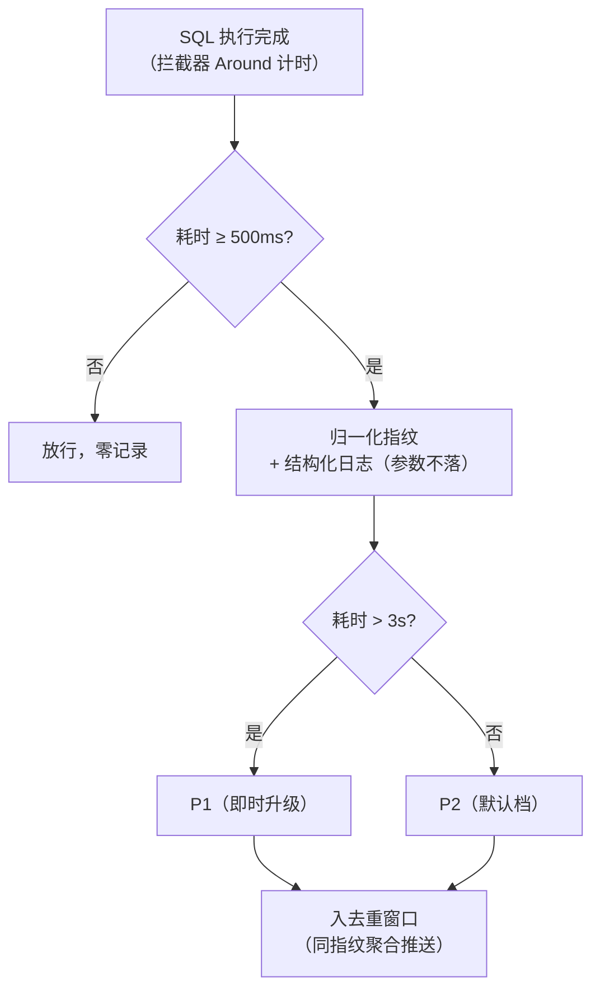

告警体系的设计从三个问题开始：**事件从哪来？怎么不刷屏？通道挂了怎么办？**

任何只回答第一个问题（「接个 webhook」）的实现，都会在第一次故障风暴里被压垮——或者更糟，被静默：通道限频撞满、消息被吞，而没人知道。

当时的现状是三无：无任何告警通道（故障靠用户反馈）、慢 SQL 不可见（数据库慢日志未开、无 SQL 耗时记录）、指标为零（无 actuator / micrometer）。而设计还要先接受三个前置约束：

1. **多实例部署**——去重不能是 JVM 本地行为；
2. **通道有硬容量**——IM 机器人限频 20 条/分钟、消息体 ≤20KB——去重聚合不是优化项，是前提；
3. **平台未就绪**——监控平台排期不在掌控内，业务级告警不能等它。

本文复盘这套告警体系的 0→1 设计（信号源侧的异常出口、链路检索入口分别见《日志治理》《链路追踪治理》篇）。

## 一、定级模型：按影响面，不按事件类型

第一个决策是「怎么定级」。定级依据选择的是**故障影响面**，而不是事件类型本身——同样是「异常」，打挂一个定时任务和打挂核心链路，响应动作应该完全不同：

| 级别 | 语义 | 消息动作 |
| --- | --- | --- |
| P0 · 致命 | 系统不可用 / 大面积失败 | @全员（可配置关闭） |
| P1 · 严重 | 单点故障 / 关键链路失败 | @处理组（按手机号，须在群内） |
| P2 · 一般 | 低风险事件 / 性能劣化 | 不 @，仅记录 |

**谁负责定级**，有一张明确的职责矩阵——这决定了「引擎」与「平台」的边界：实例掉线、`health` 非 UP 这类系统级事件（P0），应用内的代码感知不到，属平台规则职责；应用内引擎的触发点最高到 P1（系统异常固定 P1；慢 SQL 默认 P2、单条超 3s 即时升 P1）。**升级语义定为「单条恶化即时升级」**——3 秒以上的慢查询本身就是强信号，不等窗口聚合、不攒次数。@ 策略按三分支实现：`P0 && at-all` → 全员；`P1 && at-mobiles 非空` → 按手机号；其余不 @。

## 二、事件管道与去重：窗口聚合的每个参数

事件进入引擎后的完整管道：



**异步管道**：专用线程池与队列——发送动作永远不占用业务线程，网络抖动被隔离在管道内；发送失败延时重试 ≤2 次，仍失败则落日志。这里的设计原则一句话：**发送失败不是业务失败**。

事件模型回答「发什么」——类型、指纹、级别、上下文四要素；发布入口是异步的：

```java
AlertEvent event = AlertEvent.builder()
        .type("system-error")                     // 事件类型：路由与模板维度
        .fingerprint(fingerprint(e))              // 指纹：根因异常类 + 抛出点——同根因聚合为一条
        .level(AlertLevel.P1)                     // 定级：按影响面（见第一节）
        .env(env)                                 // 环境标识：prod / test / dev
        .traceId(TraceContext.current())          // 排障入口：消息携带 32hex
        .summary("创建单据接口异常")
        .build();

alertPublisher.publish(event);                    // 异步管道：发送永不阻塞业务线程
```

**去重合并**是抵御「故障风暴」的核心，三个参数每一个都有出处：

- **去重键 = 故障类型 + 指纹**。指纹的设计按事件源定：慢 SQL 用「归一化后的 SQL 指纹」（去字面值），系统异常用「根因异常类 + 抛出点」——同一根因的不同实例、不同参数字面值，聚合为同一条；
- **窗口默认 300s**：同一键在窗口内只推一条，其余合并计数。这个参数同时兼容了另一个外部约束——机器人限频 20 条/分钟：没有这层聚合，一次数据库抖动就能把通道打爆、把群刷屏；
- **分布式去重（Redis SETNX + TTL）**：这是**多实例约束**的直接答案——如果做 JVM 本地去重，N 个实例对同一「全体感知」的故障各推 1 条，N 条轰炸加上限频合撞。即使当前是单实例部署，去重键也要设置——防御恢复期抖动造成的重复推送。

跨实例的「只推一条」，落到 Redis 上就是一条原子原语——SETNX 与 TTL 的绑定天然就是「窗口内只放行一次」：

```java
String dedupKey = "alert:dedup:" + event.getType() + ":" + event.getFingerprint();
Boolean firstInWindow = redis.opsForValue()
        .setIfAbsent(dedupKey, "1", Duration.ofSeconds(windowSeconds));  // 窗口默认 300s
if (!Boolean.TRUE.equals(firstInWindow)) {
    redis.opsForValue().increment(dedupKey + ":suppressed");             // 窗口内重复：合并计数，不推送
    return;
}
dispatch(event);   // 窗口内首次：进入分级路由 → 异步发送
```

去重窗口本身就是一个两态状态机——「静默中」与「可推送」之间的迁移，控制着每一条通知的去留：



窗口过期后，同一指纹的下一个事件会再次推送——**抑制的是风暴，不是知情权**：持续故障每过一个窗口仍会提醒一次。

**告警消息本身也是设计对象**——它不该是「某处出错了」的通知，而应该是**排障入口**：

```
【P1 · 严重】系统异常 · prod
影响：创建单据接口异常
错误：xxxException（统一出口）
trace_id：4bf92f35...
排障：/actuator/traceLogs?traceId=4bf92f35...
```

时间、环境、实例、级别、影响、错误摘要、trace_id、跳转链接——前四项回答「在哪、多严重」，后四项直接把排障路径铺好：点开链接就是字段化的调用链时间线；没有检索平台的环境，则输出「ssh + grep」的排障指引行，保证**任何部署形态下，告警消息都能换成排障动作**。

**降级兜底**是管道设计的最后一环，也是「不丢事件」原则的实现：通道未配置或不可用（凭据空占位）→ 自动回退日志通道（LoggingAlertSender）——告警以结构化 ERROR 日志落地，事件不丢；启动时给出明确警告而非静默失败：

> [告警引擎] dingtalk.enabled=true 但 webhook/secret 未填写（占位待运维回填），回退日志通道 LoggingAlertSender，不真实外呼

这条设计让接入可以两步走：先用日志兜底验证「事件确实产生了」，再接真实通道——「事件没产生」和「事件没送到」从此是两类问题，排障口径不混。

## 三、通道决策：从「引现成」到一次毒链审计后的自研

告警通道的初版结论是「引现成组件、不自研」——理由很常规：钉钉机器人就是 HTTP + 加签 + JSON，薄封装不值当自研。

这个结论被一次依赖审计**推翻**。审计方法是三件套：依赖树全量核查 + 上游 POM 比对 + 官方安全公告逐条核对。结果发现现成组件的传递链里混着一条**毒链**：

- 组件 → 旧版钉钉 SDK（release 即停滞）→ **log4j 1.2.15**——2007 年产物；log4j 1.x 于 2015 年终止维护、官方明确不再修复，含已公开的远程执行风险簇；旁支还有 javax.mail 1.4 与非官方坐标的 codec 仿品；
- **升级到组件最新版无效**：上游 POM 显示依赖同款、无任何排除声明；
- 换其他现成件：一个 2017 年停更、一个个人仓库维护——「干净且维护中」的替代**不存在**。

于是结论反转成**自研薄封装**（约 170 行：access_token 解析 + HmacSHA256 加签 + markdown 消息体 + HTTP 发送，只依赖项目既有 HTTP 客户端）——发送层本就抽象了 Sender，替换面窄、语义等价可测。同时立了一条硬规矩：**「功能默认关闭」不是依赖安全的免责**——毒链在 classpath 里，启用前必须拔掉；这次的处理是直接替换，未启用也不留。（另一条备选是保留组件 + pom 排除毒链依赖——不推荐：排除后有运行时 `NoClassDefFound` 风险，把不确定留在最不该留的地方。）

薄封装的主干只有四步——加签、拼 @ 选项、组消息体、HTTP 发送：

```java
public class DingTalkAlertSender implements AlertSender {

    @Override
    public boolean send(AlertEvent event, String markdown) {
        long ts = System.currentTimeMillis();
        // 加签：HmacSHA256(timestamp + "\n" + secret) → Base64 → URLEncode
        String url = webhook + "&timestamp=" + ts + "&sign=" + sign(ts, secret);
        return httpPost(url, message(markdown, atOptions(event))).is2xx();  // 失败 → 重试≤2 → 降级日志通道
    }

    private Map<String, Object> atOptions(AlertEvent event) {   // @ 策略三分支
        if (event.getLevel() == AlertLevel.P0 && props.isAtAll()) {
            return atAll();                                     // P0：全员（可配置关闭）
        }
        if (event.getLevel() == AlertLevel.P1 && !props.getAtMobiles().isEmpty()) {
            return atMobiles();                                 // P1：按手机号 @ 处理组
        }
        return Collections.emptyMap();                          // 其余（含 P2）：不 @
    }
}
```

**通道的升级路径**也一并写进设计：群机器人的 webhook 路线没有官方 SDK（官方只提供 HTTP 文档），唯一的官方非自研路径是**企业应用机器人**（应用凭证鉴权、单聊直推比群 @ 更可靠、互动卡片「认领/已处理」回调可做告警闭环、Stream 模式无需公网 IP 契合内网部署）——列为通道升级方向：**切换只动发送实现，引擎与路由零改动**。

两条通道约束如实记录进设计：自定义机器人**限频 20 条/分钟**、消息体 ≤20KB——这正是「必须聚合摘要发送」的外部依据；以及**政策约束**——自定义机器人在外部群已不可新建、内部群可用性需运维实测确认——这条被写成通道启用的**前置条件**，而不是事后惊喜。

## 四、慢 SQL：应用层拦截器的选型与口径

慢 SQL 监控有一个容易走错的第一步：以为「数据库慢日志就够了」。两条路线其实是互补口径：

| 路线 | 视角 | 本方案的定位 |
| --- | --- | --- |
| **应用层拦截（主力）** | 含连接获取与事务开销；阈值更细（500ms 可配置）；能挂 trace_id 与业务上下文（Mapper 方法、SQL 指纹） | 首发交付——性能问题**带着业务上下文**到达 |
| RDS 慢日志 + 平台规则（补充） | 服务端真实执行视角；缺索引、锁等待这类纯 DB 侧问题只有它看得见 | 数据层放大留平台规则（边界项） |

拦截器实现有一个选型细节值得记录：**用原生 MyBatis Interceptor（拦截 Executor 的 query/update 做 Around 计时），而不是 InnerInterceptor 链**——后者没有「执行完成」回调，无法测出耗时。实现上作为独立 Bean 装配进 SqlSessionFactory，与既有拦截器链共存、不改既有配置类；SQL 提取复用项目内既有的 `MappedStatement#getBoundSql` 模式。

慢 SQL 事件的**双输出**设计：

- **结构化日志**：SQL 指纹（归一化去字面值）+ 摘要截断（≤500 字符）+ Mapper 方法 + 耗时 + trace_id；**参数一律不落日志**——既防敏感数据泄漏，也控制体积；
- **入引擎推送**：指纹作为聚合键进入去重窗口（5 分钟内同指纹只推一条，附次数与 max/avg 耗时）——**同一类慢查询的风暴，聚合为一条可读的告警**。

判定与分级的完整路径：



拦截器的骨架是一个 Around——外层计时、内层故障隔离：

```java
@Intercepts(@Signature(type = Executor.class, method = "query",
        args = {MappedStatement.class, Object.class, RowBounds.class, ResultHandler.class}))
public class SlowSqlInterceptor implements Interceptor {

    @Override
    public Object intercept(Invocation invocation) throws Throwable {
        long start = System.nanoTime();
        try {
            return invocation.proceed();      // 原生 Interceptor 有「执行完成」回调——才能测全耗时
        } finally {
            try {
                long costMs = (System.nanoTime() - start) / 1_000_000;
                if (costMs >= thresholdMillis) {                     // 默认 500ms（可配置）
                    String fp = SqlFingerprint.of(invocation);       // 归一化：去字面值
                    log.warn("[慢SQL] mapper={} cost={}ms fingerprint={}",
                            mapperId(invocation), costMs, fp);       // 参数一律不落日志
                    alertPublisher.publish(SlowSqlEvent.of(fp, costMs, upgradeMillis)); // >3s 即时升 P1
                }
            } catch (Throwable t) {
                log.debug("[慢SQL] 计时逻辑异常，已隔离", t);         // 观测组件绝不拖垮业务
            }
        }
    }
}
```

阈值设计：默认 500ms（可配置）；单条超 3s 即时升 P1；测试 profile 把阈值调到 1ms——**让集成测试能稳定触发**，这是「阈值可配置」在可测性上的回报。拦截器自身做故障隔离：计时逻辑整体 try-catch，任何异常只落日志、绝不抛出——**观测组件绝不能拖垮业务**，这是贯穿所有组件的同一条纪律。

## 五、指标基座：打点一次，出口随平台切换

告警的「指标型」输入需要一个指标基座。核心原则一条：**业务代码永远只调 Micrometer 门面（register / increment），「传到哪里」由装配层决定**——业务侧不存在「推送」概念，未来接 Prometheus / 云托管 / OTLP，打点代码零变化（Micrometer 即「指标界的 SLF4J」）。

分层打点是两个入口：治理组件自身的指标随总开关装配；业务事件指标通过 Boot 恒装配的注册表直用——当 OTLP 通道加入时，多注册表自动合流（composite 双写），**打点侧零感知**。

指标设计里最值得记录的是**两次口径修正**——它们说明「指标名和口径」不是实现细节，而是告警有效性的前提：

| 修正 | 原案 | 问题 | 结论 |
| --- | --- | --- | --- |
| 失败计数标签 | `{error_code, route}` | `route`/URI 是**无界基数**——每加一个接口就多一个序列，指标库膨胀；且承载点是全应用出口，按单模块命名名不副实 | 改为 `{cause_type, error_code}`（business / system 二分 × 受控错误码） |
| 错误率口径 | 按 HTTP 状态码统计 | 本架构 **HTTP 恒 200**——按状态码统计恒为 0，告警永不触发 | 按业务响应码 code≠200 口径统计 |

> **口径错了，指标全绿也没有意义。** 错误率按什么统计，决定了告警会不会响——它不是观测细节，是告警可用性本身。
{: .prompt-warning }

两次修正最终冻结在打点代码里——业务侧只认识门面，标签必须全部有界：

```java
// 业务代码只调 Micrometer 门面：「传到哪里」由装配层决定，打点侧零感知
registry.counter("biz_request_total",
                "cause_type", causeType,     // business / system——二分枚举（有界）
                "error_code", errorCode)     // 受控错误码（有界）——错误率口径 = code≠200，而非 HTTP 状态码
        .increment();
```

命名与标签随契约冻结：Counter 以 `_total` 结尾、Timer 以 `_seconds` 结尾、标签必须有界（二分枚举 × 受控码）；**新指标先登记后写码**——防止改名/删除让 Grafana 面板与告警规则静默失效。指标挂点做故障隔离（注入可缺省 + try-catch 包裹）——指标异常绝不影响出口本身。

**传输出口**按「抓不到才推」的原则设计三个对接点：标准端点 `pull`（`/actuator/prometheus`，默认真路——抓取是 Prometheus 官方推荐的主形态）；Pushgateway `push`（平台无法回拉应用时启用，采用**整组全量替换**语义规避官方文档点名的三大陷阱：单点、失去 `up` 探活、永不遗忘的 stale 序列；多实例必须显式唯一 instance——否则会出「指标看起来有，其实只有最后一台」的经典事故）；OTLP `push`（OTel Collector 或云托管，手工注册 + composite 双写）。三者切换全部发生在装配层。

## 六、健康检查：如实上报的边界

`/actuator/health` 是标准端点，DB / Redis 由框架自动贡献；消息队列（ONS）与搜索集群（ES）没有自动健康指示器，按同一原则自写两个：

- **如实上报**是第一原则：组件不存在（瘦身测试上下文）时返回 UNKNOWN——**不虚报**；「未接中间件时 DOWN / UNKNOWN」是事实陈述，不是故障；
- **ES 探活用专用短超时客户端**（连接 2s / 套接字 3s）——防 ES 故障把健康端点一起拖挂；探活异常按 DOWN 处理、不向端点抛异常；
- **ONS 的边界如实标注**：客户端没有状态查询 API——「已启动」只能表达启动生命周期（启动失败即容器启动失败，生产态常态为 UP）；网络断连自动重连无法工程化探活——**断连期的消息积压与消费异常，由消费端的结构化 ERROR 日志 + 引擎告警兜底**。探不到的事实，用事件告警补。

健康端点的消费方有三个：平台探活规则（P0 级）、负载均衡的 upstream 检查、以及任何时候的「这台实例活不活」。

## 七、平台与引擎的分工：事件型 vs 指标型

告警体系的完整形态是「应用内引擎 + 平台规则」双轨，分工按事件性质划分：

- **事件型告警（异常 / 慢 SQL / 调度失败）→ 应用内引擎**——不依赖平台就绪。这是「空窗策略」的关键：平台排期不确定，但业务级告警**从第一天起就有**；
- **指标型告警（实例存活 / 错误率 / 响应时间）→ 平台规则**——自建小型监控栈（一台小规格机器跑 Prometheus + Grafana，Grafana 原生钉钉触点、零中间件）或云监控免费档（基础设施层兜底）。规则清单：错误率 >5% 持续 5 分钟（P1，按 code≠200 口径）、平均 RT >3s（P1）、health 非 UP（P0）、锁超时增长（P1）、业务失败数（P2）；
- **多实例的规则双层化**：实例级（`up==0` / health 非 UP → P0）与聚合级（错误率/RT 按全实例 sum 口径）分开——只做聚合会漏掉「单实例挂掉但流量被负载均衡摘走」这种聚合指标不敏感的故障；双层规则缺一不可。

双轨之间还有一条**去重纪律**：引擎不重复推送平台已覆盖的纯基础设施事件，平台不重复推送引擎承载的业务事件——同一故障只报一次（靠运行观察校准）。未来引入托管 APM 时，标准端点与 OTLP 通道已被消费端直接兼容——**零返工**。

## 八、验证与边界

验证的三个锚点：**引擎单测**（21 用例，覆盖去重键计算、分级路由、降级分支）；**替换回归**（通道自研替换后全量回归零失败）；**验收判据**（真实 ERROR 触发 → 1 分钟内到群、去重生效、模板与分级正确）。慢 SQL 侧：阈值调至 1ms 的集成测试断言事件字段与去重键计算。

生效边界（如实）：

- **运营型能力按需扩展**：当前交付事件级闭环（去重 / 分级 / 重试 / 降级）；恢复通知、日报、升级链路属运营功能，随后续迭代；
- **慢 SQL 数据层放大留平台规则**（RDS 慢日志 + 平台告警），应用层已覆盖主口径；
- **平台规则依赖平台就绪**——但业务级告警无空窗（主力在应用内）；
- **@ 策略需要配置才完整**：P1 的 @ 名单未配置时实际不 @ 任何人——真实通道验证时需一并回填。
- **真实通道上线以运维开关排期为准**：凭据回填、内部群实测确认是前置条件（政策约束见第三节）。

**明确不做**：不采购商业托管 APM（标准出口先行）；不做多通道并行直发（Sender 抽象保证了切换能力，同时直发是重复告警的来源）；本期不做恢复通知与日报（避免「看起来完整」的功能集拖慢交付）；不改业务逻辑（红线）。

## 九、机制对照与总结

| 本方案机制 | 行业对应物 |
| --- | --- |
| 去重窗口 + 分级路由 + 合并抑制 | Alertmanager 的分组/抑制、Sentry 的事件聚合——应用内轻量等价实现 |
| Redis SETNX + TTL 跨实例去重 | 分布式去重模式：同一故障在多实例下只产生一条通知 |
| 指标门面 + 注册表分层 + 有界标签 | Micrometer / Prometheus 生态的标准形态 |
| 失败计数与错误率口径（code≠200） | 业务指标与传输协议解耦——口径服务于告警有效性 |
| Sender 抽象（webhook → 企业机器人） | 依赖倒置：通道实现可替换，引擎与路由不动 |
| health 如实上报（含 UNKNOWN） | 健康端点语义：报告事实，不制造假绿 |

差异如实标注：这不是一个**全局告警平台**——去重范围是「本应用的故障事件」，没有跨系统的告警路由、值班编排与依赖抑制（那些属平台侧）；通道当前是「主通道 + 日志兜底」的单通道形态，多通道聚合推送是未来项而非现状。

回到开头的三个问题：**事件从哪来**——统一异常出口、慢 SQL 拦截、调度兜底、指标规则，四类信号源全部有明确归属；**怎么不刷屏**——类型+指纹的去重窗口，分布式实现保证多实例只出一条；**通道挂了怎么办**——降级到结构化日志，事件不丢、分步验证。告警体系的本质不是「把消息发出去」，而是**对事件的一条完整承诺链**：产生必有记录、严重必到达、重复必抑制、故障必降级——链上每一环都断得开，但每一环都修得上。

> **适用边界**：适用于无商业 APM 预算、以 IM 群为告警终端、多实例部署的 JVM 服务；去重窗口、指纹设计、分级路由三件套与平台无关，换成任何通知通道（企业微信、飞书、PagerDuty）都成立——替换面只在 Sender 实现。
{: .prompt-tip }

**延伸阅读**（本文对照的行业依据）：

- push 模型的官方口径与三种经典陷阱：[prometheus.io · When to use the Pushgateway](https://prometheus.io/docs/practices/pushing/)
- 告警分组、抑制与静默的参考实现：[prometheus.io · Alertmanager](https://prometheus.io/docs/alerting/latest/alertmanager/)
- 指标命名与标签基数纪律：[prometheus.io · Metric and Label Naming](https://prometheus.io/docs/practices/naming/)
- 指标门面（「指标界的 SLF4J」）：[docs.micrometer.io · Micrometer](https://docs.micrometer.io/micrometer/reference/)
- 健康检查端点规范：[docs.spring.io · Spring Boot Actuator](https://docs.spring.io/spring-boot/docs/2.7.18/reference/html/actuator.html)
- 钉钉自定义机器人接入（通道约束依据）：[open.dingtalk.com · 自定义机器人接入](https://open.dingtalk.com/document/orgapp/custom-robot-access)
