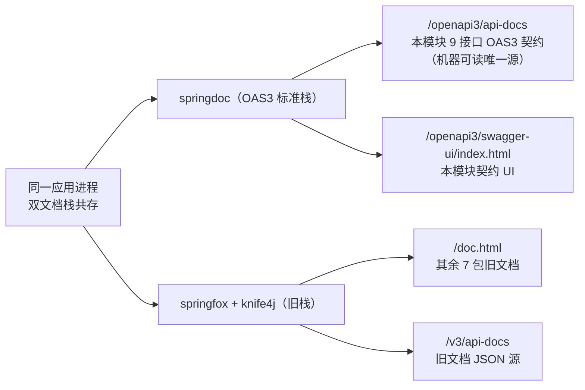
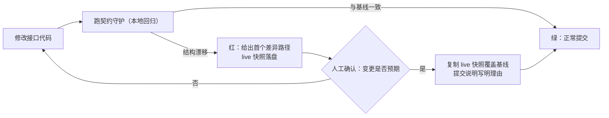

“这个字段可能有哪些取值？”
“你看 Service 源码，第 380 行有判断。”

这是换货单模块联调期的日常对话。9 个接口，注释近乎为零：没有参数说明、没有字段注释、没有状态机与金额公式的业务规则。前端只能读 Service 源码猜语义——猜错就返工；后端改掉一个响应字段，也没有任何校验拦得住它上线。

这不是某一次疏忽，而是长期负债的叠加。本文复盘这次 API 契约治理的完整落地：五种代价、两层选型对比（契约格式 + 生成器）、双栈共存的绞杀者策略、契约守护机制——以及一份如实标注的生效边界。

## 一、契约缺失的五种代价

| 场景 | 表现 |
| --- | --- |
| ① 前后端联调返工（协作成本） | 9 个接口只有一句话注释：无参数说明、无字段注释、无业务规则。前端读 Service 源码猜语义，猜错返工；后端新增字段前端无从感知，到线上才发现请求体缺字段 |
| ② 接口变更无感知（质量成本） | 无契约测试、无接口快照：响应字段改名 / 删除 / 改类型不经过任何校验直接上线，前端运行时才报错；“字段改了文档没改”成为常态 |
| ③ 文档栈停维护（技术债） | 文档生成器的最后版本停留在 2020 年：无安全更新、与新版本 Boot 不兼容（靠路径匹配 workaround 迁就）；旧版注解与 OAS3 标准不互通——客户端生成、契约校验等现代工具链全部接不进来 |
| ④ 生产文档暴露（安全成本） | 生产配置里接口文档开关为 true——参数、响应结构、调试入口对外可访问，是真实的安全暴露面 |
| ⑤ 错误码口径不一（排障成本） | 错误码的含义、触发场景与处理建议没有单一出处：前端提示、后端日志、运维排障各说各话 |

五笔债有一个危险的共同点：**它们都不产生失败**——没有报错、没有告警、没有红线。注释少不会让构建变红，文档漂移不会让测试失败，死栈与暴露面也不会自己浮出水面。所以治理的第一步，不是“写更多文档”，而是把这些无声的成本变成有机制、有门禁的显性负担。

## 二、治理全景与业务价值

治理方案把“契约”拆成四件事：**可读**（写得清）、**可查**（找得到、机器可读）、**可守**（漂移即红）、**安全**（生产关闭）。五个代价逐一对应治理手段、直接收益与受益方——业务价值就在这张对照表里：

| 代价 | 治理手段 | 直接收益 | 受益方 |
| --- | --- | --- | --- |
| ① 联调返工 | C2 注释四件套（9 接口 summary / 业务规则 / 参数 / 错误码 + 契约链模型字段注释全覆盖） | 联调以文档为准：字段含义、业务规则、错误码可查，前端不再读源码猜 | 前端 / 后端 / 测试 |
| ② 变更无感知 | C3 契约快照门禁 + C4 契约断言用例 | 结构变更随提交 diff 可见、本地回归漂移即红——“改了没人知道”变成“改了就拦得住” | 前后端 / 测试 |
| ③ 栈停维护 | C1 引入 springdoc（OAS3 标准栈：端点 / 扫描 / 注解换代） | 机器可读的标准契约，现代工具链可接入——技术债止血、升级路径打通 | 全团队 |
| ④ 生产暴露 | C6 生产关闭（配置级，零代码） | 消除文档暴露面：参数、响应结构、调试入口不再对外可访问 | 安全 |
| ⑤ 错误码口径 | C5 错误码契约表（含义 / 触发场景 / 前端建议 / 可达性分级） | 前端提示 → 后端日志 → 排障检索同一取值，问题定位口径一致 | 前端 / 运维 |

一句话概括：**联调少返工、变更看得见、技术债止血、暴露面关闭、排障同口径**——五项收获都落在协作效率与质量成本上，而不是“文档变得更漂亮”。

一条贯穿全程的红线：**契约治理不得引入业务逻辑变更**——注解、配置、测试之外一切零改动，以全量回归零失败为验收；治理对象只有本模块 9 个接口，其余模块零接触。

“可读”落到代码里是什么样：

```java
// 注释四件套：summary + 业务规则 + 参数 + 错误码
@Operation(summary = "取消换货单",
        description = "业务规则：仅「待受理」状态可取消，成功后释放占用额度。错误码：500（状态不可取消）")
@PostMapping("/cancel")
public Result<Void> cancel(@RequestBody CancelBo bo) { ... }

// 契约链模型字段注释 100%：顶层 DTO 与 14 个嵌套子表模型全字段 @Schema
@Schema(description = "取消原因")
private String reason;
```

## 三、选型对比（一）：契约格式层——为什么是 OpenAPI 3

契约治理的第一个问题不是“用哪个工具”，而是“契约以什么格式存在”。本项目消费方是浏览器前端（REST + JSON 为既定架构），格式层的真实问题不是“选哪种 API 风格”，而是：有没有一个**与代码同源、机器可读、生态存活**的标准。以下对比为背景论证——排除不是因为“不好”，而是因为“不对症”：

| 候选 | 本质 | 为什么不选 |
| --- | --- | --- |
| **OpenAPI 3（选）** | REST 契约事实标准（Linux 基金会托管） | 唯一同时满足：机器可读、注解自动生成（与实现同源不漂移）、工具链生态活跃、浏览器前端可直接消费 |
| RAML / API Blueprint | 曾经的 REST 描述语言 | 均已事实停维护，社区与工具链整体转向 OpenAPI——选它等于选死栈，与现生成器困境同构 |
| GraphQL | 查询语言，schema 由消费方查询驱动 | 不是“接口文档”而是 API 风格重写：前端查询方式、后端数据装配、鉴权模型全变——属架构级变更，不是文档治理 |
| gRPC + Protobuf | RPC + 强类型 IDL | 面向服务间调用；本项目消费方是浏览器前端（HTTP + JSON），协议栈整体重写收益不匹配 |
| Spring Cloud Contract | 消费方驱动契约（CDC） | 面向跨团队微服务的“提供方—消费方”契约测试；本项目消费方是前端（人 + 浏览器），快照 + 断言已覆盖需求，引入属过度设计 |
| 手写文档（Word / Wiki） | 无标准、无代码绑定 | 无机器可读性；改字段必忘改文档——正是要消灭的问题本身 |

两种“死法”值得记住：**停维护系死于生态**——RAML / Blueprint 与现在的旧栈是同一类命运；**架构级改造系死于问题定位不匹配**——GraphQL / gRPC 解决的是别的层次的问题。另外如实说明：本项目真实的选型对比发生在生成器层（下一节）；格式层因 REST + JSON 既定，属常识性排除，保留于此是为了说明“格式层为什么不存在竞争”。

## 四、选型对比（二）：生成器层——为什么是 springdoc

真正的选型发生在生成器层：目标是把 Java 注解自动生成为 OAS3 契约。候选分两组——springdoc / springfox / knife4j 为项目内真实对比（现状代码 + 实测）；手写静态契约 / 自研生成器为常识性排除：

| 候选 | 判定 |
| --- | --- |
| **springdoc-openapi（选）** | Spring 生态中 OAS3 的标准实现、维护活跃、官方兼容矩阵清晰、注解即标准（@Operation / @Schema）；项目为 Boot 2.7.x，选 1.7.x 兼容线 |
| springfox（现状，含“升级 3.x”路径） | 2020 年起再无新版本——升级 3.x 仍是死栈：对 OAS3 仅部分支持、无安全更新，且还需双重 workaround 维持运行；注解体系停留在旧版，与 OAS3 注解不互通 |
| knife4j（现状） | 基于 springfox 的 UI 增强层——底层栈停维护的问题无法绕开 |
| 手写静态 OAS JSON / YAML | 与代码零绑定：改字段必忘改文档，漂移问题原样回来；除 schema 校验外无守护能力 |
| 自研注解扫描生成器 | 生成器本身就是“注解扫描 → OAS3 文档”的成熟实现——自研等于重复造轮子，还要自己承担规范演进与漏洞修复 |

有个细节值得记录：旧栈停在 2020 年，但“还能跑”——项目靠着路径匹配 workaround 一直迁就着它。**停维护的组件往往不是立刻坏掉，而是慢慢把团队拖进“无人敢动、无路可升级”的角落**——这是比停维护本身更贵的代价。

## 五、为什么“共存”，而不是“全工程迁移”

全工程迁移的量级：约 1008 处旧注解、118 个 Controller；而测试用例只保护本模块的 9 个接口——其余 100+ 接口的迁移没有回归保障。两个事实让“最小共存”成为最优解：

1. **本模块接口从不在旧文档里**——旧文档的扫描配置只覆盖 7 个业务包，换代前后旧文档零变化；
2. **注解坐标可分**——旧包用 1.x 注解坐标（1.6.7），本模块换用 OAS3 注解坐标（与生成器实际传递的 2.2.9 显式对齐），两套坐标可以共存。

因此采用 **Strangler Fig（绞杀者模式）**：新文档栈只服务本模块先行落地，其余包换代与旧栈移除留作独立立项候选。Fowler 在定义该模式时特意提醒：人们常抵触为“新老共存”而建过渡期架构的成本，但风险降低与提前收益值得这笔投入——本方案对此完全认同，并把“双栈并存成本”列为显式接受项（见第九节）。



两套栈并存后，“去哪看契约”本身成了需要引导的问题——旧文档 UI 里**永远不会有**本模块的接口：

| 端点 | 提供方 | 内容 |
| --- | --- | --- |
| `/openapi3/api-docs` | springdoc | 本模块 9 接口 OAS3 契约（机器可读唯一源） |
| `/openapi3/swagger-ui/index.html` | springdoc | 本模块契约可视化 UI（字段注释默认展开） |
| `/doc.html` | springfox + knife4j | 其余包旧文档，不含本模块 |
| `/v3/api-docs` | springfox | 旧文档 JSON 源 |

## 六、四个关键技术决策

| 决策 | 做法 | 为什么 |
| --- | --- | --- |
| ① 注解坐标不迁移 | 旧包保留 1.x 注解坐标（1.6.7）；本模块用 2.2.9（与生成器传递的 swagger-core 显式对齐） | 坐标整体升级会让旧包约 600 处旧注解编译失败——这是“旧包零改动”成立的技术前提；且注解类与传递版本必须严格对齐，否则文档端点直接 500（版本失配 NoClassDefFoundError，实测踩过） |
| ② 扫描双限定 | `packages-to-scan` + `paths-to-match` 双限定 | 仅按包扫描会收入同包另一单据模块的 6 个接口；生成器默认全量扫描 118 个 Controller——漏配即文档失控 + 内部接口暴露 |
| ③ 契约端点自定义 | 契约端点固定为 `/openapi3/api-docs` | 默认端点已被旧栈占用——两套生成器注册同一路径会直接 Ambiguous mapping 启动失败 |
| ④ UI 路径让出 | UI 固定为 `/openapi3/swagger-ui` | 两个栈都会注册 `/swagger-ui/**` 静态资源——同路径后注册者覆盖先注册者，实测发现旧栈 UI 被顶掉；自定义路径后 `/swagger-ui` 归还旧栈，并新增一条 UI 路径守卫用例防回归 |

决策 ④ 是**实测暴露**的：自查时发现旧文档 UI 突然变成了新栈的界面，才意识到静态资源路径撞车。两套栈共存的世界里，“不越界”不能靠约定——每个共享路径都得显式让开，并配上守卫用例。

## 七、契约如何被“守住”

治理的前半程是“把文档写出来”，后半程是“让漂移无法静默发生”。后者由两条机制构成。

### 7.1 快照门禁：结构变更，提交可见

机制：集成测试拉起应用后拉取 `/openapi3/api-docs`，与入库基线做**语义 diff**（JSON 树对比，字段顺序无关），漂移即红——失败信息直接给出首个差异路径：

```java
@Test
void contract_should_not_drift() throws Exception {
    String live = mockMvc.perform(get("/openapi3/api-docs"))
            .andExpect(status().isOk())
            .andReturn().getResponse().getContentAsString(StandardCharsets.UTF_8);

    JsonDiff diff = JsonDiff.of(baseline(), live);   // JSON 树语义对比，与字段顺序无关
    assertFalse(diff.isDifferent(), () -> "契约漂移，首个差异路径：" + diff.firstPath());
}
```

三个设计细节：

- **基线随代码入库**：153KB 的契约基线放在 `src/test/resources/api-contract/`，覆盖 9 接口 + 18 个契约链模型的全部字段（含 14 个嵌套子表模型——补齐断言用例只护顶层 DTO 的盲区）。结构变更随提交 diff 天然可见；
- **不依赖执行顺序**：用例自足（只读文档端点）+ 事务回滚 + 无并行配置——单跑与任意顺序结论一致；
- **防假绿**：基线只按显式动作更新——代码改错不会自动把错误“升级”为新标准。反向验证过：篡改基线标题 → 门禁红并报 `$.info.title`；恢复 → 绿。

更新基线的流程也是纪律的一部分：改完接口 → 跑门禁 → 红（失败消息给首差路径，live 快照已落盘 target 目录）→ 人工确认变更是否符合预期 → 复制 live 快照覆盖基线 → 重跑绿 → 基线改动随代码提交，**提交说明写明变更理由**。

> **不要把这个更新开关常驻在 IDE 的 VM options 里**：命令行场景的 `-Dcontract.baseline.update=true` 用完忘清，此后每次运行都会用当前实现静默覆盖基线——门禁永久失效，且不产生任何失败。
{: .prompt-warning }

### 7.2 契约断言：运行时实现与契约不漂移

6 个断言用例，覆盖现有测试（只断 success / msg）完全没碰的地方：

- 成功 / 失败响应符合统一响应结构的五字段契约（code / msg / success / traceId / data 的存在与类型）；
- 错误码协议：缺认证头、非法 JSON 的响应行为；
- 9 个端点逐一可达且为统一响应包装（防路由漂移 / 端点丢失）；
- 顶层 DTO 关键字段名与类型快照（防改名 / 删字段 / 改类型）。

写断言的过程还修正了两条“想当然”的契约事实——**以实测为准回写断言**：缺认证头的报错来自框架（`MissingRequestHeaderException`），Controller 内部断言不可达；非法 JSON 请求 HTTP 层仍是 200，由全局异常处理兜底成业务 code 500——本项目没有 HTTP 400 边界。

还有一个根因修复值得单独说：统一响应体的 `data` 字段此前声明为 `Object`——泛型擦除导致文档里的 `data` 永远是空对象，DTO 字段从未真正进入过文档。声明为泛型 `T` 后（对运行时零影响），响应结构才首次真实呈现。**文档的“看不见”和代码的“写不对”一样，都要找到根因，而不是打补丁。**

守护闭环：



## 八、错误码契约与生产关闭

### 8.1 错误码契约：把散落的口径收成一张表

错误码表以框架统一错误码枚举为单一事实源，逐码给出含义 / 触发场景 / 前端处理建议 / **可达性分级**。盘点（代码核查 + 断言实测）得到一个必须如实记录的事实：本模块 9 个接口当前实际可触达的错误码只有 200 与 500——业务校验失败、缺认证头、非法 JSON 等全部被全局异常处理兜底为 500；而 401 / 403 / 501–503 / 701 是**契约声明、当前不可达**（鉴权组件依赖存在但零接线、防重注解零使用）：

| code | 含义 | 可达性 |
| --- | --- | --- |
| 200 | 成功，data 携带结果 | ✅ 实测可达 |
| 500 | 业务失败 / 系统异常（含缺认证头、非法 JSON） | ✅ 实测可达 |
| 401 / 403 | 未登录 / 未授权 | ⚠️ 预留（鉴权未接线） |
| 501–503 | 会话令牌失效 | ⚠️ 预留 |
| 701 | 不允许重复提交 | ⚠️ 预留（防重未启用） |

“预留”如实标注的价值在于：**契约不假装覆盖运行时**。未来接入鉴权 / 防重时，按表语义生效，并须重跑契约门禁确认。错误码还与日志的 `error_code` 同源——前端提示 → 后端日志 → 检索 → 告警按同一取值贯通。

### 8.2 生产关闭：两行配置，双保险测试

```yaml
springdoc:
  api-docs:
    enabled: false     # 生产关闭契约端点
  swagger-ui:
    enabled: false     # 生产关闭文档 UI
```

配置级、零代码，只影响新栈两个端点；验收用双保险测试：关闭键生效后三个文档端点均 404（集成断言），且生产配置文件必须含关闭键（防误删）。回滚 = 删除两行。

一条红线要如实标注：本方案关闭的是**新栈**文档的生产暴露；旧栈（其余 7 包）与另一个独立服务的生产文档治理不在本方案范围内，列为独立立项候选。

## 九、收益与生效边界

已兑现的量化结果：

- **契约可读**：9 接口四件套齐全；18 个契约链模型字段注释 100%（嵌套子表模型曾整体缺注释，第二轮逐一补齐——141 处旧注解换代 + 117 处字段注释）；
- **契约可查**：`/openapi3/api-docs` 为标准 OAS3 契约，机器可读唯一源；
- **契约可守**：18 个守护用例（门禁 9 + 断言 6 + 快照 1 + 关闭 2）随代码入库，漂移即红；
- **零回归**：全量 241 个用例零失败；旧包、另一独立服务、同包另一单据模块零改动；
- **根因修复 1 处**：统一响应体 `data` 泛型化，响应结构首次真实进入文档。

生效边界（如实）：

- **自动关卡缺位**：当前 CI 流水线不执行测试——18 个守护用例目前在本机 `mvn test` / IDE 运行即生效，但 CI 自动拦截暂缺；按工程约束本方案不新增 CI 编排，接入 CI 属独立决策。这是本方案唯一一处“机制就绪、关卡未挂载”；
- **双栈并存成本**：依赖冗余、注解体系分裂（旧包与本模块各一套）、新接入者需要认识两套文档入口——这是“只做单模块”的必然代价，消除并存 = 全工程迁移（独立立项）；
- **回滚零成本**：全部改动配置级可回滚——关闭键删除即恢复、扫描配置清空即回到无文档状态，无删除操作。

## 十、机制对照与总结

这套机制在成熟工程实践中都有对应物：

| 本方案机制 | 行业对应物 |
| --- | --- |
| 注解即契约、与实现同源 | Docs-as-Code：文档的单一事实源就在代码里 |
| 契约快照 + 语义 diff | 快照测试（Snapshot Testing）：以基线守住结构 |
| 断言用例护运行时结构 | 提供方单侧的结构守护（schema / 契约断言）——见下方差异标注 |
| 双栈共存、模块先行 | Strangler Fig（绞杀者模式）：渐进替换，不做大爆炸迁移 |
| 基线只按显式动作更新 | 门禁的“防假绿”原则：不追随错误、不静默漂移 |
| 生产关闭文档端点 | 攻击面最小化（Reduce Attack Surface） |

两处与经典实现的差异需要如实标注，避免模糊归属：

- **Strangler Fig 的变体应用**：该模式的经典对象是“整个应用系统”的现代化替换；本方案的绞杀对象是“文档技术栈”这一横切设施——粒度更小、机制同构，属变体应用而非教科书场景；
- **不是 CDC**：Pact 官方定义强调“契约由消费方测试生成、contract by example”；本方案守的是提供方单侧的全量结构基线（schema 快照 + 断言），没有消费方参与定义、没有契约 broker——这是“消费方是人 + 浏览器”场景下的轻量取舍，不等价于消费方驱动契约测试。

总结成四句话：

- **契约要可读**：注释四件套 + 字段注释全覆盖，联调以文档为准，不再读源码猜；
- **契约要可守**：快照门禁 + 断言用例，结构变更提交可见、漂移即红；
- **选型要对症**：不选“最新”，选“同源、机器可读、生态存活”——OpenAPI 3 + springdoc 的唯一性就在这三条；
- **边界要诚实**：共存成本、CI 关卡缺位、旧栈暴露——如实标注优于含糊承诺。

> **适用边界**：适用于 REST + JSON、消费方含浏览器前端的服务；若消费方是其他微服务团队，CDC（Pact 等）可能是更对症的形态；若接口协议本身需要重写（gRPC / GraphQL），那是架构问题，不是文档治理问题。
{: .prompt-tip }

**明确不做**：不升级 Boot 3.x；不迁移其余包的注解存量；不治理同包另一单据模块；不引入 Spring Cloud Contract；不新增 CI 编排（工程约束）；不强制全模块一次性补注释。

**延伸阅读**（本文对照的行业依据）：

- OpenAPI 3.0.3 规范：[spec.openapis.org · OpenAPI Specification](https://spec.openapis.org/oas/v3.0.3.html)
- Spring 生态 OAS3 实现：[springdoc-openapi 官方文档](https://springdoc.org/)
- 旧栈仓库（最后版本停留在 2020 年）：[github.com · springfox](https://github.com/springfox/springfox)
- 与旧栈同命运的 REST 描述语言：[github.com · RAML Specification](https://github.com/raml-org/raml-spec)
- 绞杀者模式：[martinfowler.com · Strangler Fig Application](https://martinfowler.com/bliki/StranglerFigApplication.html)
- 消费方驱动契约：[martinfowler.com · Consumer-Driven Contracts](https://martinfowler.com/articles/consumerDrivenContracts.html)
- 契约测试工具与理念：[Pact 官方文档](https://docs.pact.io/)
- 契约测试框架（本文对比中排除的候选）：[Spring Cloud Contract](https://spring.io/projects/spring-cloud-contract)
