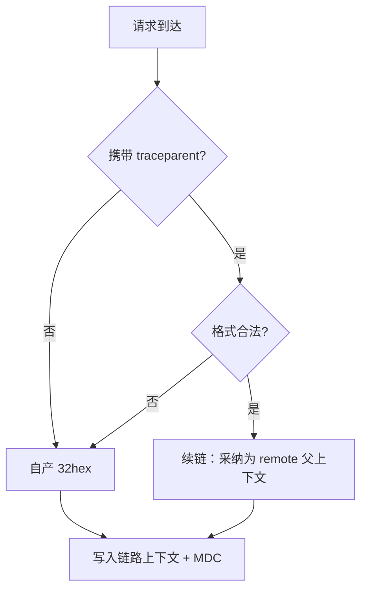
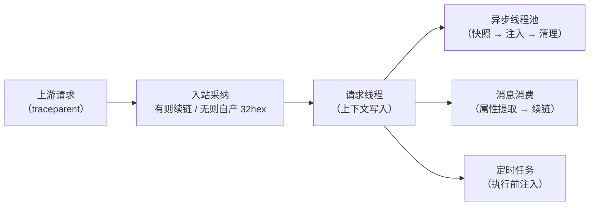
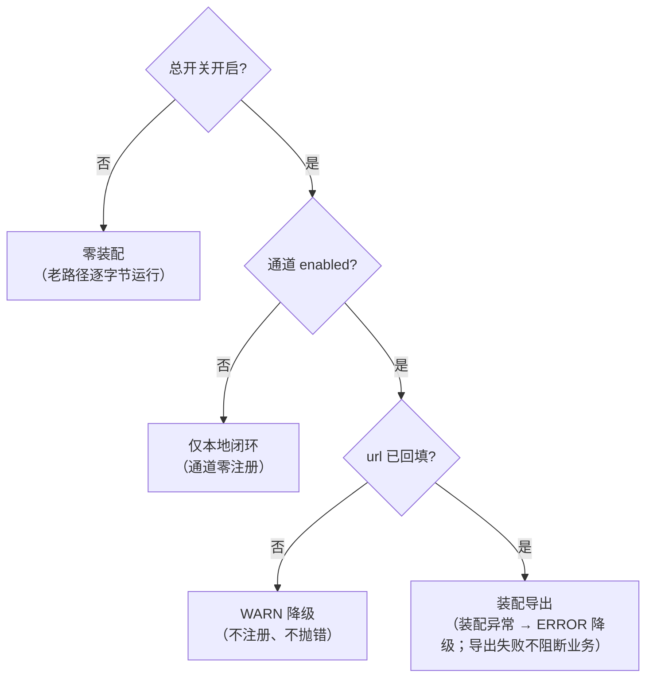

链路追踪这件事，最危险的阶段不是「没有」，而是「有一个不能用的」。

接手时的状态正是如此：traceId 已经在打——但格式是非标准的（含分隔符的 36 进制串），进不了标准传播头，托管 APM、日志平台、OTel Collector 这些标准工具链一个都识别不了；生成器还有一个并发缺陷——计数变量建在方法体内，自增恒为 1，同毫秒的并发请求拿到**相同**的 traceId，按它检索会捞到别人的请求；而请求一旦离开 HTTP 线程——进异步线程池、进消息消费回调、进定时任务——trace 整段消失。

三笔债的根因完全不同：格式是标准问题、重复是生成策略问题、断链是传播问题。本文复盘链路追踪的 0→1 设计，回答四个问题：**身份怎么定、入口怎么续、执行体怎么传、生态怎么接**——每个决策附上当时的依据与实测结论。

治理的硬约束只有一条：**只新增承载，不改业务逻辑**——老类恢复上线前形态即可回滚（装配与回退的完整设计见《日志治理》篇）。

## 一、身份：W3C 格式与生成策略的三选一

第一个决策不是「用哪个组件」，而是「用什么身份」：

| 候选 | 本质 | 判定 |
| --- | --- | --- |
| **W3C Trace Context（选）** | trace-id 32 位 hex、span-id 16 位 hex、traceparent 头跨服务传播；OpenTelemetry 的默认传播器 | 标准互操作——任何标准工具链都能识别；格式即资产，升级只换消费端 |
| 维持自定义格式 | 含分隔符、36 进制，仅本体系可解析 | 「先用着、以后再改」等于必然返工——私有格式无法对外互通 |
| B3 / 自研头 | 其他传播约定 | 生态事实收敛于 W3C；选小众头等于放弃工具链兼容 |

W3C 标准里的传播头长这样（`00-<trace-id>-<parent-id>-<trace-flags>`）：

> traceparent: 00-4bf92f3577b34da6a3ce929d0e0e4736-00f067aa0ba902b7-01

格式定下后，真正有取舍的是**生成策略**——它决定了「并发不撞号」能不能成立：

| 候选 | 优点 | 致命问题 |
| --- | --- | --- |
| 静态原子计数 | 快、可读、可排序 | 多实例部署下，跨实例同毫秒同序号**必重复**；要补实例前缀才能用 |
| 时间戳 + 序号 | 天然可排序 | 实现复杂，引入时钟回拨问题——为一个 ID 不值当 |
| **随机 128 位（选）** | W3C 建议做法；单实例与多实例全局唯一；碰撞概率可忽略 | 无（SecureRandom 的吞吐足够日志场景） |

同时立了两条硬性禁止，都是现状缺陷的直接映射：**禁止方法体局部计数器**（现状 bug 的根因——每次新建，自增恒为 1）；**禁止裸静态计数**（跨实例必撞）。旧生成器实现没有其他引用，直接删除——**不保留死代码**，避免它日后被「考古式复用」。

身份生成落到代码只有一个方法——它替代的正是那个「自增恒 1」的实现：

```java
// 128 位随机（SecureRandom）→ 32 位小写 hex——单/多实例均全局唯一
private static final SecureRandom RANDOM = new SecureRandom();
private static final char[] HEX = "0123456789abcdef".toCharArray();

public static String newTraceId() {
    byte[] bytes = new byte[16];
    RANDOM.nextBytes(bytes);
    char[] out = new char[32];
    for (int i = 0; i < bytes.length; i++) {
        out[i * 2]     = HEX[(bytes[i] >> 4) & 0xF];
        out[i * 2 + 1] = HEX[bytes[i] & 0xF];
    }
    return new String(out);
}
```

旧链路组件的退场方式也值得记录：不做「双轨开关」——曾短暂尝试过用旧的 id-generator 配置行做格式开关，评审后否决（两个开关管同一件事，行为组合不可预期）。最终语义是：**旧组件原样保留为回退基线，开启治理后由观测链路统一产出 32 位 hex**；旧格式只保留「读取兼容」（检索时能匹配历史日志），输出一律新格式——双格式输出等于双检索路径，成本翻倍。

## 二、入站：traceparent 的采纳与合法性边界

有了标准身份，下一个问题是：外部进来的请求带 traceparent 时，认不认？

答案是认——**入站采纳是跨系统拼接完整链路的前提**。不采纳，链路从本服务开始断开；采纳后，「上游 → 本服务 → 下游」才是同一条 trace。尤其在多实例 + 负载均衡的部署下，同一个用户请求可能落在任意实例上，入站解析是跨实例串联的**关键路径**。

采纳的判定本身就是一个决策流程：



采纳拦截器（TraceParentInboundInterceptor）挂在 MVC 链路上，随统一总开关装配。设计上处理三个细节：

- **合法性校验**：格式非法（版本位/长度/hex 字符集不合法）的 traceparent 直接丢弃、自产新 trace——**不做「半采纳」**。半信半疑地沿用一半字段，会造出格式正确但语义错误的链路，比断链更难排查；
- **无头请求自产**：没有 traceparent 的请求（内部调用、curl 调试、健康检查）自产 32 位 hex——保证任何入口都不缺身份；
- **采纳的边界**：当前采纳面向内部调用链；若未来对公网入口开放，要按「不信任来源」策略收敛——拒绝或清洗外部传入的 traceparent，防止伪造头污染链路数据（OTel 上下文传播的安全实践里对这一条有明确提示）。

采纳逻辑落成一个 MVC 拦截器——校验、续链、清理三步都在请求的入口与出口：

```java
public class TraceParentInboundInterceptor implements HandlerInterceptor {

    @Override
    public boolean preHandle(HttpServletRequest req, HttpServletResponse resp, Object handler) {
        TraceContext ctx = TraceContext.parse(req.getHeader("traceparent")); // 版本/长度/hex 逐段校验
        TraceContext.bind(ctx != null ? ctx : TraceContext.generate());      // 非法或缺失 → 自产 32hex
        return true;
    }

    @Override
    public void afterCompletion(HttpServletRequest req, HttpServletResponse resp,
                                Object handler, Exception ex) {
        TraceContext.clear();   // 请求结束清理：线程归还池，下个请求不带上一个的上下文
    }
}
```

关闭态（总开关 false）下拦截器不注册，MVC 配置回到上线前形态——零行为变化。

## 三、跨线程传播：难的不是「传」，是「不串」

先把全景画出来——一次业务处理可能流经四类执行体，链路要在每一段接续：



链路断得最狠的地方是线程边界。这里的设计从一次**现状盘点**开始——盘点本身就是设计输入，而且推翻了两条方案早期的假设：

- 全工程 @Async 生效 32 处（18 个文件，另有 3 处注释态），统一经唯一执行池（AsyncConfigurer 族）；
- 方案早期设想的两个线程池配置类，**现网根本不存在**——如果按它们写接入位，会扑空；
- 全工程没有任何 TaskDecorator——异步子线程拿不到父线程的 MDC，日志里 trace_id 为空；
- 原设想「CallerRunsPolicy 回退到调用线程」的场景也不成立：执行池默认是 AbortPolicy，回退路径根本不存在。

真正的机制只有一个装饰器（TraceTaskDecorator），但三段逻辑缺一不可：

```java
// 示意：提交时快照 → 子线程注入 → 终了幂等清理
public Runnable decorate(Runnable task) {
    Map<String, String> mdc = MDC.getCopyOfContextMap();  // ① 提交线程：全量快照
    String traceId = TraceContext.current();              //    含业务键与 traceId（同源）
    return () -> {
        try {
            restore(mdc, traceId);                        // ② 子线程：执行前注入
            task.run();
        } finally {
            clear();                                      // ③ 终了清理
        }
    };
}
```

三个设计点各自防一种事故：

- **快照取全量 MDC，而不只是 traceId**：子线程日志同样需要 `user_id`/`order_id` 这类业务键——只传 traceId 的话，异步段日志有链路身份、没有业务身份；
- **父无上下文不凭空注入**：提交时父线程没有上下文（如启动期任务），子线程就为空——**无中生有比缺失更贵**（会造出无法关联的假链路）；
- **终了幂等清理**：线程池的线程是复用的——不清理，下一个提交的任务会「继承」上一位用户的上下文，检索时张三的日志里混着李四的 trace。清理做了幂等处理，重复调用无害。

验收方式刻意避开「假跳转」：**真实线程跳转测试**——不 mock 线程池，真实提交、真实切线程，断言子线程日志与父线程同一个 32 位 hex。修正前该组用例红 4 条，挂上装饰器后绿 6 条——测试红绿的变化就是「断链被接上」的实证。

装饰器挂在开启态的执行池上，与老执行池**同参复制**（线程数、队列、拒绝策略完全一致）——避免「开启治理后池行为漂移」这种隐性变更。

**定时任务**是另一类断点（v1.25 之前是「三盲」：任务内日志无 trace、异常只有默认文本 ERROR、无人感知）。设计两条：任务执行前注入标准 32hex（任务内 @Async 子任务经装饰器自动继承，链路串联）；异常兜底升级为「结构化 ERROR（对齐统一出口字段）+ 发布告警事件」——事件定级 P1、聚合键取「根因异常类 + 抛出点」、300s 窗口去重、payload 脱敏。定时任务的失败从「翻日志才能发现」变成「按异常类型聚合的告警」。

## 四、消息链路：双实现与「可直调性」约束

消息是天然断链点：消息从生产者发出、到消费者回调，中间隔着 broker，线程、进程、时间都断开。设计落在一个接口和两个实现上：

**MqTraceSupport** 接口 + Trace/Noop 双条件实现（随总开关装配）：

- **消费端**（decorate）：包装 listener——开始处从消息属性提取 traceparent，有则续链、无则自产，写入链路上下文与 MDC；结束处 finally 清理。老类里只有 2 处 subscribe 调用点需要包装饰，**类内零开关代码**；
- **发送端**（enrich）：发送前向消息写入 traceparent 属性；Noop 实现是空操作——**关闭态的消息形态与上线前逐字节一致**。

接口只有三个动作，开关不在接口里、在装配条件上：

```java
public interface MqTraceSupport {

    /** 发送端（enrich）：发送前向消息属性写入 traceparent；Noop 实现不写。 */
    Map<String, String> enrich();

    /** 消费端（decorate）：进入时提取 traceparent——有则续链、无则自产，写入上下文与 MDC。 */
    void bind(Map<String, String> properties);

    /** 消费结束：finally 清理。 */
    void clear();
}

@Bean
@ConditionalOnProperty(name = "observability.enabled", havingValue = "true")
MqTraceSupport mqTraceSupportTrace() { return new TraceMqTraceSupport(); }    // 开启态：真实透传

@Bean
@ConditionalOnMissingBean(MqTraceSupport.class)
MqTraceSupport mqTraceSupportNoop() { return new NoopMqTraceSupport(); }      // 关闭态：消息形态逐字节不变
```

这里有一条容易被忽略、但当时作为**硬约束**写进设计的点：**消费入口必须保持「可直调性」**。真实 ONS 消息抵达路径与测试路径共用同一个封装方法——测试可以绕过真实 ONS、直调入口方法，断言「日志输出同一个 32 位 hex」。如果为了包 trace 把入口藏进不可直调的框架回调里，这类验证就永远做不了。集成测试里消费端本就是 `@MockBean` 替换的——入口可直调，是留给测试的正式调用面，不是后门。

顺带说明一个前置事实：云消息队列（ONS）没有官方 Agent 插件——这也是下一节评估里最重要的约束之一。

## 五、Agent 还是自建：一次完整的引入评估

代码级机制跑通后，做了一次正式评估：**要不要换成 OTel Java Agent**（`-javaagent` 零代码自动埋点、自动传播、自动注入日志 MDC）？

评估的结论是**不引入**——但比结论更重要的是五条依据，它们构成了这类决策的完整检查单：

| # | 维度 | 评估发现 |
| --- | --- | --- |
| 1 | 覆盖缺口 | ONS 无官方插件：消费/发送端的 trace 续接**仍须代码级承担**；Agent 覆盖的 HTTP/JDBC 与本项目已建能力重叠——换不来「少维护」 |
| 2 | 双写冲突 | Agent 自动注入日志 MDC 与代码级写入**同键互覆**：同线程两个来源写同一个 trace_id，取值抖动、检索分裂；消除冲突要么停代码级写入、要么对齐键名——都是二次重构 |
| 3 | 收益侧 | 当前没有 span 拓扑消费端（无托管 APM、无 Collector），Agent 产出的 span 无处安放；而「按 trace_id 检索日志」的闭环已由代码级机制满足 |
| 4 | 运维形态 | `-javaagent` 是实例级启动参数变更，与应用内配置开关是**两套灰度/回退机制**——对当前部署形态过重 |
| 5 | 迁移前置 | 引入 Agent 的前置是「先停代码级双写」，灰度窗口内新旧 trace 并存需容忍——迁移本身就是一个项目 |

结论落成两句话：**维持代码级 W3C 机制**；**「不引入」不等于「不兼容」**——迁移触发条件写清楚（引入 span 消费端 + 出站透传交付之后），届时二选一：a) OTel SDK 手动埋点（与现有 trace_id 同源封装，不互覆）；b) Agent + 停代码级写入、对齐键名单一来源。

这次评估沉淀出一条更普适的设计哲学：**埋点面由应用显式声明，而非字节码猜测**。代价是四类入口（HTTP / 消息 / 异步 / 定时）各需要一处封装；收益是覆盖边界可控、与业务语义贴合（业务键、告警上下文）、且随时保留向标准生态迁移的完整路径。

## 六、span 导出：同一份身份的第二出口

链路数据除了「日志里的 trace_id」，还应该有结构化出口。span 导出的设计围绕一条纪律展开——**同源**：span.traceId 恒等于当前链路的 trace_id（与日志、告警、检索端点同键）——日志与 span 可以按 trace_id 互跳，检索主键永不分裂。这是对「双写冲突」教训的直接应用：**可以有多个出口，不能有多个源头**。

实现上没有引入 SDK 自动装配（Boot 2.7 无 OTel 自动配置），手工装配三步：`SdkTracerProvider`（BatchSpanProcessor 批量导出 + OtlpHttpSpanExporter HTTP 导出，Resource 携带 service.name）→ Tracer 门面 → 静态桥接类（OtlpTraceSupport 的 start/finish 两个方法：父上下文取「合法入站 traceparent（remote）」或「本地自产」；span_id 在生命周期内注入 MDC——访问日志事件因此天然携带 span_id）。版本锁 OTel 1.52.0——Java 8 实证（class major 52），HTTP 传递链的 okhttp 与项目既有版本同线（依赖树核对过）。

装配方法把三级降级写成了显式分支——每条降级路径都只降级、不抛错：

```java
@Bean
@ConditionalOnProperty(name = "observability.trace.otlp.enabled", havingValue = "true")
SdkTracerProvider otlpTracerProvider(TraceOtlpProperties props) {
    if (!StringUtils.hasText(props.getUrl())) {
        log.warn("[链路导出] 通道已开启但 url 未回填，跳过装配（中间件就绪后只改配置）");
        return null;                                  // 二级降级：WARN、不注册
    }
    try {
        OtlpHttpSpanExporter exporter =
                OtlpHttpSpanExporter.builder().setEndpoint(props.getUrl()).build();
        return SdkTracerProvider.builder()
                .setResource(Resource.getDefault().toBuilder()
                        .put("service.name", props.getServiceName())
                        .build())
                .addSpanProcessor(BatchSpanProcessor.builder(exporter).build())
                .build();
    } catch (Throwable t) {
        log.error("[链路导出] 装配失败，降级为不注册——绝不因观测组件拖垮启动", t);
        return null;                                  // 三级降级：ERROR、不注册
    }
}
```

装配采用**三级降级**：通道关 → 不注册（null Bean）；通道开但 url 空 → WARN 降级、不注册（中间件未回填）；装配异常 → ERROR 降级、不注册（**绝不因观测组件装不上而拖垮启动**）。导出侧还有一层运行期隔离：导出失败由 exporter 内部重试消化，不阻断业务——集成测试把导出端指向一个无人监听的端口（127.0.0.1:1），业务请求恒 200。

装配与降级的判定路径：



span 的「触点」是一份显式清单：HTTP root span（S1，已挂载——kind=SERVER、名称 = METHOD + URI、携带 status_code 语义属性）；ONS 消费段（S2）、@Async 子任务段（S3）、@Scheduled 段（S4）为预留触点——挂载成本恒定为**两行调用 + 一次语义边界评审**，因为各自链路的 trace_id 上下文继承在第三节已经就绪。采样也留了缝：默认全采样（占位期零产出无成本），真实后端启用后按流量成本在装配层补 sampler 槽位。

## 七、检索闭环：一个 trace 端点的设计边界

链路数据有了，最后一个问题是「怎么查」。当时的检索方式是 ssh 上服务器手工翻文件：grep trace_id 凭记忆、单行 JSON 人眼难读、没有任何可点通道。为此设计了一个本地检索端点（TraceLogsEndpoint）：**按 trace_id 直接查看字段化的调用链时间线；`latest` 参数查看最近 N 条错误现场**。

一个「内部端点」也按外部边界来设计，六条约束：

| # | 设计点 | 做法 |
| --- | --- | --- |
| 1 | 数据源零漂移 | 活动日志文件从 log4j2 **运行时 appender** 取 fileName——与写入侧同源，不写死路径，滚动改名自动跟随 |
| 2 | 高效读取 | RandomAccessFile 从文件尾**字节级倒扫** tail——按需读取，不整文件加载 |
| 3 | 灰度兼容 | 双形态匹配：JSON 的 `trace_id` 字段 / 旧格式内联 `trace_id=`——切换期两种日志都能查 |
| 4 | 编码健壮 | UTF-8 容错解码：非法字节替换而非抛错——单行坏字节不毁掉整个查询 |
| 5 | 输入白名单 | traceId 强制 32hex；latest 限幅 1~100——不做「任意路径/任意正则」的通用查询面 |
| 6 | 输出限幅 | 命中 ≤500 行、单行 ≤800 字符；输出为日志原文——不新增数据暴露面 |

还有一个实现路径的决策记录：最初想用 actuator endpoint 承载，实测发现 2.7.4 的 endpoint 参数必填且无默认值机制——缺参请求会被统一异常出口吞成「HTTP 200 + code=500」，排障体验不可接受；最终改为 MVC 控制器（路径保留 `/actuator` 前缀，与既有心智一致）：**无路径参数（零路径穿越面）、参数校验前置、行为可测**。

端点的定位也写进了设计：它是**无集中检索平台时的过渡通道**——集中检索就绪后自动降级为本地兜底（不删除：检索平台故障、断网场景下，它是唯一还能按 trace_id 看到链路的地方）。告警消息的「排障入口」与之双通道配套：有检索平台填「可点链接模板」，没有平台则输出「ssh + grep」的排障指引行。

## 八、验证与生效边界

这套机制的测试锚定方式（每条对应一个曾经的缺陷模式）：

- **生成器并发唯一性**：同毫秒多线程并发生成，断言零重复——直接锚定「计数恒 1」的历史缺陷；
- **消费入口同 trace**：直调封装入口（绕过真实 ONS），断言日志输出同一个 32 位 hex；
- **异步真实线程跳转**：真实池提交 + 切线程断言父/子同 trace——不 mock 假跳转；
- **端点限幅**：输入白名单与输出限幅用例；
- **全量回归零失败**：该阶段收尾 381 个用例、Failures=0 / Errors=0。

生效边界（如实）：

- **出站透传收敛到统一 HTTP 客户端一处注入**，随其立项交付——在那之前，跨服务链路按各自 trace_id 分段（段内完整、跨段需人工拼接）；
- **ONS 消费治理覆盖现有订阅范围**；新消息入口接入时按同一封装扩展；
- **Agent 迁移的触发条件已写明**（span 消费端 + 出站透传交付），不是「永远不做」；
- **SkyWalking 类 agent 型 APM 的衔接**：日志模板已预留第二个 agent 注入键位（注释级）——引入试点时取消注释即加键，与主检索键不互覆。

**明确不做**：不引入字节码 Agent（触发条件见上文）；不迁移旧格式存量数据（读取兼容即可）；不为出站透传单独排期（随统一客户端一处落地）；不做跨语言 SDK（能力随统一框架分发）。

## 九、机制对照与总结

| 本方案机制 | 行业对应物 |
| --- | --- |
| 32hex 生成 + 入站 traceparent 采纳 | W3C Trace Context——OpenTelemetry 默认传播器的规范基础 |
| 快照 → 注入 → 终了清理 | 线程上下文克隆模式（Log4j Thread Context 官方给出的线程池方案与此同构） |
| 消息消费/发送双实现 | 传播器的 extract / inject 语义在消息链路的代码化落点 |
| 出站单一注入点 | 探针集中注入原则：注入点收敛，避免散落式二次改造 |
| span.traceId ≡ trace_id 同源 | 单一事实源：多出口、单源头，检索键不分裂 |

两处差异如实标注：本方案是**代码级采集**而非 Agent 全自动埋点（评估与迁移路径见第五节，覆盖边界可控是它的交换条件）；本地检索端点是**过渡通道**，集中检索就绪后降级为兜底而非替代品。

回到开头三笔债：**格式**用 W3C 标准 + 随机 128 位生成解决；**重复**用生成策略的硬性禁止解决；**断链**用「四类执行体、四种封装修复」解决——HTTP 入站采纳、线程池装饰器、消息双实现、调度注入。链路追踪的设计没有一锤定音，全是逐点接续：**每接上一个入口，就多一段可以检索的链路；每个决策留下的迁移缝，都让下一次演进只是配置问题。**

> **适用边界**：适用于 JVM + Spring Boot、以日志检索（而非 span 拓扑）为主要消费方式的团队；若组织已计划引入托管 APM / OTel Collector，本文的 Agent 评估五维（覆盖缺口 / 双写冲突 / 消费端 / 运维形态 / 迁移前置）可直接复用为引入检查单。
{: .prompt-tip }

**延伸阅读**（本文对照的行业依据）：

- W3C 标准全文（traceparent 格式与传播语义）：[w3.org · Trace Context](https://www.w3.org/TR/trace-context/)
- 上下文与传播的概念、提取与注入：[opentelemetry.io · Context Propagation](https://opentelemetry.io/docs/concepts/context-propagation/)
- 零代码 Agent 的官方说明（本文评估对象）：[opentelemetry.io · Java Agent](https://opentelemetry.io/docs/zero-code/java/agent/)
- span 导出协议：[opentelemetry.io · OTLP Specification](https://opentelemetry.io/docs/specs/otlp/)
- 线程上下文与线程池快照模式：[logging.apache.org · Thread Context](https://logging.apache.org/log4j/2.x/manual/thread-context.html)
