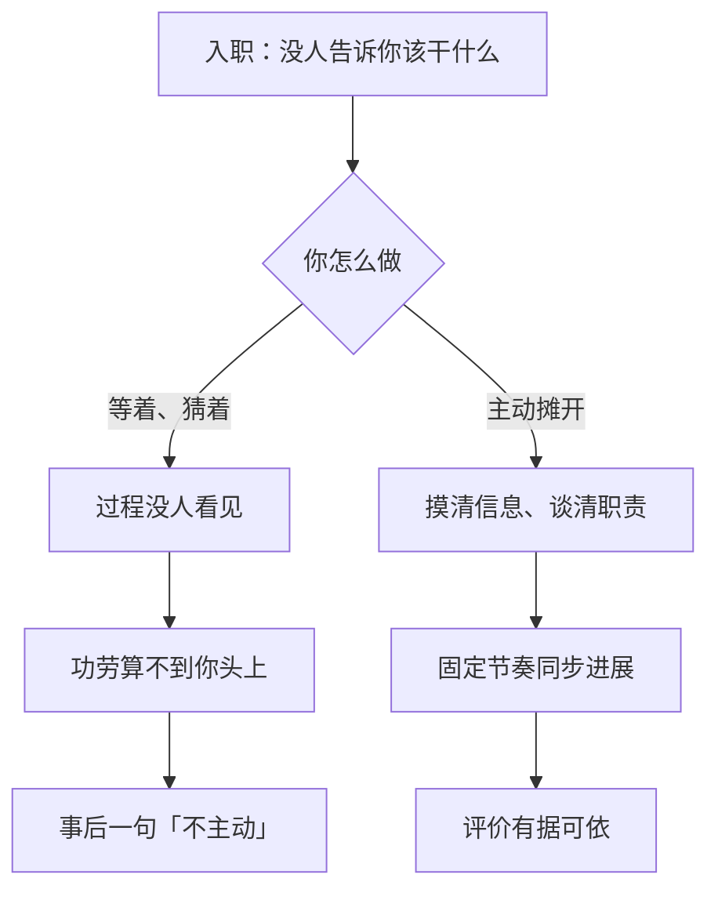
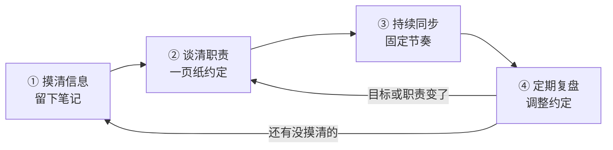
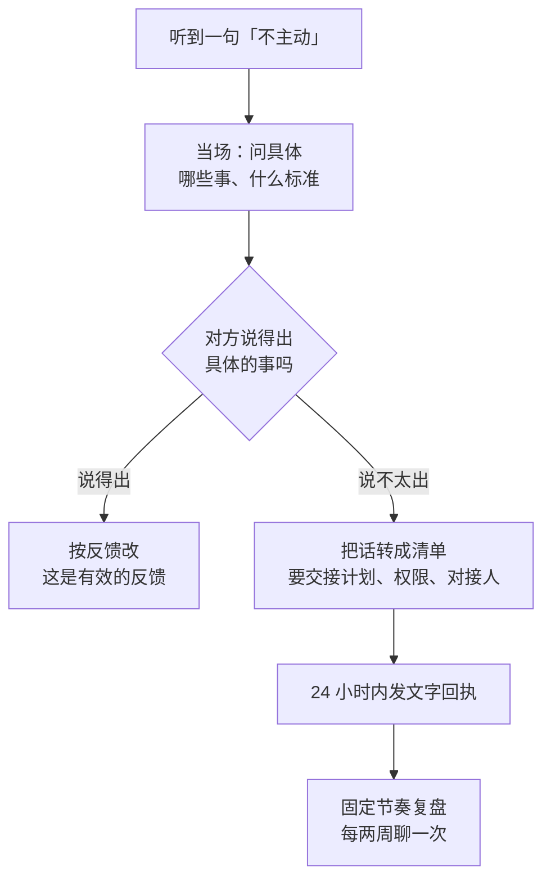

一个并不少见的开局：新人进了一家小公司。没有入职培训，没有文档——技术资料、需求记录、业务说明，一样都没有。能拿到的，只有一个第三方低代码平台（拖拽配置就能搭出系统的那种），和一张画着业务流程的脑图。

刚入职时问过几个业务和技术问题，回复很模糊。之后的每个需求，都是做完就结束了，没人接、没人评。没有对接人，也没被拉进任何群；好不容易进了群，也没人说他该干什么——因为压根没人交代过。然后是一次谈话：评价是「不积极、不主动」。也是在这场谈话里，他第一次听说，自己的定位是「接替某某，负责整个小项目」。

这个定位，从入职到现在，没有任何人提过。**公司从来没告诉他该干什么，却在评价的时候，按这个标准算了他的账。**

这不是谁倒霉，而是很多公司都在重复的一种情况。下面把应对方法拆开写清楚。标题里的 SOP 听着正式，说白了就是「固定几步、照着做就行」的流程。这套流程不是教你「更努力」，而是把含糊的东西变清楚：把期待谈成约定，把过程留下来，把说不清的评价落回事实。

## 一、先说清楚：为什么「三无」最后会变成「不主动」

先给结论：**这不是态度问题，是信息问题。**

没有培训、没有文档、没有对接人，说穿了就是：公司该做的三件事——交代清楚干什么、告诉你信息在哪、安排好交接——一件都没做，全默认你自己搞定。活没有变少，只是换了个扛法：从公司的流程，变成你的自力更生。

这种情况不分公司大小。大公司的边缘团队、外包驻场、换了两任领导的业务线，都是一个样子。经济不好的时候更常见：培训、文档、交接这些事最先被砍掉，因为它们不直接产生业绩——而省下来的成本，最后往往由新人来扛：来得最晚的人，接得最多。

具体来说，有三件事在同时发生。

**第一，没说出口的期待，照样算数。** 管理学里有个词叫「心理契约」，说白了就是：合同里没写、但双方心里都默认对方该做的事。这些默认不会因为没写下来就消失：公司不说，你只能猜；猜错了，基本是你买单。更麻烦的是，期待没人拿出来对过，双方就各记各的账，直到某天对方觉得你「欠账」了——开头那次谈话，就是这么一次你事先毫不知情的判定。

**第二，「主动」成了管理缺位的万能补丁。** 没有培训，就指望你自学；没有文档，就指望你四处打听；没有分工，就指望你自觉认领。问题出在评价标准上：标准握在管理者手里，而且是事后才生效的。**没有事先说好的标准，任何行为都能被事后说成「不够主动」。** 想明白这一层，就不必拿这句话攻击自己——它说的是环境，不是你的品质。

**第三，你不说话，两边会理解成两件相反的事。** 你不说，是觉得「没消息就是没事」；管理者看到的，却是「这个人没动静，也没投入」。工程上有句老话：系统没有监控，运维就只能靠「有没有出事」来判断健康。同样的道理：你的工作过程没人看见，功劳就算不到你头上；到了评价的时候，看不见的付出约等于没有。



所以下面这套方法，要的不是「让公司满意」，而是给你攒下三样实在东西：**信息**（该知道的能自己拿到）、**记录**（做过什么、要过什么支持、对方怎么回的，都记下来）、**选择权**（早看清值不值得待，早决定去留）。

## 二、整套方法长什么样

全篇只有一个原则：**没说出口的期待，想办法变成说清楚的约定。**

一共四步，每步留下一样东西，也有一个「怎么算做完」：

| 阶段 | 做什么 | 留下什么 | 怎么算做完 |
| --- | --- | --- | --- |
| 第一周 | 把信息问清楚、摸清楚 | 一份入职笔记 | 笔记能回答三个问题：系统边界在哪、核心流程是什么、有事找谁 |
| 第一个月 | 主动约一次对齐，把职责谈开 | 一页纸的职责约定 | 对方确认过（哪怕只回一个「收到」） |
| 日常 | 固定节奏同步进展 | 一次次同步记录 | 连续发出 3 次以上，而且每次都有「需要你做什么」 |
| 定期 | 回头复盘，调整约定 | 更新过的约定 | 有过至少一次「拿事实说话」的复盘 |

四步的顺序有讲究，别跳：信息没摸清，职责就无从谈起；职责没定，你每周同步什么都是空的；没有前面这些记录，复盘（回头拿做过的事对一遍当初定的目标）又变成「凭感觉评价」。



## 三、第一周：把信息摸到手

「问了没人认真答」，很多人会理解成「这里不让问」。其实大多数时候，问题不在「问」这个动作，而在问法：问题太模糊，对方得先花力气帮你理清楚，回报太低，于是回你一句「你先看看吧」。

说白了：**提问要让对方一秒钟就能答上来。** 能答「是 / 不是」，或者「选 A 还是 B」，对方就愿意答；问得没边没沿，谁都没耐心。

所以提问就三步：**先说你的猜测 → 给出选项 → 请对方确认或纠正。**

| 模糊问法 | 换个问法 |
| --- | --- |
| 「这个业务是做什么的？」 | 「我理解主流程是 A→B→C，其中 C 是人工兜底——对吗？不对的话，是哪个环节？」 |
| 「这个模块怎么改？」 | 「有两条路：A 改配置，影响面小；B 加分支，改动可控。我倾向 A，理由……你觉得对吗？」 |
| 「以前是怎么处理的？」 | 「我在系统里翻到过 X 这类记录，猜当时是按 Y 处理的；有没有例外情况？」 |

注意，这些话里都带着「我已经查过什么」。这样做有两个好处：对方答得省事；更重要的是，问一句就能让他看见你做了功课。

信息分三条线摸，缺了哪条，后面都会不顺：

- **业务线**：谁在用这个系统、主流程是什么、出了岔子谁来兜、关键说法对不对得上（同一个词，在两个人嘴里是不是一个意思）。
- **技术线**：系统边界（哪些是自己维护的、哪些是别人家的平台）、数据怎么流、怎么部署、环境和权限怎么开——还有第三方平台的能力和限制。用低代码平台尤其要多问一句它**不能**做什么：不知道平台的限制，你会把「平台做不到」当成「需求就这样」。
- **组织线**：谁拍板、谁维护、有事实际找谁（注意，不一定是名义上的那个人）。这条最容易被忽略，但对你最要紧——不知道找谁，公司就会默认「你自己想办法」。

找不到人问怎么办？别硬着头皮去「搞关系」，去翻记录：代码提交、系统日志、工单历史、群里的发言。谁在过去 90 天动过你要接的系统，谁就是实际上的对接人。这件事不靠社交，靠考古——翻一翻，人就浮出来了。

第一周要留下的，是一份**入职笔记**：系统边界、核心流程、常用名词，还有一份「待确认清单」，想到就先记下来。没有文档的公司里，新人自己记笔记是性价比最高的一件事，一次投入，三个回报：省得重复问、待确认清单就是你后面谈职责的现成议题、而且这本笔记本身就是你「做了事」的证据。

提问也要有分寸。一次只问对方答得上来的问题；「当初为什么这么设计」这种问题，先记进待确认清单，别当场追着问——追没有答案的问题，只会让人觉得你难带。分清楚哪些该问人、哪些该自己查，是这一周的纪律。

## 四、第一个月：把职责谈清楚，落成一页纸

第一周摸完信息，主动约一次 30 分钟的对齐会——「对齐」就是坐下来把双方的理解谈成一致。这一步听起来别扭：新人主动找领导「谈职责」，很多人不敢，怕被当成「教领导做事」。算笔账就清楚了：现在花 30 分钟；不谈，就是三个月后的一次「谈话」，而且由不得你挑时间——就像开头那样，定位在谈话里才第一次出现。

顺带说一句：这种「主动找上级把事谈清楚」的做法，有个听着很唬人的名字叫「向上管理」。它跟讨好、拍马屁没关系——就是把该对齐的事主动对齐，仅此而已。

对齐会只谈三件事：

1. **目标**：分三个阶段——入职第 1 个月、第 2 个月、第 3 个月（也就是常说的 30 / 60 / 90 天）——你希望我做成什么？做成什么样算好？
2. **边界**：哪些事我负责、哪些事我配合、哪些事不归我？
3. **决定权**：哪些事我可以自己定、哪些必须先问你？卡住了找谁、按什么顺序往上走？

第二件事可以借一个现成的工具来谈：RACI 职责矩阵（一套给职责分角色的通用表格）。RACI 是四种角色的英文缩写：R 是动手做的人，A 是最后担责的人，C 是动手前得先问的人，I 是做完要告诉的人。它很细，但前提是你手上得先有一份任务清单，而职责混乱的小公司根本给不出来。所以这里只用简化版：先分「我负责 / 我配合」，再把第三件事里的「决定权」补上。先把「有没有边界」解决，精确度以后再说。

会上别谈完就算，收尾说一句：「我回去把今天说的整理成一页纸，发你确认。」24 小时内发出去：

```text
# 职责与交付确认（30 / 60 / 90）

## 目标与验收
- 30 天：____（做成什么样算好：____）
- 60 天：____
- 90 天：____

## 边界
- 我负责：____
- 我配合：____
- 暂不归我（最容易被默认加上的一项，请明确）：____

## 决定权
- 我直接定：____
- 要先问你：____
- 卡住了找：____ → ____

## 同步节奏
- 每周书面同步一次（四段式）；每两周一次、30 分钟的单独沟通
```

这一步是整篇最关键的变化：**口头说的，变成了白纸黑字。** 口头的话，别人转头可以不认；写下来的东西要改，得两边都点头。对方哪怕只回一个「收到」，记录就成立了；不回，也是信息（见第七节）。

如果对方谈不出定位呢？「你先熟悉熟悉」「到时候再说」——别泄气，这本身就是一个重要信息：**这家公司现在没有定位。** 没有定位，不代表你不能干活，而是两件事：一，你按自己的理解先做，但把理解说出来——「我先按 X 做，有偏差随时纠正我」；二，以后如果谁拿「定位」来找你算账，先问一句：这个定位，是什么时候跟我确认过的？别在没有约定的地方认领责任——这不是顶撞，是把缺掉的信息补上。

同理，要是听到「你要接替某人，把整个项目负责起来」这种量级的话，当场把它拆成具体问题：交接计划呢？时间表呢？原来那个人以后是什么角色？我有多大的决定权？**期待要跟资源一起给。** 只加活、不给配套（不给权限、不给信息、不给对接人），就是管理缺位最典型的样子。你不拒绝活，你只要求活和资源一起到位。

## 五、日常：让「主动」被看见

回到开头说的：过程没人看见，功劳就算不到你头上。所以在领导眼里，「主动」不是「你干了多少」，而是「你有没有让他看见你在推进」。解决办法不是加倍干活，而是给自己装上「监控」——固定节奏地发信号。做过监控系统的读者可以这样理解，核心就三条：

- **固定节奏**：每周发一次，别等想起来才发。想起来才发的信号，等于没有信号。
- **格式固定**：每次长一个样，对方扫一眼就知道进展在哪。
- **带着请求**：每条里都要有「需要你做什么」。同步不是汇报工作，是把风险摆出来、把该要的决策要回来。

```text
【本周】完成 ____（对应目标：____）
【风险】____（影响：____；我建议这样处理：____）
【需要支持】____（需要谁、做什么、什么时候前：____）
【下周】计划 ____（和计划有出入的话，说明原因）
```

四段里最有分量的是中间两段。「风险」：领导最怕新人的不是犯错，是「不知道他在忙什么、什么时候爆雷」。坏消息早说，是最省力的信任建立方式。「需要支持」：把「求帮忙」变成「要资源，好把说好的活干成」——跟「我不行」是两回事。

一周一次就够了。公司越是没有周报文化，越该发：正因为没有规矩，你的固定节奏才显眼。

还有一个动作：**嘴上说的，落成文字。** 「这个先不做了」「下周给你开权限」——这类口头共识，24 小时内用三五句话复述一遍：「按今天说的，我理解是 X、Y、Z，有出入请纠正我。」道理和上一节一样：口头的话谁都能改口，写下来的要改，得两边同意。

分寸也要有：**同步不是表演。** 三条纪律——不吹进展（下一次同步就会被戳穿，信任一次性清零）；不写流水账（对方读完不知道要做什么，就是噪音）；和真实产出对齐（这周没产出，就照实写「卡在 X，需要 Y」——承认卡住，本身就是合格的信号）。

最后说句实在话：这一条条同步攒下来，也是一条条记录。你做了什么、提前报了什么风险、要了什么支持、对方怎么回的，全在。等到评价那一天——不管是好是坏——你不用争辩，把记录拿出来就行。吵起来往往是因为双方各记各的账；有记录在，账只有一套。

## 六、被说「不积极、不主动」时，怎么办

先分清你听到的是哪种话，后面的做法完全不同：

- **对事的反馈**：说得具体（「X 延期了三天，希望你早点说」）——这是能改、能讨论的，该谢就谢；
- **对态度的话**：说的是人（「不积极」「不主动」「没有主人翁意识」），没有具体的事，也没有标准——没法验证、没法执行、也没法改。

开头那种谈话，听到的是第二种。说这种话，一般是因为对方手里没多少事实可看：要么是你同步得太少（用第五节的模板补），要么这家公司习惯这么评价人（那不是你能修的）。先别急着自责，先看看是不是自己的信号问题。

处理分四步，当场两步、事后两步。

**第一步，当场问具体。** 不辩解、不认错、不上头，用一句话把话接住，换个问法：「明白。想具体对一下——哪些事上希望我多担一点？做成什么样算好？」对方答得出来，这次谈话就变成了一次有用的反馈；答不出来，只剩「就是感觉」——那你也看清了这次谈话是什么性质。

**第二步，把话转成两张清单。** 这类话背后，通常藏着一个从没说出口的期待。当场把它问出来，并且要资源配套：期待是「接替某人」，那交接计划（范围、时间表）、决定权、原来那个人的角色，分别是什么？记住第四节那句话：期待要跟资源一起给。你不拒绝任何期待，你只要求它配套。

**第三步，24 小时内发一条文字回执。** 就三行：

```text
按今天的沟通，我对齐到三点：1) ____；2) ____；3) ____。
我的打算：____。
需要你确认的两点：1) ____；2) ____。
```

这条回执，会把一场不好受的谈话变成一份草案。对方确认之后，以后评价你，就得对着这份东西说，而不是凭感觉说。

**第四步，把对齐变成固定动作。** 借这次谈话，把「每两周单独聊一次」定下来。一次冲突是事故，定期对齐是巡检——事故靠事后复盘，巡检靠制度。



然后是最不好受、也最重要的一步：**重新看这个环境。** 下面四条里，出现任何一条，都值得认真想想去留：

- **该谈的一直谈不起来**：你想谈职责、谈标准，对方永远是「你先做着看」；
- **只看态度，不看产出**：说好的目标完成了，评价还是「感觉不够主动」；
- **要支持从来没回音**：连着几次「需要支持」都没人理，或者永远是「你自己想办法」；
- **答应了的不算数**：对齐会上点头给权限、给对接人、给交接计划，一个月过去还是零。

怎么下结论：主动试一轮——约对齐、发同步、请确认。观察一到两个月。如果什么都立不起来，那就是这地方没法按规则沟通。**这不是你的失败，是一个你已经验证过的事实。**

「走」这个选项也要摆正位置：转岗或者离职，是规则立不起来之后的正常一步，不是认输。记录在这里同样有用——它让你用一个事实来下决定：「我尽力建立了规则，规则立不起来」，而不是「我干得不好被赶走」。前一句才是真的。

## 七、边界：这套方法能做什么，不能做什么

最后把边界说清楚，免得把它当成万能药：

- **它不能让管理差的公司变好。** 不培训、不写文档、不交接、反馈不及时——这些毛病只有公司自己能改。个人的办法是补丁，不是解药。
- **把话挑明，是要付代价的。** 有的领导不喜欢被要求「定职责」「说标准」，觉得你在划界、谈条件。这个代价值得付：连职责都不肯谈清楚的地方，早点知道，比三个月后在一次谈话里知道要好。
- **它也分场合。** 三五人的创业班子，活是流动的，口头对上加文字同步就够了；救火期，对齐可以压到最简，哪怕先问清「眼下最要紧的三件事是什么」；反过来，管理正规的公司，入职培训、30 / 60 / 90 的阶段目标、定期的一对一沟通，本来就该公司提供——那种环境里，这套东西多半轮不到你操心。
- **最要紧的一句：别因为这套方法有用，就把问题当成正常的。** 新人的培训、文档、交接、定期反馈，是公司的责任，不是新人的天赋。「新人自己补管理课」成了常态，该反思的是公司。方法的价值只有一个：在你不得不自己补位的时候，帮你留住信息、留住记录、留住选择权。

入职不是等着被安排，而是件得自己张罗起来的事：把期待谈成约定，把过程变成记录，把评价落回事实。愿意谈的公司，值得投入；谈不拢的，至少让你早点看清。
