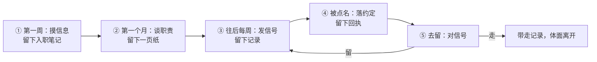
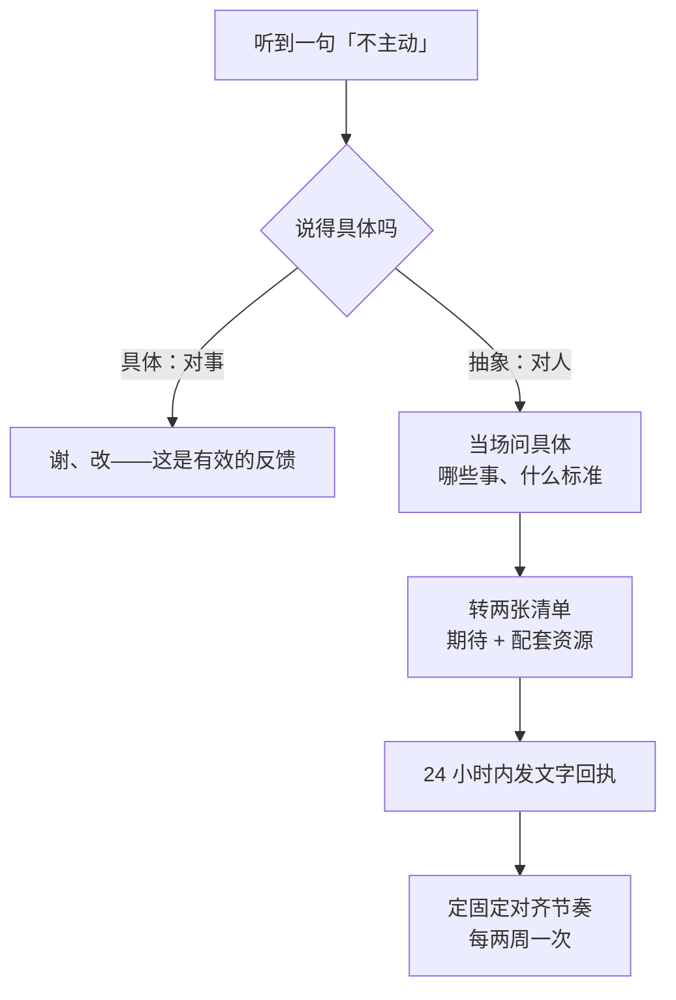

新人进了一家没有培训、没有文档、没有对接人的公司：业务和技术问题问出去，回复很模糊；每个需求做完就结束了，没人接、没人评。直到一次谈话，他第一次听到「不积极、不主动」，也第一次听到自己的定位——那个位置，从来没人跟他提过。

公司没告诉他该干什么，却在评价的时候按这个标准算账。这篇写给桌子这一边：没人给信息、没人划边界时，怎么自己把局面立起来。标题里的 SOP 听着正式，说白了就是「固定几步、照着做就行」的流程——下面五件事按时间排开，每件都写清楚怎么开口、留下什么、做到什么程度算完，附的四份纸可以直接抄。

## 一、先把整件事看一遍

| 什么时候 | 大概花多久 | 做什么 | 留下什么 | 怎么算做完 |
| --- | --- | --- | --- | --- |
| 入职第一周 | 每天一两个问题 | 把业务、技术、组织三条线摸一遍；问不到人就去翻记录 | 一份入职笔记，附一份待确认清单 | 能自己答出：系统边界在哪、主流程是什么、有事找谁 |
| 入职第 2–4 周 | 一个 30 分钟的会，加当天一条确认稿 | 主动约一次对齐，把目标、边界、决定权谈开 | 一页纸的《职责与交付确认》 | 对方回过一个「收到」以上 |
| 往后每周 | 写 10 分钟 | 固定一天发进展：本周、风险、需要支持、下周 | 一次次攒起来的同步记录 | 连着发三次以上，每次都有「需要你做什么」 |
| 被点名的那天 | 当场两步，事后 24 小时内一条回执 | 把话问具体、转成清单，发回执，定下固定对齐 | 一条回执，外加「每两周聊一次」的约定 | 那些没有主语的话，变成有日期、有验收的约定 |
| 试过一轮之后 | 观察一到两个月 | 对照四条信号，判断去留 | 自己的结论，连着全部记录 | 结论是「规则立不起来」，不是「我干得不好」 |



下面一节一件事。急用哪件，直接翻到哪一节。

## 二、第一周：把信息摸到手

「问了没人认真答」，很多人会理解成「这里不让问」。其实大多不是不让问，是问法的问题：问题太模糊，对方得先花力气帮你理清楚，回报太低，于是回你一句「你先看看吧」。

说白了：**提问要让对方一秒钟就能答上来。** 所以别空手问，按这个顺序来——先说你的猜测，给出选项，再请对方确认或者纠正。

| 别这么问 | 换成 |
| --- | --- |
| 「这个业务是做什么的？」 | 「我理解主流程是 A→B→C，其中 C 是人工兜底——对吗？不对的话，是哪个环节？」 |
| 「这个模块怎么改？」 | 「有两条路：A 改配置，影响面小；B 加分支，改动可控。我倾向 A，你觉得对吗？」 |
| 「以前是怎么处理的？」 | 「我在系统里翻到过 X 这类记录，猜当时是按 Y 处理的；有没有例外情况？」 |

这三句话里都带着「我查过什么」。对方答得省事；更值钱的是，他一眼就看出你做了功课。

信息分三条线，缺哪条后面都会不顺：

- **业务线**：谁在用这个系统、主流程是什么、出了岔子谁来兜，还有关键说法对不对得上——同一个词，在两个人嘴里是不是一个意思。
- **技术线**：系统边界（哪些是自己维护的、哪些是别人家的平台）、数据怎么流、怎么部署、权限怎么开。第三方平台尤其要多问一句它**不能**做什么：不知道平台的限制，你会把「平台做不到」当成「需求就这样」。
- **组织线**：谁拍板、谁维护、有事实际找谁。注意，不一定是名义上的那个人。这条最容易被忽略，但对你最要紧——不知道找谁，公司就会默认「你自己想办法」。

找不到人问怎么办？别硬着头皮去「搞关系」，去翻记录：代码提交、系统日志、工单历史、群里的发言。谁在过去 90 天动过你要接的系统，谁就是实际上的对接人。这件事不靠社交，靠考古。

笔记不用漂亮，记成一份能查的就行，想到一条补一条：

```text
# 入职笔记（第一周，边问边记）
1. 系统边界：自己维护 ____；别人家的平台 ____；坏了找 ____
2. 核心流程：____ → ____ → ____（最常卡在 ____）
3. 常用名词：A＝____；B＝____（谁和谁的说法不一样）
4. 有事找谁：____ 管 ____；实际维护是 ____
5. 待确认清单（先记下，攒着一起问）：1) ____ 2) ____
```

几个容易做错的地方：一次问一串连环问题，对方答不过来；追「当初为什么这么设计」这种没人答得上来的问题——先记进待确认清单，别当场追；空手问，问题里不带自己已经查到的东西。

一周过完拿三个问题验一验：系统边界在哪、主流程是什么、有事找谁。答得上来，这一周就没白过。

## 三、第一个月：把职责谈清楚，落成一页纸

这一步很多人不敢开口，怕被当成「教领导做事」。算笔账就清楚了：现在花 30 分钟；不谈，就是三个月后的一次「谈话」，而且由不得你挑时间——开头那个定位，就是在谈话里才第一次出现的。

顺带说一句，这种做法有个听着很唬人的名字叫「向上管理」。它跟讨好没关系——就是把该对齐的事主动对齐，仅此而已。

约的时候可以直接这么说：「想约你 30 分钟，把接下来三个月的目标和边界对一下，我整理成一页纸发你确认。」坐下之后只谈三件事：

| 谈什么 | 怎么开口 | 他答成什么样才算数 |
| --- | --- | --- |
| 目标 | 「30/60/90 天，你希望我做成什么？做成什么样算好？」 | 能验收的一句，不是「先熟悉业务」 |
| 边界 | 「哪些我负责、哪些我配合、哪些不归我？」 | 有一条「暂不归我」——这是最容易被默认加上的一项 |
| 决定权 | 「哪些我可以自己定、哪些必须先问你？卡住了找谁？」 | 具体到事：「脚本怎么写你自己定；改别人在用的流程，先对一下」 |

谈完别拖，当天把说好的整理成一页纸发过去：

```text
# 职责与交付确认（30 / 60 / 90）

## 目标与验收
- 30 天：____（做成什么样算好：____）
- 60 天：____
- 90 天：____

## 边界
- 我负责：____
- 我配合：____
- 暂不归我（最容易被默认加上的一项，请明确）：____

## 决定权
- 我直接定：____
- 要先问你：____
- 卡住了找：____ → ____

## 同步节奏
- 每周书面同步一次（四段式）；每两周一次、30 分钟的单独沟通
```

口头的话，别人转头可以不认；写下来的要改，得两边都点头。他哪怕只回一个「收到」，这份约定就算立住了；不回，也是信息——说明这地方连一个「收到」都不肯给。

那要是对方谈不出定位呢？「你先熟悉熟悉」「到时候再说」——别泄气，这本身就是一个重要信息：**这家公司现在没有定位。** 两件事要做：一，按自己的理解先做，但把理解说出来——「我先按 X 做，有偏差随时纠正我」；二，以后谁拿「定位」来找你算账，先问一句：「这个定位，是什么时候跟我确认过的？」

「你要接替某人，把整个项目负责起来」这种更大号的话也一样，当场拆成具体问题：交接计划呢？时间表呢？原来那个人以后是什么角色？决定权多大？**期待要跟资源一起给**——你不拒绝活，只要求活和资源一起到位。

这一步做到没做到，看一件事：那页纸他回过没有。回过，从这天起，评价你的所有话就该对着它说。

## 四、往后每周：让「主动」被看见

在领导眼里，「主动」不是「你干了多少」，而是「有没有让他看见你在推进」。所以办法不是加倍干活，是给自己装个「监控」——固定节奏地发信号。做过监控系统的可以这样理解，核心就三条：固定节奏、格式固定、带着请求。

- **固定节奏**：每周固定一天发，别等想起来才发。想起来才发的信号，等于没有信号。
- **格式固定**：每次长一个样，对方扫一眼就知道进展在哪。
- **带着请求**：每条里都要有「需要你做什么」。同步不是汇报工作，是把风险摆出来、把该要的决策要回来。

格式就四段：

```text
【本周】完成 ____（对应目标：____）
【风险】____（影响：____；我建议这样处理：____）
【需要支持】____（需要谁、做什么、什么时候前：____）
【下周】计划 ____（和计划有出入的话，说明原因）
```

中间两段最有分量。「风险」：领导最怕的不是新人犯错，是不知道他在忙什么、什么时候爆雷——坏消息早说，是最省力的信任建立方式。「需要支持」：把「求帮忙」变成「要资源，好把说好的活干成」。这两件事听着像，其实不是一回事。

还有个小动作：**嘴上说的，落成文字。** 「这个先不做了」「下周给你开权限」——这类口头共识，24 小时内用三五句话复述一遍：「按今天说的，我理解是 X、Y、Z，有出入请纠正我。」道理和上一节一样：口头的话谁都能改口，写下来的要改，得两边同意。

发同步也有分寸：不吹进展，下一次同步就会被戳穿，信任一次性清零；不写流水账，对方读完不知道要做什么，就是噪音；也别装顺——这周没产出，就照实写「卡在 X，需要 Y」，承认卡住本身就是合格的信号。

怎么算做到位：连着发三次以上，每次都有「需要你做什么」。这些同步攒下来就是一本账——你做了什么、提前报过什么风险、要过什么支持、对方怎么回的，全在。等到评价那天，不用争辩，把记录拿出来就行：吵起来往往是因为两边各记各的账，有记录在，账只有一套。

## 五、被说「不积极、不主动」时，怎么办

先分清你听到的是哪种话：

- **对事的反馈**：说得具体（「X 延期了三天，希望你早点说」）——能改、能讨论，该谢就谢；
- **对态度的话**：说的是人（「不积极」「不主动」「没有主人翁意识」），没有具体的事，也没有标准——没法验证，也没法改。

第二种话按四步处理，当场两步、事后两步。

**当场，把话问具体。** 不辩解、不认错、不上头，一句话把话接住：「明白。想具体对一下——哪些事上希望我多担一点？做成什么样算好？」他答得出来，这次谈话就变成了一次有用的反馈；答不出来，你也看清了这次谈话是什么性质。

**当场，把话转成两张清单。** 这类话背后，通常藏着一个从没说出口的期待。当场把它问出来，并且要资源配套：期待是「接替某人」，那交接计划（范围、时间表）、决定权、原来那个人的角色，分别是什么？

**24 小时内，发一条文字回执。** 就三行：

```text
按今天的沟通，我对齐到三点：1) ____；2) ____；3) ____。
我的打算：____。
需要你确认的两点：1) ____；2) ____。
```

这条回执，会把一场不好受的谈话变成一份草案。他确认之后，以后评价你，就得对着这份东西说，而不是凭感觉说。

**借这次谈话，把对齐变成固定动作。** 定下「每两周单独聊一次」。一次冲突是事故，定期对齐是巡检——事故靠事后复盘，巡检靠制度。



谈完拿一句话验：那些没有主语的话，是不是变成了有主语、有日期、有验收的约定。

## 六、去留：用四条信号，不用感觉

先把该做的做完——约对齐、发同步、请确认，连着做一到两个月。然后对照四条信号，出现任何一条，都值得认真想想去留：

- **该谈的一直谈不起来**：你想谈职责、谈标准，对方永远是「你先做着看」；
- **只看态度，不看产出**：说好的目标完成了，评价还是「感觉不够主动」；
- **要支持从来没回音**：连着几次「需要支持」都没人理，或者永远是「你自己想办法」；
- **答应了的不算数**：对齐会上点头给权限、给对接人、给交接计划，一个月过去还是零。

什么都立不起来，不是你的失败，是一个你已经验证过的事实：这地方没法按规则沟通。转岗或者离职，是规则立不起来之后的正常一步，不是认输。

记录在这里同样有用——它让你用一个事实来下决定：「我尽力建立了规则，规则立不起来」，而不是「我干得不好被赶走」。前一句才是真的。

## 七、分场合，也分底线

上面这套不是所有地方都这么用：

- **问不到人**，就考古：代码提交、日志、工单、群记录，90 天内动过系统的人就是对的人——考古比社交可靠；
- **对方永远「你先做着看」**，按自己的理解做，但把理解说出来：「我先按 X 做，有偏差随时纠正我」——没确认过的定位，不认领责任；
- **三五人的创业班子**，活是流动的：口头对加文字同步就够了，别强推一页纸，但文字同步不能省；
- **救火期**，对齐压到最简：先问清「眼下最要紧的三件事是什么」，同步一条也行，但不能断；
- **管理正规的公司**，入职培训、阶段目标、定期一对一本来就该公司给——公司给了就用公司的，这套轮不到你操心。

最后三句实话：

- 它不能让管理差的公司变好。不培训、不写文档、不交接、反馈不及时——只有公司自己能改，个人的办法是补丁，不是解药。
- 把话挑明是要付代价的。有的领导不喜欢被要求「定职责」「说标准」——这个代价值得付：连职责都不肯谈清楚的地方，早点知道比晚点知道好。
- 最重要的一句：别因为这套方法有用，就把问题当成正常的。新人的培训、文档、交接、定期反馈，是公司的责任，不是新人的天赋；「新人自己补管理课」成了常态，该反思的是公司。方法的价值只有一个：在你不得不自己补位的时候，帮你留住信息、留住记录、留住选择权。

入职不是等着被安排，是件得自己张罗起来的事：把期待谈成约定，把过程变成记录，把评价落回事实。这个系列的另一端，是坐在桌子另一边的人该做的动作——招聘、前 90 天、日常带人、发展与告别；这几篇和这篇的索引，都收在[《职场治理》系列目录]({{ '/categories/职场治理/' | relative_url }})里。
