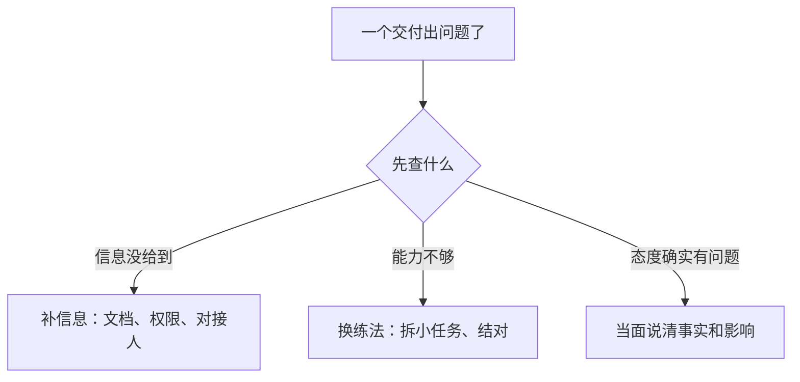

他把方案发给你，你说「收到，我看下」，然后没有然后。第二周他又发一版，你回「好的」。方案行不行、哪里要改，全靠他自己猜。几个月后，评估表上出现一句「主动性不够」——他愣了一下：他做的每一件事，都发过给你。

这件事在管理岗上有个更常见的名字：他不太主动。可你回头翻记录会发现，**没被记录的付出，默认是零**——你脑子里只剩两个印象：最近有没有出事、这人话多不多。

上一篇（[《带新人前 90 天》]({{ '/posts/onboarding-first-90-days/' | relative_url }})）讲人刚到怎么带；这一篇讲 90 天之后、日复一日的动作——五件事按节奏发生，三份模板可以直接抄。新人视角那一端（[《入职上手 SOP》]({{ '/posts/newcomer-onboarding-sop/' | relative_url }})）里，一个人被迫自己发信号、自己找反馈，对应的就是这边没做的动作。

## 一、先把整件事看一遍

「一对一」是管理者和下属两个人的固定单独沟通，不是项目会；「同步」是他自己发出来的周进展。

| 什么时候 | 大概花多久 | 做什么 | 留下什么 | 怎么算做完 |
| --- | --- | --- | --- | --- |
| 双周一次 | 30 分钟 | 他先讲；四问走完；当场记；散会发回 | 每人一页纸：结论 / 你承诺的事 / 下次核对点 | 你上次承诺的事，这次开头有回音 |
| 收到同步后 24 小时内 | 5 分钟 | 只读三样：要晚了 / 在等谁 / 要你做什么；回三行 | 三行回执 | 连续三次同步都有回执；风险提前出现，而不是事后才知道 |
| 每个交付之后 24 小时内 | 3–5 分钟 | 三步走：具体的事 / 影响 / 下次怎么做 | 一条反馈记录（做得好的也记） | 每个交付都有下文；对方说得出下次改什么 |
| 出问题时 | 30 分钟 | 先查信息给没给到，再查能力，最后才谈态度 | 一个结论，加一条记录 | 没把信息问题当态度问题办 |
| 他卡住时 | 24 小时内上报 | 翻译成「影响 + 时限 + 要他做什么」；带选项去 | 向上请求，加一个回音 | 说好的时间给回音，成不成都有答复 |


下面一节一件事。急用哪件，直接翻到哪一节。

## 二、一对一：这是他的会，不是汇报会

频率先说清：**双周一次、30 分钟，这是底线。** 它比「每个月聊两小时」有用——短、固定、离问题近。每周排得开就每周；排不开就双周——**底线是「固定」，不是「频率」，真正伤人的是随机和断掉。**

最容易开错的地方：开着开着变成了进度汇报——你问一句进度，他答一句，散会。**一对一首先是他的会**，所以议程上让他先讲，你的事放后半段。

四个问题，按顺序走：

1. **进展**：上次说的事，现在到哪了？
2. **风险**：哪件事最可能出岔子，影响多大？
3. **障碍**：卡在谁、或者卡在什么上？需要你做什么？
4. **成长与关系**：这阵子想学什么？你哪里帮得不够？

顺序有讲究：先事实，再风险，然后才是需要你出手的地方；最后一问很多人省掉，但它是唯一能提前半年知道「他为什么想走」的入口。

两个小操作：开场别问「最近怎么样」，用一句交代开场——「上次说的那个权限，我问了，下周能开」，同时说清两件事：你说的事我记得，而且我去办了。冷场时换个具体问题：「这半个月里，哪件事最费劲？」他说「都还好」，补一句：「有没有哪件事，你希望我别插手？」

记录用一页纸，按人存：结论、你承诺的事、下次要核对的点。会前让他把议题写在最上面，你只往后补——议程天然是他的；散会后把那一页发他一份，你记的和他记的就不会各是一套。**你承诺的事，下次开头先讲结果**——回音比承诺值钱；这一条断了，后面四个问题都会变成走过场。

```text
# 一对一议程（四问，30 分钟）
1. 进展：上次说的事，现在到哪了？
2. 风险：哪件事最可能出岔子？影响多大？
3. 障碍：卡在谁或什么上？需要我做什么？
4. 成长与关系：这阵子想学什么？我哪里帮得不够？
记录（每人一页纸）：结论 / 我承诺的事 / 下次要核对的点
```

几个容易做错的地方：开成汇报会；只记不跟进（承诺没回音）；时间随机改期；一聊聊两小时，然后两个月不开。

## 三、收到同步之后：先看什么、怎么回

大多数人的周报是写给自己的：「本周完成 A、B、C，下周计划 D。」**你要是只读「做了什么」，就等于没读。** 一份同步里真正该看的是三样：

- **哪件事要晚了**——以及晚多久、影响谁；
- **哪里在等谁**——等审批、等数据、等另一个团队；
- **他需要你做什么**——这一栏是同步的全部意义。

先追问两次，格式会自己长出来。他写「本周完成某方案」，追一句「这版谁验收、什么时候反馈」；他写「下周计划做 D」，问一句「D 依赖的那个权限拿到了吗」。追问两三次，他自己就会把风险写进同步里——不是他学会了，是格式会自己长成你的关注点。

然后是回音，24 小时内给，哪怕只是一句：「看到了，我去问，周四前回你。」**没有下文等于告诉他：写在这里没用。** 他不会再写；你收到的就变成「没动静」；再然后，你说他不主动。这个链条的每一环，起点都在那条没回的消息上。回执不用长，三行就够：

```text
【收到】那个依赖还没到，我明天问某某，周四前给你回话
【支持】权限我在跟，最晚周三给准信
【下一步】你先做不依赖它的那部分，别等
```

最后一条自查：如果一个人连着三周同步里的「需要支持」都是空的，别急着认为他顺——问一句确认。写了没人回和没什么可写，是两回事。

几个容易做错的地方：只看进度不看风险；收到了不回；把回执写成任务派发（他要的是答复，不是新活）。

## 四、每个交付，都要有下文

反馈这件事，最坏的不是负面反馈，是没有反馈。没下文的时候，人只能按自己的标准判断——标准一旦分叉，返工会替你们说话。

给反馈有个三步结构，当面或文字都可以：**具体的事**（时间、场景、原话或结果）→ **影响**（对交付、对同事、对客户）→ **下次怎么做**（给一个能执行的动作）。

第三步有个变体：不直接给答案，先问一句「你觉得下次可以怎么改？」——让他自己先说；这对老手尤其合适，对已经很慌的新人，就直接给动作。

对比一下就清楚了。一句「方案写得不行」，等于什么也没说；换成三步：「周三你给的那版方案没写回滚（出问题怎么退回去），我按它上线，出问题时只能手动救。下次做方案，把回滚步骤写进第一页。」——同样直，但对方知道改哪。

**做得好的也走这三步。** 只夸一句「不错」，对方不知道什么值得重复；「昨天排查时你把日志提前贴出来了，我少花两小时，以后都这么干」，这样夸完，那个好习惯才会留下来。

两条分寸：反馈不是把每件事都点评一遍，那是唠叨——要说的只有两类：影响了交付的、值得被重复的；时限是 24 小时内给回执，哪怕只是「先看到这，详细的我周四说」，**别用「回头聊」——回头没有日期，就等于没有下文。**

```text
# 反馈三步
1. 具体的事：____（时间、场景、原话或结果）
2. 影响：____（对交付、对同事、对客户）
3. 下次怎么做：____（给一个能执行的动作，或先问他）
（做得好的也走这三步，别只用在出问题时）
```

几个容易做错的地方：只在出问题时给反馈（于是反馈＝批评）；攒到绩效季一次说；只给评价不给动作（「方向感不够」没法执行）。

## 五、出了错：先查你给没给到位

一个交付出问题，第一反应往往是问「怎么回事」。先别问这句，先查一件事：**他知不知道。**

按三个问题过一遍：他知道这个规矩吗？他现在会做吗？他做了但没成吗？——顺序别反：

| 原因 | 判断依据 | 你的动作 |
| --- | --- | --- |
| 信息没给到 | 他不知道边界、规矩，或拿不到权限 | 补信息：文档、权限、对接人 |
| 能力不够 | 知道该做什么，但暂时做不到 | 换练法：任务拆小、结对做一次、先演练再上 |
| 态度有问题 | 知道、会做、不做 | 当面说清事实和影响，别绕弯子 |

**先信息、再能力、最后才轮到态度。** 反过来默认「先怀疑态度」的团队，很快会学会两件事：少报问题，多做表面功夫——报问题会挨骂，藏起来反而安全。

第三类最难开口，可以按「事实、原因、影响」的顺序说：「周四那个改动没跟任何人说就上线了（事实）。是有什么考虑吗（原因）？那天要是出问题，没人知道该退回哪一版（影响）。下次类似的事，先在群里说一声。」——先摆事实，对方不容易觉得在被怀疑；问了原因，还可能发现第四种情况：他其实是好意，只是不知道规矩。

一条纪律：处理错误就事论事。别翻旧账，别在群里点人，别用「你总是」开头。



几个容易做错的地方：先问「怎么回事」再问「谁的责任」；把信息缺失当态度问题办；在群里公开处理。

## 六、他卡住了：替他把障碍翻译成资源

一线管理者有个容易被忽略的职责：**把下属卡住的地方，翻译成上级能决策的事。** 他遇到的障碍，一半是你手上没有的东西：人、权限、预算、优先级。

先翻译。「某某的账号申请三周没批」这种话，上级听不出轻重；翻成「这件事压着两天工期，会拖这周五的交付，需要你在某某那边点一下」——影响、时限、要他做什么，三样齐了，他才好决策。

再换成选项带过去。两件事撞在一起、他没权限排优先级时，别带着一个问题去找上级：「A 往后挪，B 保住；或者反过来；或者两个都要，那得加一个人。」让上级做选择，比让他替你想办法快得多。这里补一句：流行的那句「别只带问题来，要带方案来」只对一半——选项是给要拍板的事用的；**风险本身要早报，哪怕你还没有方案**：「这套东西撑不到月底，我在想办法，先把风险放你这」，比憋出一个完美方案再开口安全得多。

给自己定三条规矩：**带回音**（成不成都要给他一个答复，别让他在猜里等）；**有时限**（说好什么时候回就什么时候回）；**不承诺你给不了的东西**（拿不准的：「我去争，周三给你准信」，而不是「没问题」）。

最后按上级的习惯递。同一件障碍，对信息饥渴的上级要写细，对只想要结论的上级要一句话加选项——不是拍马屁，是降低他替你办事的成本。

```text
# 向上请求（三段，一次说完）
【障碍】____（谁卡在哪一步、卡了多久）
【影响】____（压着谁的工期、会拖什么、什么时候前必须解决）
【要你做什么】____（找谁、点哪一下、哪天前给答复）
备选：A ____ / B ____ / C ____（我倾向 ____，理由 ____）
```

几个容易做错的地方：只报困难不给影响和时限；越级或绕过流程；答应了回音却没回；把「我去争」说成「没问题」。

## 七、条件不够的时候，怎么降级

| 约束 | 降级打法 | 底线 |
| --- | --- | --- |
| 没时间 | 一对一压到双周 30 分钟；实在排不开，站会里每人多留几分钟，或每周固定 15 分钟窗口 | 私下的问题不会在站会上说，这只是降级 |
| 不擅长谈心 | 照着四问走，别自由发挥 | 有清单就不会开成「最近怎么样」然后两边尴尬 |
| 没权限 | 承诺带回音、有时限；给不了的直说给不了 | 别替公司许你兑不了的愿 |
| 带的人多（7 人以上） | 核心的人双周、全员月度 | 别让谁零反馈：最起码每个交付都要有回执 |
| 救火期 | 节奏可以短，但不能断 | 一句「这周先扛过去，周一的 30 分钟留给你」也比没有强 |
| 团队很成熟 | 一对一更短，重点换成「有没有他想做但没机会做的事」 | 别把成熟当不用管 |
| 你刚接手团队 | 先保住「每个交付有下文」 | 这一件最容易被看见 |

别指望它替代制度：涨薪、编制、晋升，靠的是制度和你向上争取的结果，一对一里聊得再好也变不出来。能变出来的是别的东西：**一个人不用靠猜，就知道自己干得怎么样、卡住该找谁、下一步往哪走。**

日常带人没有大动作：每周接一次信号，每个交付给一次下文，双周坐下来聊 30 分钟，出问题时先查信息。做到，那句「不主动」就很难有机会出现。
