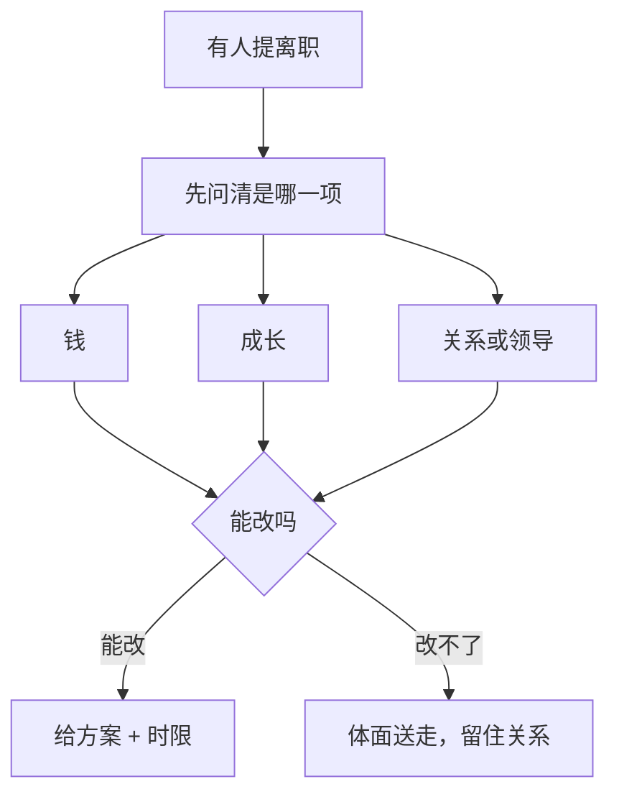

两年的人提离职，理由写「看不到成长」。回头查这两年：没有任何人跟他说过，做到什么样算上一个台阶；涨薪靠每年那一次预算，晋升靠「有坑再说」。他不是没被培养，是**从来没拿到过标准**。

这篇不讲「为什么要重视人」。它写的是后半程的具体做法：从标准怎么定，到最后一天怎么送，每件事写清楚什么时候做、做什么、留下什么、做到什么程度算完；四份纸可以直接抄。

## 一、先把整件事看一遍

| 什么时候 | 大概花多久 | 做什么 | 留下什么 | 怎么算做完 |
| --- | --- | --- | --- | --- |
| 入职、转岗、年初 | 一次 60 分钟 | 三步：列团队下一阶段的活，标判断力层级，合成「下一格」一句 | 每人一页《下一格标准》 | 外行听得懂；有具体的证据动作；能判做到没做到 |
| 每季度 | 30–45 分钟 | 五段走：事实 → 标准 → 差距 → 计划 → 待遇 | 《成长对话清单》，当场给一份 | 他复述得出「下季度做哪一件、我出什么资源」 |
| 半年或一年 | 60 分钟 | 先填证据表，再谈四步：事实 → 标准 → 差距 → 计划 | 《绩效证据表》，加一个结论 | 每条结论后面挂着一条事实；涨不了时给了标准、原因、节点 |
| 他提离职当天 | 首答 24 小时内 | 问清是哪一项，分项给答复，或者体面送 | 方案加时限，或者启动交接 | 四类原因每条都有明确答复；改不了的没画饼 |
| 定了离职之后（至少留两周） | 从 D-14 到 D+90 | 清单交接，验收，面谈四问，回访 | 《离职交接清单》，加面谈记录 | 接手人能独立跑通一遍；账号密码交接完就改 |
| 劝退或裁员决定做出后 | 按公司流程 | 备证据，当面通知，交接，善后 | 证据包，加通知脚本 | 同一把尺子、记录完整、当面说清、给体面 |


下面一节一件事。急用哪件，直接翻到哪一节。

## 二、成长标准：三步做出「下一格」

没有职级体系也能做。三步，60 分钟。

**先把活列出来。** 把团队下一阶段要干的活列 5–10 条（改造、迁移、稳定性、带新人……）。

**再给每条标一个层级。** 标的是「独立完成需要的判断力」：**照做**（有明确步骤）、**自己排**（知道目标，自己定做法和顺序）、**自己定义**（目标也给得含糊，要他来定目标）。

**最后合成一句。** 挑出比他现在高一层级、且团队正好需要的活，写成一句「下一格的标志性工作」。

三档写出来长这样（照你们的活改写）：

| 现在的位置 | 下一格的一句话 | 怎么验收 |
| --- | --- | --- |
| 能照做：按单子执行 | 「独立跑完一次完整的月度核对：自己排顺序、发现问题先判断影响再上报」 | 出现两次不需要你兜底的完整周期 |
| 能自己排：管好一个模块 | 「独立带一条链路的改造：方案、排期、上线、线上第一轮处理，只在关键取舍上问我」 | 一条链路从他手里走完，事故复盘里他不是被兜底的那个 |
| 能自己定义：管一条线 | 「替团队定义下一阶段的问题清单：自己找需求、判断优先级，给出一个季度的路线」 | 他提的清单被采纳一半以上，且能自己推动落地 |

写完自检三条，一条不过就重写：外行听得懂吗；有明确的证据动作吗（能说出「做到时发生了什么」）；能判做到没做到吗。写成「提升沟通能力」「更有主人翁意识」的，回到第一步重来。

两个常见写法，直接改：写成技能清单（「熟练使用某某工具」）的，改问「用这个工具要把哪件事做成什么样」；写成态度词（「更主动」）的，改成具体事件——哪件事，以后不用等他说，他自己就报、就推进？

一条纪律：**标准要事先说。** 事后长出来的标准，不管多合理，听起来都是「不合适」的另一种说法——[《招人之前》]({{ '/posts/hiring-before-you-hire/' | relative_url }})里那句「没有事先说好的标准，任何人都可能被事后说成不合适」，在这里同样是病根。

## 三、成长对话：每季度一次，对着标准过一遍

固定议程，按分钟分配，谁先说写清楚：

| 段 | 时长 | 内容 | 谁讲 | 你要追问的一句 |
| --- | --- | --- | --- | --- |
| 1 事实 | 5 分钟 | 这季度做成了什么、卡了什么（对着标准讲） | 他先说 | 「卡住那次，你当时判断是什么？」 |
| 2 标准 | 5 分钟 | 下一格那句话还成不成立 | 你 | 「你觉得这句话哪部分不认同？」 |
| 3 差距 | 10 分钟 | 离标准差哪两三件事，具体到事 | 双方 | 「要补上它，最缺的是机会还是方法？」 |
| 4 计划 | 10 分钟 | 下季度做哪一件、你给什么资源 | 双方 | 「我给的这个资源够不够？还差什么？」 |
| 5 待遇 | 5–10 分钟 | 能涨不能涨，如实说 | 你 | 见下表的三种说法 |

待遇这一段最难，也最容易躲——躲过去的代价是：他会自己去打听、自己去猜，猜到最后就是一个离职申请。提前想好走哪一支：

| 情况 | 说法（照念） |
| --- | --- |
| 能涨 | 「这次涨，幅度大概是多少，什么时候生效。同时把下一步标准再对一遍。」 |
| 不确定 | 「结果要到哪天知道，取决于哪两件事。不管结果如何，那天我给准信。」 |
| 不能涨 | 「这次涨不了：标准上你还差这几点（具体到事），原因是预算或名额卡在哪，下次能谈的节点是什么时候、需要什么前提。」 |

收尾动作：清单填完，当场给他一份。**这张纸就是下个季度的依据**——他说不清该干什么时看它；你想说「怎么没进展」时也看它。

几个容易做错的地方：把对话开成绩效答辩（全程你问他答）；待遇留到最后当安慰奖（只说「没名额」，等于把他推向猜和打听）；没有记录，下一次对话只能靠回忆。

```text
# 成长对话清单（每季度一次，30–45 分钟）
1. 事实：这季度做成了什么、卡了什么（对着标准讲）
2. 标准：下一格的标志性工作（再审一遍还成不成立）
3. 差距：离标准还差的两三件事（具体到事）
4. 计划：下季度做哪一件 / 我给什么资源 / 下次对哪一条
5. 待遇：结论 + 原因 + 下次能谈的节点
```

## 四、绩效对话：先备证据，再开口

绩效对话最常见的两种开法都不对：一种是「还不错，继续保持」（没信息），另一种是攒了一年的不满一次倒完（伤关系）。正确顺序是**先填表，再开口**。

第一步，填《绩效证据表》。每一条目标一行，必须有事实栏。事实栏空着的目标，不许进对话——平时不记录，这时候就只能靠回忆，而回忆对人不公平：人记得住最近的事和出过事的事，记不住稳稳当当的日常。

```text
# 绩效证据表（谈话前填，不给他看，用来防自己凭印象说话）
| 目标 | 事实证据（时间、产出、数据） | 对照标准 | 结论 |
| --- | --- | --- | --- |
| ____ | ____ | ____ | 达标 / 超标 / 不达标 |
```

第二步，按结论决定动作。同一张表，三种结论走三条路：

| 结论 | 你的动作 | 开场话术（照念） |
| --- | --- | --- |
| 超标 | 讲清「什么值得重复」，争取待遇，给更大的活 | 「这半年三件事：X、Y、Z。X 那条链路你自己扛下来了，以后同类的事默认归你。」 |
| 达标 | 确认标准，给下一格，明确待遇情况 | 「按年初说好的标准，这条达到了。下一格是这句，我们把资源对一下。」 |
| 不达标 | 只谈行为，给期限，给支持，说明后果 | 「对齐一下事实：这件事的承诺是 A，实际是 B。缺的是哪一块——信息、能力，还是别的？我们定个期限和检查点。」 |

第三步，对事不对人。把评价句改写成事实句：

| 评价句（删掉） | 事实句（照这个说） |
| --- | --- |
| 你责任心有问题 | 这半年交付晚了两次，都是临到期才说 |
| 你不够主动 | 群里问的那个问题等了两天没人应，你没再追 |
| 你沟通不行 | 改动上线前没同步，下游是第二天才知道的 |
| 你态度不端正 | 三次评审你两次没到，也没提前说 |

第四步是收尾。谈完他手里应该多一张纸：目标、资源、下次复盘时间。

一条分寸：评级可以没有，标准不能没有。有家大公司取消年度评级之后，不少人觉得自己被低估了——因为再没人明确说过他站在哪。**人不缺感觉，缺的是别人给的坐标。**

## 五、有人要走：先分清是哪一项

有人提离职，第一反应通常是加薪挽留——这是最省事的动作，也常常是最没用的：真能靠钱解决的那部分，等他说出口，说明别的部分早就出问题了。按这条链走：



四个方向，每个方向问一句，让他自己说：

| 方向 | 你问 | 能给的方案长什么样 | 时限话术 |
| --- | --- | --- | --- |
| 钱 | 「差的是总包、奖金结构，还是兑现时间？」 | 给得起：幅度加生效时间；给不起：说清卡在哪 | 「我去争取，周三给你准确答复。」 |
| 成长 | 「你现在最想接的一类事是什么？」 | 给标准、给活、给示范——是承诺就配资源 | 「下季度这条线交给你独立带，配套是 X、Y。」 |
| 关系 | 「是和团队里的谁，还是在外面？」 | 调组、换汇报线、把话说开 | 「这周内我给你一个调整方案。」 |
| 领导 | 「是我哪件事让你这么想的？」 | 听完整版，不辩解；改不了的如实说 | 「你说完，我两天内回你哪些能改。」 |

然后是那个不舒服的判断：**不是所有离职都值得留。** 值得留的，通常是「人还在往前走，只是这里没有下一格」；不值得留的，是已经长期消耗、或者要靠加钱续着的关系——用涨薪留住一个心已经凉了的人，多半半年后他还是会走，而这半年两边都别扭。判断可以简单一点，问自己两句话：「如果这个人明天提离职，我会不会努力挽留？」「一年后，希望他还在团队里吗？」两问都答「不」，就别用加薪拖时间，把力气花在体面送上。

还有一句说出来会后悔的话：「你要是想涨，我可以去争」——说出去，等于告诉他：这里得先提离职才有涨薪。对这个人和他旁边的同事，都是一个坏信号。下面这几句也别说：「外面没你想的那么好」（贬低他的选择）；「再等等看」（没有日期的承诺＝没有承诺）；「我尽量」（给不了的别松口）；「你走了项目怎么办」（用愧疚绑人）。

## 六、从提离职到最后一天：按时间轴走

离职一旦定了，事情反而清楚：交接清楚、面谈问够、关系留着。从当天开始按时间轴走，每一格都有动作和判据：

| 时间 | 你要做 | 怎么算做完 |
| --- | --- | --- |
| D 日（当天） | 确认离职日期；定好内部通知范围；启动交接 | 接手人已指定，不是「到时候再说」 |
| D-14 至 D-2 | 每天半小时过一遍清单：任务 / 账号权限 / 文档 / 关系 / 遗留风险 | 每类都有接手人确认过 |
| D-1 | 对着清单验收：让接手人**独立跑一遍**关键流程 | 跑通了才算交完；账号密码交接完即改 |
| D 日（最后一天） | 离职面谈四问；收回权限；给体面（对外说法、证明、推荐） | 四问有记录；他走出门是平静的 |
| D+7 | 遗留风险再过一遍：他走后暴露出来的问题 | 没有无人认领的活 |
| D+30 至 D+90 | 让第三方（人力资源或不是你的人）做一次回访 | 至少一件「要改的事」落进流程 |

交接里最容易漏的一项，是遗留风险——哪里可能出事、兜底方案是什么、出事找谁。这一项不写，他走后的第一个月就是你的地雷区。清单给他填，你验收：

```text
# 离职交接清单
- [ ] 任务：在手的活 + 进度 + 接手人 + 下一次交付时间
- [ ] 账号与权限：逐项移交，交接完改密
- [ ] 文档：关键系统与流程的「看这份就够」最小集
- [ ] 关系：内外部对接人清单，谁接着跟
- [ ] 遗留风险：可能出事的地方 + 兜底方案 + 出事找谁
```

**离职面谈四问**：为什么走？这里最好的是什么？最差的是什么？会不会推荐朋友来？

怎么问：别辩解，别追问细节逼他表态。最后那个问题的答案最值钱——**一个人会不会推荐朋友来，是这里值不值得待最诚实的答案。**

两个提醒，都有点反常识：**面谈拿到的信息多半不准**——人已经进入「要走了」的状态，不想烧桥，说的多是场面话；愿意来面谈的本来就是一小撮。所以别把它当唯一来源，真正的问题应该在平时的沟通里就听到过；能安排的话，回访放到 D+30 以后、由不是他的人来做，答案才真。反过来，**好话通常是真的**——「这里最好的是什么」的回答往往是真话，别当客套，那是你团队还能留住人的原因，值得记下来。

走后的关系也要管：他去了哪里、在做什么，你记得；他回头找你（介绍人、问技术、问行情），你接得住；有条件的话，把回聘渠道留着。同行圈子不大，**一个人离开时的样子，就是他以后讲起这家公司的样子。**

## 七、劝退与裁员：合规前提下的四步

劝退（这个人不匹配，通常你发起）和裁员（岗位没了，公司发起、你执行）都有法律与流程的硬约束：**按你所在地区的法规和公司政策走，这一篇不给法律建议**；赔偿、通知期、协商，都找人力资源和法务，别自己拍脑袋。

走上这一步之前的最后一道门，是**绩效改进计划**——写清差距、目标、期限（通常一到三个月）、支持、检查点的书面安排，到期给结论。它只有在三个前提下才有意义：确实有改进的可能、平时的绩效管理一直在做、且有第三方参与把关；缺一个，它就只剩流程意义。

四步流程：

| 步骤 | 动作 | 怎么算做完 |
| --- | --- | --- |
| 1 备证据 | 拉齐三样：标准（事先说过）、记录（改进要求、给过的资源、时间）、结论 | 证据包能回答「我提前说过什么、给过什么、他还是没做到什么」 |
| 2 当面通知 | 单独、当面、一次说完；不要群里先说、不要让别人转达 | 决定、原因、接下来怎么走，三件事都说了 |
| 3 定交接 | 交接范围、时间、对外说法（谁讲、怎么讲） | 留下的人知道该知道的部分 |
| 4 善后 | 证明、推荐、必要的对外说明；执行口径前后一致 | 团队里没有「是不是该轮到我」的连锁猜测 |

通知脚本可以这样（照念）：「今天这个决定是：岗位调整或解除合作，从哪天起。原因是这个岗位的职责变成 X，我们评估过，现有安排没法覆盖（或者：过去的 A、B、C 三次，我们谈过、也给过支持，结果还是没达到事先说好的标准）。接下来交接按这个安排走，我负责到最后一程。」

他会问的三个问题，提前想好答案：

| 他会问 | 你答 |
| --- | --- |
| 「为什么是我？」 | 只讲事实和标准，不比较同事、不谈「上面定的」 |
| 「能不能再给一次机会？」 | 有就是有（回到绩效改进计划的期限和检查点），没有就明确说没有 |
| 「什么时候对外说、怎么说？」 | 给确切时间、确切说法；让他先知道 |

两条红线：**别把裁员包装成「个人成长不够」**——岗位没了就说岗位没了；说的是能力不匹配，就用记录和标准说话。理由含糊，团队会替你补上想象，而想象通常比事实更坏。另一条：别承诺你兑现不了的东西（推荐信里写不出的评价、说不准的赔偿口径）。

## 八、条件不够的时候，怎么降级

上面这套缺两样东西时最难做：涨薪的权、绩效的体系。都有降级方案：

| 缺什么 | 降级打法 | 底线 |
| --- | --- | --- |
| 没钱没编制（一线常见） | 标准你写、对话你开、争取你跑；只说过程和回音，不说承诺 | 「我去争，周三给准信」可兑现；「肯定给你涨」不可 |
| 没有绩效体系 | 自建最小版：一页纸标准（三个标志性工作）加每季度一次对话 | 别等公司一年发一次评分表——人是一天天在判断的 |
| 团队小、岗位流动 | 标准写「最少的三件事」；对话压到 30 分钟 | 对话不能省：省掉它，标准等于没说 |
| 人这季度产出低 | 先查是不是被救火和临时项目占住了，再看标准 | 拿「发挥不好」谈一个被临时项目占满的人，是拿错尺子 |
| 你自己刚接手 | 先读前任的记录，或与每人各谈一次 | 先听，再定尺 |

治不了的三件，如实说：公司整体没有涨薪机制（标准的价值只剩「让他清楚自己在哪」，别拿成长感替代钱）；上级只看结果不看人（你的争取可能一次也成不了）；行业在收缩（机会在别处，该送就送——**留住人比留住关系难，留住关系比留住人有用**）。

回到系列起点，这一整篇只做一件事：**把没说出口的期待，变成写在纸上的约定**——标准是一句能验收的话，对话是一张当场给出的纸，离开是一份对得清的清单。
