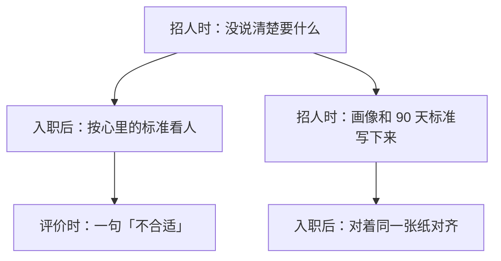
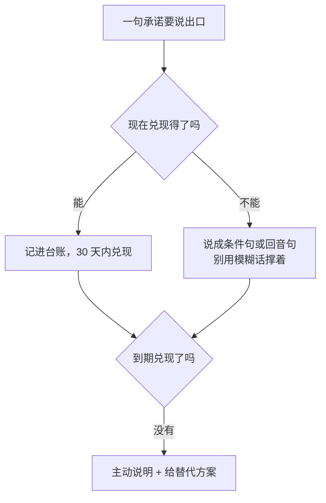

需求写得急：「熟悉某某技术、三年以上经验、能独立负责。」面试聊得不错，人来了。三周后你看他交出来的东西——不是不会做，是做的是另一件事。再往后三周，评估表上出现「可能不太合适」。

捋回面试间会发现：**那件「不合适」的事，你从来没跟他说过。** 招聘页写的是技能，你真正想要的是「把那件事理顺」——它一直待在你脑子里。新人视角那一端（[《入职上手 SOP》]({{ '/posts/newcomer-onboarding-sop/' | relative_url }})）写的是没人给信息时怎么自救；这一篇写桌子另一边该做的动作：把它拿出来、写下来、当面说清，然后兑现。

## 一、先把整件事看一遍

| 什么时候 | 大概花多久 | 做什么 | 留下什么 | 怎么算做完 |
| --- | --- | --- | --- | --- |
| 发岗位之前 | 90 分钟 | 四格填完：要解决什么问题、前 90 天做成什么样、不归他管的、能给什么资源 | 一页纸的岗位画像 | 没做过这行的人拿着它，能说出该干什么、怎么算好 |
| 约面到面完 | 每人 60–90 分钟，外加一场 30 分钟的校准 | 三类题、评分锚点、面完当场记三行 | 一张面试评分卡，加每人三行记录 | 几个候选人能放在一起比；三个月后回看有依据 |
| offer 之前 | 30–45 分钟 | 四件事说清，让他复述一遍 | 讲稿，和他的复述 | 他能自己说出「做成什么样算过」 |
| offer 之后 30 天内 | 持续 | 每句承诺记一行，到期主动给结果 | 一张承诺台账 | 到期前你主动给结果；没兑现的给替代方案 |



下面一节一件事。急用哪件，直接翻到哪一节。

## 二、发岗位之前：先把岗位写成一页纸

先把使命和几条能验收的成果写下来，再去面试——招聘圈里推这套东西的本意，就是防「凭感觉招人」。而招聘页上常见的写法是列技能：熟悉什么、几年经验、做过哪类项目。毛病有两个：**技能是输入，不是产出**——写着「熟悉某某框架」的人，可能解决不了你手上的问题；而且技能清单最好抄，能抄，就说明它没有你团队的上下文。

换个写法，四格就够，90 分钟能填完。

**先拉现状（20 分钟）。** 把团队现在卡住的活列出来，每条写成「谁在花多少时间做什么」。要的是事实：「某个环节每天要两位同事各花两小时核对」有用，「流程比较乱」没用。

**再写 90 天成功标准（30 分钟）。** 分 30 / 60 / 90 三行，每行都要能验收：能独立跑完什么、什么环节砍一半、什么状态维持多久。哪一行写不出验收动作，说明第一格还没想清楚。

**然后写「不归他管的」（10 分钟）。** 至少两条，写那些最容易被默认塞给新人的：「跨部门的取数协调由你来；线上事故的第一响应不归他。」这一格空着，岗位迟早膨胀成谁来都不合格。

**最后写资源与权限（20 分钟）。** 数据看得到吗、测试环境能用吗、什么可以自己定、卡住了问谁、谁带他、带多久。**没有资源的 90 天目标，是许愿。**

常见的写法，逐条换掉：

| 常见的写法 | 换成的写法 |
| --- | --- |
| 「负责对账模块的维护」 | 「某个环节每天要两位同事各花两小时核对，希望自动跑完，出错有人收到提醒」 |
| 「按期完成分配的任务」 | 「30 天：独立跑完一次完整核对；60 天：人工环节砍一半；90 天：链路稳定跑满一个月，异常有提醒」 |
| 「提供良好的发展空间」 | 「数据看得到、测试环境能用；脚本自己定，改别人的流程要先对一下；前两个月每周三下午留一小时答疑」 |

写完自检三条，一条不过就重写：一个刚毕业、聪明、没做过这行的人，拿着这页纸能说清该干什么吗；每条 90 天标准有验收动作吗；资源那格能对上标准吗。要是自检卡在「他得有三年经验」，就把那三年翻译成一件具体的事写进第一格——「他得亲手把一条混乱的流程治理稳定过一遍」，比「三年经验」有用得多。

```text
# 一页纸岗位画像（含 90 天成功标准）

## 要解决什么问题
- 现状：____（谁在花多少时间做什么）
- 做成了会怎样：____
- 做不成的代价：____

## 前 90 天成功长什么样
- 30 天：____（能独立处理什么）
- 60 天：____
- 90 天：____（怎么验收：____）

## 不归他管的
- ____（最容易被默认加上的一项，写明确）

## 能给的资源与权限
- 数据与账号：____
- 决定权：____（可以自己定 / 必须先问谁）
- 带教：____（谁带、带什么、带多久）
```

这页纸不止用于招聘：面试的题从这里出，试用期拿它当标准，人到岗后对齐也用这张纸。

## 三、面试：同一套题、同一把尺子，加一件真实的活

常看到的面试是聊项目、聊技术、聊规划，聊完凭印象打分。问题在于每个人拿到的题和尺子都不一样——几个候选人之间没法比，最后拼的是谁更会聊。结构化听着正式，其实就是四件具体的事：**同一套题**（都从画像第一格出）、**同一套评分锚点**（1 到 5 分，每一分长什么样写清楚）、**多个人独立打完分再讨论**、**记录不靠回忆**。

**出题（面之前，20 分钟）。** 从团队积压的事里挑一件，脱敏之后当案例：「这件事现在是这样：……你会先问什么、先做什么、大概多久能看到结果？」要看的不是答案跟你一样不一样，是**他先搞清楚问题，还是先给方案**——一个人面对模糊事情的第一反应，就是他入职后的工作方式。

**定评分锚点（面之前，20 分钟）。** 从 1 到 5 分，每一分长什么样写下来，面完当场打分。没有锚点，几个人放在一起比的其实是「谁更会聊」。

**三类题问完（面中）。**

| 常问的 | 换成 | 看什么 |
| --- | --- | --- |
| 「你做过最难的技术决策是什么？」 | 「我们手上这件事现在是这样……你会先问什么、先做什么？」 | 面对模糊事情的第一反应 |
| 「你抗压能力怎么样？」 | 「上个项目最紧的那阵子是什么样，你当时怎么排的优先级？」 | 真实行为，不是自我评价 |
| 「能接受加班吗？」 | 「这件事大概要三周，中间会赶一两次节点，你行不行？」 | 直接确认，别猜 |
| 「简历上写独立负责某某项目——当时你手上有什么人？」 | 追问资源：谁配合你、卡住找谁、要不到怎么办 | 是会要资源的人，还是硬扛到失败的人 |
| 「这次换工作最看重什么？」 | 追问动机：上一份工作最想改掉的一件事是什么 | 遇难处时是找办法还是想走 |

**当场记三行，面完开个校准会（面后当天）。** 每人三行：他能解决画像第一格的哪个问题、还缺什么、给他什么支持他才做得成。

```text
# 面试评分卡（每人一张，面完当场填）
案例题：____
- 先澄清问题还是先给方案：1 2 3 4 5（锚点：1=直接给方案且不确认；3=问了一两个问题；5=先确认目标和约束再动手）
- 追问资源时的回答：1 2 3 4 5
- 动机与去向：1 2 3 4 5
三行记录：他能解决 ____；还缺 ____；需要支持 ____
```

**校准会（30 分钟）**：几个人面完，把三行和分数摆在一起，先各自亮分、再讨论差在哪——一上来就统一口径，那是把不同意见压掉，不是校准。三行字很简陋，但三个月后回头看，它比「当时感觉还行」有用得多。

几个容易做错的地方：只看「聊得怎么样」；问经历不问做法；面完不写，回去凭印象；只让一个人面，其他人事后没有发言权。

## 四、offer 之前：四件事，当面说清

人选定得差不多，还剩最后一个关键动作：**在 offer（正式发出的录用通知）之前，把该说的说清楚。** 招聘研究里管这一步叫真实工作预览：提前把工作的真实内容讲清楚，对降低离职的效应不大，**真正明显的是把「期望落差」压小**，而且几乎不会让 offer 接受率下降——**讲实话不吃亏。**

四件事，30 分钟说完：

1. **试用期标准。** 直接拿画像第二格念：「三个月后，那条链路稳定跑满一个月、异常有提醒，就算过了；要是第二个月底看下来差得多，我们坐下来看差在哪。」现在争，比三个月后吵便宜得多。
2. **汇报关系。** 向谁汇报、谁给反馈、谁拍板，一句话说清。别当常识：不少团队里，「谁是我领导」和「谁给我打分」不是同一个人。
3. **协作节奏。** 周会什么时候开、一对一多久一次、进展用什么方式同步。节奏由你给出来；不给，新人只能自己发明一套。
4. **这里没有什么。** 没有带教资源、没有现成文档、没人能挤出时间手把手带——先说清楚，再给替代方案：每周三下午固定答疑、文档和记录在哪、卡住按什么顺序找人。

两个规矩：讲具体事实，不讲情绪（「每周三发版，周一二要压测，季度末可能要值班」，而不是「我们这儿挺乱的」）；难点和应对成对讲（「没时间手把手带，但每周三下午留了一小时答疑」）。

**收尾动作：让他复述。** 「你把接下来三个月该做成什么样，用你的话说一遍。」他复述得出，说明传达到了；复述不出，就是刚才这段白讲了——重讲一遍。

说清缺失不是劝退，是筛人：知道真相还愿意来的人，更不容易在三个月后掉队。

## 五、说出去的承诺，一条条兑现

面试到尾声，三句话最容易出口：「权限到时候给你开」「人手以后会招」「过了这阵子就好」。这些话当时能推动签约，之后会变成两个麻烦：他按你说好的资源排了计划，资源没到，**你看到的是「产出不够」，实际发生的是「资源没到」**；第一次承诺落空，之后你说的每句话都得打折。

纪律就一句：**给不了的别承诺，给得慢的定期限。** 给不了、以后能谈的，讲清「什么时候、在什么前提下能谈」；能给的在 offer 后 30 天内兑现；到期没兑现的主动说明并给替代方案——主动说明一次，比让对方发现三次值钱。真想给个盼头，就说成条件句：「这个季度招到人，第一个给你配。」条件写清楚，没做到也不算赖账。



```text
# 承诺台账（面试到入职 30 天，面完当天记）
| 承诺 | 说的时间 | 约定兑现 | 状态 |
| --- | --- | --- | --- |
| 例：数据权限 | 面试当天 | 入职两周内 | 在办 / 已兑现 / 改成 ____ |
```

怎么算做到位：到期前你主动给结果，而不是等他来问。他一次都没问过，未必是忘了——多数时候是问过一次没回音，就不问了。

## 六、条件不够的时候，怎么降级

这套的前提是你对招人有点话语权。没有的时候，按这张表降级：

| 约束 | 降级打法 | 底线 |
| --- | --- | --- |
| 编制、薪酬、流程都不在你手里 | 画像你写、面试你问、期望你说；定不了的直说「这个我定不了」 | 别用模糊话撑着，那是替他签了张你兑不了的欠条 |
| 岗位本身要干三个人的活 | 摆上台面：「按现在的需求是两个人的量，我按一个人的标准定目标，剩下的我们一起排优先级」 | 别等新人来了背这个锅 |
| 人不是你面、岗位不是你定的 | 从入职第一天补课：把画像当对齐底稿 | 而不是事后抱怨的依据 |
| 紧急补位（有人下周就走） | 先招能干活的人，一个月内把画像补齐 | 别永远停在「先招了再说」 |

三处别硬套：**小团队、岗位流动**——第一格写「最少的三件事」就够；**流程本来就规范的大公司**——评分卡和校准会通常已经有了，你要做的是把评分卡填实，不是自己另发明一套；**你不在场**——把画像写给能拍板的人看，用事实说话，别用「招不到人」说话。

最后一句：这一页纸不是写给人力资源的，是写给三个月后的你——**账在入职后结算，欠条在招人时签。**
