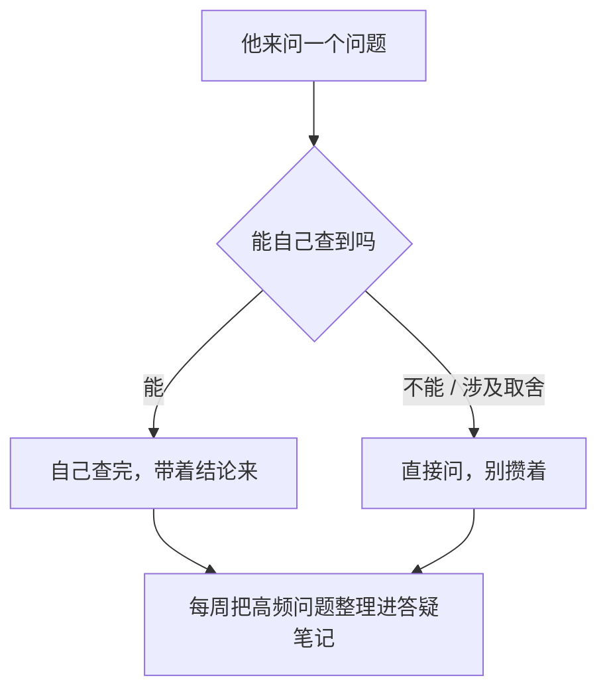

早上九点半，新同事到了，工位还没定。你在开会，让一位同事先带他转转。下午他被拉进三个群，没有人说话。第二天他问系统怎么登录，你说「问某某吧」——某某那天在赶需求。第三天，他就不怎么问了。一个月后，你心里冒出一句：「他好像不太主动。」

这几周他做的事是：找工位、问登录、翻历史消息、猜自己该干什么。**一个人要在没人给信息、没人划边界、没人接问题的环境里「主动」，靠的不是态度，是运气。**

新人视角那一端（[《入职上手 SOP：信息采集、职责对齐与信号机制》]({{ '/posts/newcomer-onboarding-sop/' | relative_url }})）讲的是没人给信息时怎么自救——这一篇讲管理者这边本来该做的动作：前 90 天按时间排开，每件事写清楚做什么、留下什么、做到什么程度算完，附的四份表可以直接抄。

## 一、先把整件事看一遍

先给一个判断坐标，只有三个词：**角色清晰**（知道自己该干什么、怎么算好）、**自我效能**（觉得自己能把事做成）、**社会接纳**（有没有被团队接住）。这三样都不靠天赋，就是信息给到位之后的结果，也直接关系到人愿不愿意留。后面每件事，都是在给这三样里的某一样供货。

| 什么时候 | 大概花多久 | 做什么 | 留下什么 | 怎么算做完 |
| --- | --- | --- | --- | --- |
| 入职前一天 + 第一天 | 前一天 1 小时，当天 30 分钟 | 把清单逐项备齐；你亲自讲 30 分钟；安排好第一件小任务 | 《入职第一天清单》 | 他第一天能干上活：东西就位，知道找谁、第一件事做什么 |
| 入职第 1–7 天 | 累计 3–4 小时 | 写三页文档；指定对接人并给他减活；群里提前介绍 | 三页文档，加「有事找谁」一页 | 他能自己答出：这归我们管吗、这事找谁、坏了怎么办 |
| 入职第 2–4 周 | 谈 30 分钟，成文 30 分钟 | 主动给 30/60/90 目标和边界，落成一页纸发他确认 | 一页纸的《30/60/90 与职责约定》 | 他复述得出「做到什么算过」；有异议的地方谈过 |
| 前 90 天，每周 | 每次 15–30 分钟 | 固定答疑窗口开着；分级什么该问；示范一次怎么问 | 一份按周整理的答疑笔记 | 提问质量在变：带着猜测和选项来，而不是空手问 |
| 第 90 天前后 | 30 分钟 | 摆出那张纸逐条对；定下一阶段；转正结论落回事实 | 下一阶段约定，或转正结论 | 对着同一张纸说话，不靠回忆 |


下面一节一件事。急用哪件，直接翻到哪一节。

## 二、第 0 天：把开工要的东西备齐

第一天最怕的不是忙，是「什么都不在」：设备没到、账号没开、权限没批、没人知道他要来。这些事没有一件是难的，难的是它们全都落在「别人的时间表」上——所以要提前一天做，不是当天现跑。

**前一天（1 小时）**：设备、账号、权限、座位、日程，照清单逐项打勾。

**当天**：上午 30 分钟开场，由你亲自讲，讲三件事——团队在做什么、最近在忙什么、有事找谁。这三件事新人自己考古半个月才摸得到，你坐着讲半小时就能给完。

**第一件小任务，别随便挑。** 要小、能独立完成、有明确结果，比如「把这周的某份数据核对一遍，做成一张表」。目的不是产出，是让他第一天就完整走一遍「接到事、做完、被确认」——**自我效能不是靠鼓励攒的，是靠一次真实的小胜。**

**收工前 10 分钟收个尾**：今天看了什么、有什么卡住的、明天从哪继续。新人对第一天的记忆，多半取决于有没有这十分钟。

```text
# 入职第一天清单（管理者版）
- [ ] 设备：电脑 / 显示器 / 外设 / 门禁 / 座位
- [ ] 账号：邮箱 / 内部系统 / 代码仓库 / 文档库 / 群
- [ ] 权限：至少给到「能开工」的那一档
- [ ] 对接人：谁带、带什么、带多久、带人的时间从哪来
- [ ] 第一天日程：谁接待、见谁、第一件小任务是什么
- [ ] 30 分钟开场：团队、业务、谁拍板、找谁问什么
- [ ] 收工前 10 分钟：看了什么 / 卡在哪 / 明天做什么
```

几个容易做错的地方：当天现找工位、现申请账号；把「有问题群里问」当交接；第一天塞一堆文档让他自己看。

## 三、第一周：三页文档，一个对接人

**先写三页文档（累计约 2 小时）。**

- **第一页，系统边界。** 哪些是自己维护的、哪些是别人家的平台、坏了找谁。省掉他之后所有「这归不归我们管」。
- **第二页，主流程。** 一件事从进来到出去走哪几步、哪一步最容易卡、卡住通常怎么办。五到八个框就够，不用画漂亮。
- **第三页，有事找谁。** 一份小表：名字（或岗位）、管什么、什么事找他。**要写「实际找谁」**——不少团队里，名义上的负责人和实际在维护的人不是同一个。

省力办法：别从零写，攒问题。他第一周问你的问题随手记下来，周末按「问得最多的十个」整理成问答，就是一份能用的文档。

```text
# 有事找谁（示例，按你们的实际情况改）
- 数据从哪来 → 数据侧同事；要不到，找组长
- 发布和部署 → 发布负责人，工作日随时可问
- 线上报警 → 先找负责人；别丢群里，容易漏
```

以后他每撞一次墙，就往上补一行——一个月下来，这一页会自己长成一份真正的对接表。

**再指定一个对接人（30 分钟谈一次）。** 给新人配一个固定的带教人，是衔接研究里数得着的动作：文档管「角色清晰」，答疑管「自我效能」，对接人主要管「社会接纳」。指定的时候对他说清四件事：带什么、带多久、什么情况可以打断、**他的时间从哪来**。最后一条最关键——你不给他减掉一点活，他嘴上答应，实际顾不上，新人得到的答复就会变成「等会儿啊」。

**最后在群里提前介绍（5 分钟）。** 提前一天在群里说一声「明天有新同事到，叫什么名字、负责什么」——团队不措手不及，他也少一次尴尬。

几个容易做错的地方：把文档写成大工程，所以干脆不写（第一周只需要三页）；对接人指定了却不减活；文档写完就锁死，没人维护。

## 四、第一个月：目标和边界由你主动给

新人视角里，这件事需要他鼓起勇气来约你；很多人不敢，怕被当成「教领导做事」。所以这一步该你走：**30 / 60 / 90 天目标和职责边界，由你在第一个月内主动给出去。** 顺带说一句，30 / 60 / 90 是从销售团队实践里流行起来的分段，90 这个数字不是科学常数，团队节奏慢就改成 30 / 60 / 120——要紧的是三样东西齐不齐。

谈的时候 30 分钟，两个人，边说边填：

1. **目标写到能验收。** 不是「熟悉业务」，而是「30 天内能独立跑完一次完整的核对」。写不成能验收的样子，三个月后评估还是凭印象。
2. **边界写「不归他的」。** 比如「线上问题的第一响应不归你，先找我」。这一条看着多余，其实在保护他：什么都要管的岗位，干好干坏都说不清。
3. **决定权举出具体的事。** 「脚本怎么写你自己定；要改别人在用的流程，先跟我说一声。」抽象地说「大胆做」，等于没说。
4. **配套写进去。** 每周的答疑窗口、每两周一次的一对一（管理者和下属两个人的固定单独沟通，不是项目会）、他需要的权限和资料。写进去就是承诺——做不到的别往上写。

谈的脚本先给结论：「这一个月，我希望你做到这几件，做到了就算过。」说完停下来，让他讲哪里不同意、哪里做不到。他要是全说「都行」，追一句「你觉得哪里最难」，把话逼实。谈不顺也别散会：先只写第一个月的一件事，剩下的往后再补。**一张只写了一行的纸，也比没有纸强。**

24 小时内成文发出去，让他回一个「收到」——这一步是整篇最关键的变化：**口头说的，变成白纸黑字。** 口头的话别人转头可以不认；写下来的东西要改，得两边都点头。

```text
# 30/60/90 与职责约定（管理者版）

## 目标与验收
- 30 天：____（怎么算做到：____）
- 60 天：____
- 90 天：____

## 边界
- 你负责：____ / 你配合：____
- 暂不归你（写明确）：____

## 决定权
- 可以自己定：____ / 先跟我说：____ / 卡住了找：____ → ____

## 我给你的配套
- 每周答疑窗：____
- 一对一：每两周一次、30 分钟
- 信息与权限：____
```

几个容易做错的地方：等他来问；目标写成「熟悉业务」；只写「负责什么」不写「不负责什么」；配套写了不兑现。

## 五、答疑：让他敢问

新人问不出问题，通常不是没问题，是问的成本太高：怕显得笨、怕打扰你、怕问错了被记住。你能改的，是把「问」的成本降下来。最省事的一招：把「随时找我」换成固定窗口。三句话的改法——

| 常说的一句 | 换成 |
| --- | --- |
| 「你先看看吧」 | 「先花半小时看某某，看不出方向的话，带两个方案来找我」 |
| 「这个我也不清楚」 | 「这个我也不确定，我去问某某，明天回你」 |
| 「有问题随时找我」 | 「每天下午四点我留十五分钟，攒着那个时候问」 |

第三句是关键：**「随时找我」听起来慷慨，实际等于没有门**；写进日历的窗口是你主动让出来的时间，他反而敢来。

窗口开了，再定一件事：什么该问、什么该自己查。给他一条简单的分级——**能查到答案的先自己查**（怎么登录、某段历史怎么来的），查完带着结论来；**查不到的、涉及取舍的直接问**（这件事该不该这么做、两件事先做哪个）。不划线的话，两种偏差都会出现：要么什么都来问，你被问烦；要么什么都不敢问，问题攒到爆。

还可以示范一次怎么问：你自己不确定一件事时，说一句「我查了某某地方，猜是这样，你帮我确认下对不对」。这比要求他「不懂就问」管用——他学的不是「应该问」，是「怎么问」。



这份答疑笔记每周整理一次，攒法很简单：

```text
# 答疑笔记（前 90 天，每周整理一次）
- 本周问得最多的三件：____
- 问题：____ → 答案：____ → 要不要写进文档：是 / 否
```

它有两个用处：周末把问得最多的三个问题补进三页文档；一个月后，它就是新人眼里的「这一篇看完就够」。

几个容易做错的地方：把「随时找我」当承诺（等于没有门）；他问了三次同一个问题就烦（多半是你的答案没被写下来）；只答疑、不更新文档。

## 六、第 90 天：对着同一张纸复盘

到期别忘了收口。留 30 分钟，把第一个月那张纸摆出来，一条一条对：哪些做到了、哪些没做到、哪些是当时没写清楚的。

对完做三件事：定下一阶段目标（换一张新纸，别在原纸上改）；把「当时没写清楚」的补进下一份；如果涉及转正结论，结论要落在纸上的事实上，不是印象上。

复盘时可以顺手过一遍开头那三个词：角色清不清、他觉得自己能不能做成事、有没有被团队接住。哪一项空着，下一阶段就补哪一项——这比笼统地定一句「再熟悉熟悉」有用。

这一步做到没做到，看一件事：这次谈话用的纸，和第一个月那张是同一张；他离开时手里有新的下一份。

## 七、条件不够的时候，怎么降级

时间不够时，按这张表降级：

| 约束 | 降级打法 | 底线 |
| --- | --- | --- |
| 没时间写文档 | 只写第三页「有事找谁」，另外两页让他写笔记、你顺手改 | 一周内必须有一页能查的纸 |
| 没人能当对接人 | 把每周两次、每次半小时的答疑时间挂在自己日历上 | 效果差一些，但门是开着的 |
| 你自己也是刚上任 | 先只做两件：第一天清单 + 第一个月的 30/60/90 一页纸 | 这两件省掉的是最贵的返工 |
| 招来的人是来救火的 | 先把话说窄：「这三周先集中干这一件事，其他都往后放」 | 别让他按部就班地「熟悉业务」 |
| 来的是熟手 | 别拿新人流程招呼他；文档只给「有事找谁」，第一周直接谈目标和边界 | 把人当实习生，是最快劝退熟手的办法 |
| 团队总共三五个人 | 清单可以省 | 开场和一张纸不能省 |

这套东西治不了「公司根本没人顾得上新人」。如果连你也被项目按在水里，那说明问题不在新人，也不在你——但这不该由那个最晚来的人承担。你能做的是把自己这一环做好：**带人不是等他犯了错再教，是先把地图给他。**
