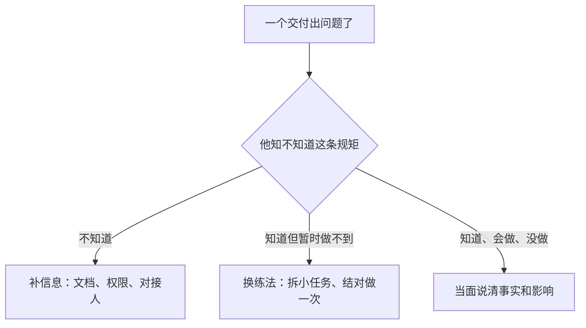

这一页不用从头读到尾。手上出了一件不好办的事，再来翻对应那一节，照着做。

不知道算哪类事，就用下面这张表按现象找；已经知道要看哪一节，用右边的目录跳过去。每一节都写得完整，跳进中间一节不用先看前面。

每节最后都留了一句「怎么算做对了」，说的是接下来一周到三个月里你能看到的现象。写不出这个，那一节就只是在讲道理。

**这一页的可信度分两层，说清楚。** 骨架是通行做法：一页纸岗位说明、30 / 60 / 90 计划、面试当场填评分卡、反馈先讲事实再讲影响、定期一对一、离职按清单交接——这些别的公司也在做。往下的具体个数就不一样了：卡几天算久、一次谈多久、几周见两次、攒够几件再去谈，这些是我按自己带人的情况拍的，没人统计过，也不算标准。动作你照做，数字请换成你们公司的节奏。

还有一层要说明白：这些做法和话术全部出自一个人的经历，我没有在第二家公司的环境里试过它们。你读到某条觉得「我们这儿根本不是这么回事」，那个判断是对的——那条对你就是废的，划掉，换成你们真能做得出的动作。这页唯一值得照抄的是它的问题清单，不是它的答案。

这一页只管带人这一端。新来的人怎么自己去把信息、职责和反馈补齐，写在[《入职上手 SOP》]({{ '/posts/newcomer-onboarding-sop/' | relative_url }})里——那篇讲的正是这边没做到的部分。

## 索引：按现象翻

| 你现在碰到的 | 翻到 |
| --- | --- |
| 简历写得漂亮，面完心里没底 | 场景 01 |
| 他问加班多吗，你想说实话又怕吓跑人 | 场景 02 |
| offer 要发了，有些话不好开口 | 场景 03 |
| 人明天到，工位账号权限都没到位 | 场景 04 |
| 他第三天开始不问问题了 | 场景 05 |
| 全组没人能带他 | 场景 06 |
| 给的目标写成「熟悉业务」 | 场景 07 |
| 第 90 天到了，你手上没有能摆出来的东西 | 场景 08 |
| 一对一开成汇报会 | 场景 09 |
| 他的周报全是流水账，一条风险都没有 | 场景 10 |
| 你压了他两周的方案，他自己做了 | 场景 11 |
| 他出了问题，你想说又不敢说，已经拖三周 | 场景 12 |
| 同一件事连着错了两次 | 场景 13 |
| 他卡在别的部门，只有你能开口 | 场景 14 |
| 两个人各执一词，要你定谁先做 | 场景 15 |
| 两年没被说过好也没被说过不好的那个人 | 场景 16 |
| 他问什么时候能涨，你今年没名额 | 场景 17 |
| 绩效要给他差评，你只有印象 | 场景 18 |
| 他想换方向，你手上没那个位置 | 场景 19 |
| 他今天提离职 | 场景 20 |
| 留不住了，最后五天怎么交干净 | 场景 21 |
| 你要劝退一个人 | 场景 22 |

## 场景 01｜简历写「独立负责」，你分不清他是不是拍板的人

**什么时候翻到这页**：简历上写「独立负责某某系统」，聊得顺，你准备给过——但你分不清他是做决定的人，还是照别人方案干活的人。

**第一步（当场 30 秒）**：别问「你负责哪部分」，他一定说全部。问资源：「这项目你手上几个人、谁配合你、要不到东西你找谁。」真做过的人答得出人名和卡点；挂名的答得出一串技术名词。

**第二步（只挑一件事往下钻三层）**：「你说某某指标砍了一半——那版方案最初长什么样？」→「中间改过吗，为什么改？」→「改完谁验收的，标准谁定的？」第二层能说出一个他自己做错了的决定，可信度立刻上升；到第三层开始说「都挺好的」，他基本没做过决定。**两问之内说不出验收人，这件事就没经过他手。**

| 他怎么回 | 你接着做什么 | 说明什么 |
| --- | --- | --- |
| 「方案是同事出的，我负责落地」 | 换一件问：「那你自己从头拍板过哪件？」 | 诚实，继续挖第二件 |
| 「大概是这样，我们先……」（讲流程不讲决定） | 收回来：「这几个人里，哪一步是你定的？」 | 在糊。再追一次，别追第三次，那就成审讯了 |
| 「数据记不清了」 | 评分卡记一行：说不出自己那部分的结果 | 不等于造假，但必须留痕 |

**当天做完**：三行字进评分卡——他拍板过哪件、还缺什么、给他什么才做得成。别只写「感觉还行」。

**怎么算做对了**：三个月后回看这页纸，你能指着一行说「当时就知道他会卡在这」。三行全是形容词，这场就算白面。

**最容易搞砸**：他聊得热，你当场暗示了录用意向，回去想补问已经来不及。

## 场景 02｜他问「加班多吗」，你想说实话又不想吓跑人

**什么时候翻到这页**：面试最后十分钟，他问你们这儿加班多不多。你要么想说「看情况」，要么怕说实话把人吓跑。

**第一步**：把「加班」换成一件具体的事回答。「上线集中在周三，那天通常要到九十点；其他日子六点走是常态；季度末有一两次要压测。」——他问的其实不是小时数，是**会不会突然来**。

| 他接着说 | 你怎么接 | 说明什么 |
| --- | --- | --- |
| 「可以接受」 | 「那我们把这条立下来：赶节点提前一周说，不临时压人。」 | 他在意的多半是临时，不是时长。规矩要现在给 |
| 「有调休吗」 | 「有，规则是这样：什么时候能调、找谁批。这块人力说了算，我不编。」 | 正常问题，别当场承诺你没有的东西 |
| 听完不问了 | 别追「你真没问题？」，改问「这事你还有别的顾虑吗」 | 反复确认只会让他改口说没问题，入职后照样闹 |

**当天做完**：他答应过的那一句记一行（哪个时间段他说过可以）。以后闹的时候，你有原话，不是印象。

**怎么算做对了**：入职一个月他没提「你们当时说的不是这样」；他提了，你能翻出当时说过哪句。

**最容易搞砸**：为了要人把「挺忙的」说成「不加班」。三个月后他离开的理由就是这一句。

## 场景 03｜offer 之前最难开口的那件：这里没有什么

**什么时候翻到这页**：人选定了要发 offer，但你心里清楚：没人带、没文档、这岗位实际是两个人的活。

**第一步**：缺失和应对成对说，一条都不单着。「没时间手把手带（缺），每周三下午留一小时答疑（应）；没有现成文档（缺），你第一周写、我改（应）。」

**话术**：「有三样我这里没有：带教、文档、试错窗口。我给的是：每周三一小时、第一周你写文档我改、线上问题的第一响应我先顶着。哪一样你觉得撑不住，现在说还来得及。」

| 他说 | 你接 | 说明什么 |
| --- | --- | --- |
| 「没问题，我习惯自己摸」 | 「那我把三页东西给你，卡住按这个顺序找人。」 | 别把硬话当热情，门照样要给他 |
| 「那也太乱了吧」 | 「是乱。所以前 90 天我只给你定一件事——某某。」 | 现在有落差，比入职后有落差便宜得多 |
| 犹豫，不说话 | 「你回去想，明晚之前给我个说法。我不催。」 | 这时候放他走，比三个月后放他走强 |

**当天做完**：把说过的缺失写进 offer 那封邮件或你的笔记一行。口头说过的，三个月后不会有人记得是你说的。

**怎么算做对了**：他第一次碰壁时问的是「当时说好的周三那一小时，现在还作不作数」，不是「你怎么不早说」。

**最容易搞砸**：只讲成就不讲缺失。他对这家公司的想象是面试那 60 分钟搭起来的，塌的时候全算你的账。

## 场景 04｜人明天到，工位账号权限还没到位

**什么时候翻到这页**：明天九点他到，今天你还不知道他坐哪、账号开没开，而你明天全天有会。

**第一步（今天 40 分钟，只做三件）**：账号（邮箱 + 一个能开工的业务系统，先给到最低能干活那一档）、座位（自己的先腾出来，别等采购）、第一件小任务（结果长什么样写清楚：核对这一周的数据，输出一张表）。门禁、其余系统、文档，明早现跑，它们不阻塞第一天。

**上午那 30 分钟讲什么**：团队今年只做的一件事、现在最卡的一环、谁管什么找谁要什么。这三件讲完就停，其余交给别人去讲——第一天塞给别人的信息越多，他记住的越少。

| 情况 | 你今天做什么 |
| --- | --- |
| 权限要审批、来不及 | 今天提单，并写下「某号给不到就找某某」；明天让他先做不依赖权限那部分 |
| 没设备 | 借一台，或者让他先陪会、看代码。别让他第一天在楼下等快递 |
| 你明天全天有会 | 找一个人替他上午那 30 分钟，交代清楚「带他认人、认系统、认群」，并给那人减掉一件事 |

**当天做完**：群里提前说一句「明天某某到，负责某某」——团队不措手不及，他也省一次开场介绍。

**怎么算做对了**：第一天结束他能说清三件事：自己坐哪、明天做什么、出问题找谁。少一件，就是今天少做一件。

**最容易搞砸**：把「有问题群里问」当交接；第一天塞一堆文档让他自己看。

## 场景 05｜他第三天开始不问问题了

**什么时候翻到这页**：头两周他常来问，这一周几乎没声音。你心里那句「他不太主动」正要冒出来。

**第一步（今天，10 分钟）**：翻他这两周做的事，分清是不敢问还是没得问。一次没返工、也没催过——是没得问，你把路铺满了。返过工、延过期却一声不吭——是不敢问，出事他不说。

**是不敢问，换两句话说。** 给他一扇真门：「这活儿我周三、周五下午都在，你攒着那会儿问。」（「随时问我」是客套，写进日历的时间才算数。）再降他开口的成本：「你先说查到了什么、猜是什么，再问。」

**是没得问，划一块地给他。**「这块以后你定，怎么排期你说了算。我只看三件事：能不能按时、出了坏事谁最先知道、要不到东西找谁。」

| 他说 | 你接 |
| --- | --- |
| 「都还好」 | 「这半个月哪件事最费劲？」还答不上来，就挑一件具体的事问细节 |
| 「我不想总麻烦你」 | 「你不问，我只能当没出事；真出了事，就得算你的。」 |
| 一次没问过，活也干完了 | 不去打扰。这一节合上，第 90 天再翻 |

**当天做完**：把你的固定时间告诉他（比如每周三、周五下午哪个时段你在）；下次一对一别只听进度，主动问一句「哪件事你其实拿不准」。

**怎么算做对了**：他开始在你给的时段来找你，问的话从「这个怎么弄」变成「我查了 A、猜是 B，对不对」；风险第一次是他先说出口的，不是你在事故复盘里第一次听说。

**最容易搞砸**：他不问，你当没事；第 90 天在评估表上写「主动性一般」。

## 场景 06｜全组没人能带他

**什么时候翻到这页**：每个人都在赶自己的活，你点不出一个带教的人。

**第一步**：别指定「他带你」，那句话没人接得住。改成两件事：把「问谁」写成一张小表（数据找谁、发布找谁、线上找谁），前两周你自己当他那个对接人——留出一个固定时段，让他攒着问题来。

**话术（对那位本来该带他的人）**：「他先自己查，查不到攒着问我。你只接一件事：某某那块，别的时间不用你分。」——把带人切成一个具体的口子，比「你带带他」执行得下去。

| 情况 | 你接着做 |
| --- | --- |
| 那人明确说没空 | 别硬压。你带前两周，同时向上说一句：「这块缺人，影响是新人前 90 天要拉长」 |
| 你日历真排不出 | 两次合成一次四十分钟，固定周一上午。宁可长，不可断 |
| 两个人都指望不上 | 让他继续记自己那份入职笔记（问过谁、答案是什么），你一周扫一次——没人带的时候，他问的路径就是将来的文档 |

**当天做完**：那张小表发他，并说一句「以后每撞一次墙，你就往这一页补一行」。

**怎么算做对了**：他再来问的时候，已经带上了自己查到的那半截；那张小表被他改过——补上了你没写到的名字。

**最容易搞砸**：把「没人带」当成不用交接的理由，然后第 90 天写下「上手慢」。

## 场景 07｜你给的目标写成「熟悉业务」

**什么时候翻到这页**：要给他 30 / 60 / 90 天的目标，写出来三条全是「熟悉」「掌握」「跟进」。

**第一步**：每条后面硬加一个动词、一个数量、一个日期。规则只有一句：**写不出「谁来看、看什么」的目标，就不是目标。**「熟悉对账流程」改成「30 天内独立跑完一次完整核对，中途不用问路径，出错能自己定位到哪一步」。

| 你卡在哪 | 怎么改 |
| --- | --- |
| 这件事没法量化 | 换成「能不能独立走完一次」——独立本身就是可核对的 |
| 你说不清要做到什么程度 | 那是你还没想清楚这个岗位要什么。回去把岗位那一页写出来（本文附表 1） |
| 怕定太高把人压死 | 只把 30 天那行调低，60 / 90 别动。三档里只有第一档必须够得着 |

**话术（谈的时候）**：「这三行是我觉得算过的标准。哪一行你觉得难，现在说；都说行，就算你答应了。」

**当天做完**：24 小时内成文发他，让他回一个「收到」。口头说的，三个月后是两套记忆。

**怎么算做对了**：第 90 天你们讨论的是纸上的字，不是「我觉得他」。

**最容易搞砸**：配套写了不兑现——说好的固定时间一次没腾出来、权限没给，然后怪他推不动。

## 场景 08｜第 90 天到了，你手上没有能摆出来的东西

**什么时候翻到这页**：到期了，你要给转正结论，但你翻不出当初的标准，或者他明显差得远。

**第一步（会前 20 分钟）**：把那张纸摊开，逐行标三种：做到了 / 没做到 / **当时没写清楚**。第三类记在你自己头上，不算他头上。这一步不做，整场谈话就会变成各说各话。

| 结论 | 你原话说 | 当天要留什么 |
| --- | --- | --- |
| 差得远，原因在信息没给到 | 「这三条里两条我那时候没写清楚，是我的。剩下一条差在某某，期限到某月某日，标准是某某。」 | 一张写清新的期限和新标准的纸 |
| 差得远，原因在他 | 「按纸上的三条，一条到、两条没到。我的判断是这样。你有什么不一样的看法？」 | 他的说法也记一行 |
| 想留，但你在犹豫 | 别散会。给出具体一项 + 具体日期：「两个月，只做某某这一件。」 | 含糊的宽限最伤人 |

**怎么算做对了**：他离开这个房间时手里有一张新的纸（继续也好、收场也好，都写在纸上）；整场谈话里没出现「你要更主动」这种没法核对的话。

**最容易搞砸**：把三个月的账攒成一次审判，一开口就是印象词。这 90 天里他没收到过任何一句反馈，全在这 30 分钟里还。

## 场景 09｜一对一开了三次都变成汇报会

**什么时候翻到这页**：30 分钟里 25 分钟在过进度，最后一句是「那没事了」。

**第一步（下次开场就换）**：别问「最近怎么样」。先回你欠的那件：「上次那个权限我问了，周三能开。」——他先看到你说的事你去办了，才肯讲别的。

**四问按顺序，前 15 分钟给他**：上次说的事到哪了 → 哪件事最可能出岔子 → 卡在谁或什么上 → 这阵子想学什么、你哪里帮得不够。最后一问很多人省掉，它是唯一能提前半年知道「他为什么想走」的入口。

| 他 | 你 |
| --- | --- |
| 一上来就报进度 | 「进度我看同步就行。今天先说哪件事最可能出岔子。」 |
| 说「没什么问题」 | 「这半个月哪件事最费劲？」——把开放题换成具体题 |
| 问你答不上来的事 | 「我现在不知道，周四前给你回话。」别用「应该没问题」填过去 |

**当天做完**：一页纸三样：结论、你承诺的事、下次要核对的点。散会后发他一份，别只存你脑子里。

**怎么算做对了**：下次一开头先讲你上次承诺那件的结果。这条一断，四个问题全会变走过场。

**最容易搞砸**：时间随机改期。他两次约你都被你挪走，第三次就不约了。

## 场景 10｜他的同步全是流水账，一条风险都没有

**什么时候翻到这页**：「本周完成 A、B、C，下周计划 D」，连着三周都这样，你从里面收不到任何有用的东西。

**第一步（不改他，改格式）**：在他下一次同步下面追两处：「B 这版谁验收、什么时候反馈」「D 依赖的那个权限拿到了吗」。**格式会自己长成你关注的样子**，追问两三次，他自然把风险写进来。

**话术（当面谈，别发格式给他）**：「以后跟我同步，三样就够了：哪件事你担心要晚、你在等谁、你需要我做什么。进度我自己会看。」

| 连着三周「需要你做什么」是空的 | 怎么办 |
| --- | --- |
| 活得确实顺 | 一句话确认：「这三周没有要我的地方？」他说没有，就记下是真的没有 |
| 他在等你回 | 那就不是流水账，是欠账：先还你欠的回执 |
| 他不敢提要求 | 回到场景 05，那是门没开 |

**当天做完**：每次收到同步，24 小时内给三行回执（看到了 / 要去问谁 / 什么时候给回话）。**没有下文等于告诉他：写在这里没用。**

**怎么算做对了**：下一次那条「我担心某某要晚」是他主动写来的，不是你追问出来的——风险第一次出现在同步里，而不是出现在事故里。

**最容易搞砸**：把回执写成任务派发。他要的是一个答复，不是新活。

## 场景 11｜你压了他两周的方案，他说「那我按自己理解做了」

**什么时候翻到这页**：他发来的东西你没回，两周后他做了个自己理解的版本，你火气上来了。

**第一步**：先认账。「这个是我的问题：你周三发的，我拖到今天才看。我们看现在这版差在哪。」——不认这一句，后面所有讨论他都会当成「反正说了也没用」。

**第二步（只说三样，别扩）**：具体的事（哪一条）→ 影响（谁被拖累）→ 下次怎么办。差在方向就先解决「要不要做」，花 20 分钟对齐目标，别急着改文档；差在细节就标三处以内，剩下的他自己改。

**第三步（立一条防止再犯的规矩）**：「以后超过五天没回，你直接来敲我，不用客气。」——把补救的责任搬到你身上，比你自己保证「以后快点」管用。

**当天做完**：还掉这一条，并把积压的其他几条一起给个时间（一句「周四回你」也算回）。

**怎么算做对了**：下次他发完第三天就来问「要不要我先按某某推进」。他开始催你，说明那条规矩是真的。

**最容易搞砸**：把「主动性不够」写进评估表，而那两条消息是你没回的。

## 场景 12｜他出了问题，你想说又不敢说，已经拖三周

**什么时候翻到这页**：交付有毛病，你心里记着，但一直没开口。越拖越难开口，最后会变成一次总账。

**第一步（今天，3–5 分钟，当面或一条消息）**：三句结构——事实（时间、场景、原话或结果）→ 影响（对交付、对同事、对客户）→ 下次怎么做（一个能执行的动作）。「周三那版方案没写回滚，我按它上线，出问题只能手动救。下次做方案，回滚步骤写进第一页。」同样直，但对方知道改哪。

**第二步（先分清是哪一类，顺序别反：信息 → 能力 → 态度）**



| 他说 | 你接 |
| --- | --- |
| 「没人跟我说过这条」 | 查那一页文档到底写没写过。没写就是补信息，别办成态度问题 |
| 「我当时赶时间」 | 「赶节点要提前说，我们排先后。这条以后算你我之间的规矩。」 |
| 「我以为你要的是另一样」 | 问题在传达不在他：回到场景 11，先还回执那条账 |

**当天做完**：那三句话今天发出去，别等到「找个合适的时机」；顺手查一下这条规矩在你那一页文档里到底写没写过。

**怎么算做对了**：同样的毛病没再出现；他没在群里被点过名，也没人翻旧账。

**最容易搞砸**：默认先怀疑态度。一旦这么办，团队很快学会两件事——少报问题、多做表面功夫。

## 场景 13｜同一件事他连着错了两次

**什么时候翻到这页**：第一次你讲过、他也点头，第二次还是同一个坑。你在想「是不是没当回事」。

**第一步**：别急着加练，先换个问法。「上次那条你现在是怎么做的？给我看一下。」——看他手上有没有那次的产物。有产物但做错了：方法问题；没有产物：你讲过，他做过一次就没再做。

| 判断依据 | 是什么 | 你的动作 |
| --- | --- | --- |
| 他说得出规矩，做的时候变形 | 练得不够，或者环境比上次复杂 | 结对做一次，让他当着你的面走一遍 |
| 他说不出规矩 | 你口头讲过，他没接到 | 写下来给他，一页纸。口头讲过一次不算给到 |
| 说得出、做得到、这次没做 | 是取舍，或者真不当回事 | 先问原因：「是有什么考虑吗？」再谈影响 |

**话术**：「这条我说过一次，第二次还出。我先看是不是我那边没给到——看下来是这一句：某某。」

**当天做完**：一行记录：第几次、错在哪、这次的改法是什么。

**怎么算做对了**：第三次不再出现；或者第三次他提前来问你一个边界——**来问也算通过**。

**最容易搞砸**：第二次就直接定性「不认真」。第三次他会先把问题藏起来，你反而什么都看不见。

## 场景 14｜他卡在别的部门，只有你能开口

**什么时候翻到这页**：他卡在另一个团队的审批、接口或资源上，两周没动，他自己够不着。

**第一步（24 小时内做翻译）**：「某某的账号三周没批」这种话，上级听不出轻重。翻成影响 + 时限 + 要他做什么：「他卡在某某接口，权限提了两周没批。这压着两天工期，会拖周五那次交付。需要你在某某那边点一下，今明两天。」

**第二步（带选项，不带问题）**：「A 往后挪 B 保住；或者反过来；或者两个都要，得加一个人。」让要拍板的人做选择，比让他替你想办法快。但补一句：**风险本身要早报**，哪怕还没有方案——「这套撑不到月底，我在想办法，先把风险放你这」，比憋出完美方案再开口安全得多。

| 上级回你 | 你怎么办 |
| --- | --- |
| 「你去协调一下」 | 要一句能用的话：「我按什么优先级去谈？你给个话我就有底。」 |
| 没回 | 隔两天追一次，只追结果不带情绪；第三次当面提「这条我卡住了」 |
| 给了答复 | 24 小时内回你那位同事，成不成都要说，别让他在猜里等 |

**当天做完**：把承诺的时间写给当事人——「我去争，周三给你准信」。别把「我去争」说成「没问题」。

**怎么算做对了**：他下次卡住的当天就告诉你，而不是等事情砸了，你在复盘会上第一次听说。

**最容易搞砸**：你替他把活干了。这次通了，下次还是你，而他始终学不会向上要东西。

## 场景 15｜两个人各执一词，要你定谁先做

**什么时候翻到这页**：两份活撞车，两个人各有理由，分别来找你排。

**第一步（先问两句，别急着判）**：「这件事延一周，谁会疼？」「你们俩手上有没有一件事，其实可以共用？」前一句定优先级，后一句常常把两件事变成一件事。

**第二步（给结论 + 理由 + 时间）**：「A 先，B 挪到下周三，理由是某某。有异议现在提，今天定完就按这个走。」——**判完就闭口**，别开第二次讨论，否则变成谁嗓门大谁赢。

| 情况 | 你怎么办 |
| --- | --- |
| 两个人都不服 | 把判据摆出来：对交付的影响大小、外部时限。比事，不比人 |
| 一位是老人，你不好开口 | 越不好开口越要当场定。含糊的结果等于欺负那位说不上话的 |
| 其实两件都不该现在做 | 一起推掉，并说明推给谁：「这周都不做，我去说。」 |

**当天做完**：一句结论落到三个人都看得见的地方（群里或那张同步表），不写在私聊里。

**怎么算做对了**：下一次冲突，两个人一起来找你，而不是分别来找——说明他们信这个流程，不只是信你。

**最容易搞砸**：为了和气说「都重要」。都重要等于都没定，返工和怨气最后都归你。

## 场景 16｜两年没被说过不好，也没被说过好的那个人

**什么时候翻到这页**：评估表上你写了「符合预期」，这四个字连着第三年给他；你想不出他今年哪件事比去年强。

**第一步（今天，5 分钟，别先约谈话）**：纸上写三行——他今年办成的哪件事你不想再来一遍；哪件事你从来没敢交给他；他明天走了，第一个月你缺的是谁的手。第二行和第三行就是今天要谈的内容。

**开场只说一句**：「今天不谈你这半年干得怎么样，谈接下来一年你想干什么。我得知道，不然机会给不到你手上。」别问「你对未来有什么规划」——这句话一出口，两边都想赶紧结束。

| 他说 | 你接 | 这说明什么 |
| --- | --- | --- |
| 「没什么想法，先把手头做好」 | 「手头是你的强项。我说的是往深里收还是往外扩，你挑一个。」 | 真没想过。给二选一，别给开放题 |
| 「我想做某某」（你手上没有的活） | 「行。差三样：这类经验、三个月时间、有人替你顶现在的位置。我下周三给你个说法。」 | 有欲望。谈资源，别当场许诺 |
| 「那你们觉得我能干什么」 | 「我先说我的：某某那件你能独立跑完，某某我到现在还没敢给你。」 | 他在试探你。先给具体评价，形容词一律不给 |

**当天做完**：把那三行里挑一行改成一件有验收的事——「半年内独立顶下某某」，不写「提升某某能力」。

**怎么算做对了**：他自己来找你说某件事想干，不用你再问一遍；下次一对一，开头那件事是他先讲的。

**最容易搞砸**：谈成了一次安慰——「好好干，有机会想着你」。他没听出有什么机会，明年评估还是那四个字。

## 场景 17｜他问什么时候能涨，你今年没名额

**什么时候翻到这页**：他在一对一里第一次提，或者堵在你忙的时候提。你手上确实没有编制、名额、预算。

**第一步（当场只说一句）**：「这事我今天给不了你答案，我去问，周四前给你回话。」不许说「肯定有」，也不许说「难」。当场含糊一次，之后你说的每句话他都打折。

**第二步（周四前回话，三种真实结果各一套说法）**

| 实际情况 | 你原话说 |
| --- | --- |
| 有路径，时间没到 | 「12 月有一次评审，差的是某某这件事跑通。跑通了我就有位置替你说话，规则我现在替你去问。」 |
| 今年确实没有 | 「今年没名额，我不绕。能给你两样：这块以后归你（写在纸上）、下次有位置我先报你。哪样做不到我直说。」 |
| 你连规则都不清楚 | 「我把条件问清楚再回你，多等两天，某号前。」 |

**三句不许说**：「大家都一样」「公司就这样」「好好干不会亏待你」。

**第三步（谈完当天）**：替你争取的东西记一行——找谁、什么时候、要他点头的是什么。没到时间主动说明一次，比他自己发现三次值钱。

**怎么算做对了**：他不再追着你问什么时候涨，改成问你「那件事做到什么程度算跑通」；真跑通那天，你手里有一张能拿去替他要位置的纸（标准 + 他的交付）。

**最容易搞砸**：你答太快（「明年肯定有」），兑现那天没料，他直接把简历投出去；或者你拖两周没回，他默认没戏，人开始找下家。两条路都是当场选的。

## 场景 18｜绩效要给他差评，你手上只有印象

**什么时候翻到这页**：评估表要写「低于预期」，但你翻不出三件具体事。

**第一步（别先写表，先翻记录）**：找三件能说出日期和结果的事。翻不出来——**这条差评站不住，你写的其实是最近那次的火气。** 这时候要么改写成「这个半年我只攒出两件，我拿不准，先按某某写」，要么先去补事实，谈都别谈。

**第二步（谈的时候按顺序）**：一句结论 → 摆三件 → 停下来听他说 → 再谈下一步。

| 他说 | 你接 |
| --- | --- |
| 「凭什么，某某那件是你们改的需求」 | 「那件算我的，写在纸上。剩下两件我不改口。」把账分清，别为护住结论硬摊给他 |
| 「那我要怎么样才算好」 | 当场写一条能验收的：什么结果、什么日期、谁来看 |
| 沉默，只说「知道了」 | 问一句「你觉得哪里不公平」，把话逼实。别把沉默当接受 |

**三条纪律**：不比较同事（只对他的标准）；不说「上面定的」（那是你没谈清）；不当场追加新账（今天只谈这三件）。

**当天做完**：一行记录：三件事、他的说法、下一步那一条。

**怎么算做对了**：谈完两周内他来找你核对某一件的进展。他要改进，说明结论他接住了。

**最容易搞砸**：把一整年的账攒进 30 分钟。他没听进内容，只听见「原来你一直这么看我」。

## 场景 19｜他说想换方向，你手上没那个位置

**什么时候翻到这页**：一对一最后一问，他说「我想做某某」——而那件事你团队没有。

**第一步（别当场答应，也别当场否）**：「这事我今天不能给你答案，因为某某那块现在没人腾得出。我做两件事：帮你看这条在你手上差什么；帮我问某某那边缺不缺人。」

**第二步（把话切成两半）**：能给的（学习机会、兼一小块、跨团队帮忙一次）和给不了的（转岗、涨薪、头衔）。给不了的直说给不了——含糊留着，会拖成离职。

| 他真正要的是 | 怎么判断 | 你怎么办 |
| --- | --- | --- |
| 换内容（现在这活腻了） | 他说得出具体想做什么 | 把那块的一小片给他，定三个月，看是不是真想要 |
| 换身份（想要名分） | 他反复提级别、头衔 | 说清标准和日期；给不了就明说，别拖 |
| 在试你的口风 | 说得含糊，看的是你反应 | 直接问一句：「你是认真想过，还是最近有点烦？」两句话就能分出来 |

**当天做完**：你说过要替他问的那件事，给一个具体日期。

**怎么算做对了**：三个月内他自己提「我先把某某做完」；或者他真走了，但你替他说过话。两种都比人闷着走强。

**最容易搞砸**：为了留人说「我想办法」。三个月没动，他简历已经投出去了。

## 场景 20｜他今天提离职

**什么时候翻到这页**：他今天告诉你，下月底走。你手上还有一摊他的活。

**第一步（当天只回一句问句，别谈条件）**：「我想先听你说，是真的想好了，还是哪件事把你推到这一步？」

| 他说 | 说明什么 | 你当天能做的 |
| --- | --- | --- |
| 「有另一份了，薪资差不少」 | 决定基本做完了 | 算账：留他的代价是多少、找不到替代的代价是多少。算不清就别留 |
| 「太累了，最近这事压得我」 | 还没做完决定 | 真有一件事能挪，就当场挪掉：「某某交出去。」别说空话 |
| 「其实我也说不清」 | 想被听见 | 别急着留。约一周内的日期，让他想清楚再来 |

**当天不该说的三句**：「那你去吧，反正走的人都是对的」「你走了这摊活谁干」「外面行情不好」。第一句结仇，后两句让人带着愧疚走——带愧疚的人会拖，带尊重的人会配合。

**怎么算这页做对了**：他最后那几天交得干净；走之后还愿意替你接一次电话。

**最容易搞砸**：把挽留谈成审问，或者当场翻他的进度和评估。从今天起，他是你要用一个月的人，不是你要教育的人。

## 场景 21｜留不住了，最后五天怎么交干净

**什么时候翻到这页**：定了要走，交接只剩几天，而你手上没有他的任何文档。

**第一步（当天，两列清单）**：让他自己写「我手上有什么 / 每件现在到哪」，你只补优先级。别审措辞，只问三样：谁在等、下一步谁接、什么必须回来才能再做。

**第二步（三类东西分头落）**：

| 类别 | 落到哪 | 怎么核对 |
| --- | --- | --- |
| 跑着的东西（权限、账号、脚本、定时任务） | 一处你们都能进去的地方，不落在他个人账号名下 | 接手的人当场跑一次，跑通才算交 |
| 只在他脑子里的判断（为什么这样绕、哪个上游会坑） | 一次 40 分钟对谈，你或接手的人当场记 | 记成五行问答，不是长文 |
| 没做完的事 | 一句「做到哪、谁接、什么时候要」，写回那张同步表 | 下次复盘按行核对 |

**第三步（谈一次往后的口子）**：以后他遇到不明白的，你接不接？能接的就说清：「某号之前可以随时问我，之后走正式流程。」说得出边界，比含糊答应更让人放心。

**怎么算做对了**：他走两周后，那件事不用找他也能往下推；真找了，他愿意回。

**最容易搞砸**：最后一天才问「某某那块的文档在哪」。

## 场景 22｜你要劝退一个人，做到哪一步算干净

**什么时候翻到这页**：你判断这条路走不通了，但你手上没有能摆出来的证据，或者从来没正式谈过。（这一节只讲管理动作和边界，法律条款走人力和法务，别拿这一页当依据。）

**第一步（先查三样，缺一样就停手别急着谈）**：有没有白纸黑字的标准；有没有一次带日期的正式谈话记录；中间给没给过机会（换练法、拆小任务、结对做一次）。三样都没有，**你今天要办的不是劝退，是把这三样补上**，而且补的过程要说实话：「前一段确实没谈清楚。从今天起我按规矩来。」

**第二步（能走的四步）**

1. 结论要有事实：三件带日期的事 + 那条没达到的标准。
2. 期限要带出路：「两个月只做某某这一件，做到了我们重谈。」只有期限没有出路，那叫通知。
3. 过程要留字：每次谈完发一句「按今天说的：某某，某月某日再对一次」。
4. 决定要交底：能定的（时间安排、活怎么交）说清；不能定的（钱、编制、补偿口径）不猜——「这块某某负责，我把你的话带到，某号前给你回音」。

| 他说 | 你接 |
| --- | --- |
| 「凭什么是我」 | 只讲他的事实和标准。不比同事，不说「上面定的」 |
| 「我不同意」 | 「记下来。按这个时间走，你的意见我一起报。」别争输赢 |
| 「那我把活扔了」 | 立刻把「这段时间做到什么算交付」写成一行，双方各留一份 |

**三句不说**：「公司不想留你」「你能力不行」「外面机会那么多你该看看」。前两句激化，第三句听着像嘲讽。

**当天做完**：三样里最容易补的是那张纸——今天把标准写成一页发给他，并说一句「以后我们按这张纸谈」。

**怎么算做对了**：过程里每一次谈话，他都说得出「差在哪、到哪一天」。就算最后谈不拢，也没有一句只能各说各话。

**最容易搞砸**：把流程当整人工具（先定结论再攒证据）；或者因为怕冲突一直拖着。拖着的时候活压在别人身上，标准开始失真，所有人都受影响。

## 附表：可以直接抄的纸

上面 22 节里要写的东西集中放在这里。抄一份、填一遍、发给对方，比再读一遍手册有用。横线上的字按你的实际情况改，示例只标格式。

**表 1｜岗位画像一页纸（含前 90 天成功标准）**——用在场景 01、07。招人启动前填；面试时对着它问；offer 前发候选人一份。

```text
# 一页纸岗位画像（含 90 天成功标准）

## 要解决什么问题
- 现状：____（谁在花多少时间做什么）
- 做成了会怎样：____
- 做不成的代价：____

## 前 90 天成功长什么样
- 30 天：____（能独立处理什么）
- 60 天：____
- 90 天：____（怎么验收：____）

## 不归他管的
- ____（最容易被默认加上的一项，写明确）

## 能给的资源与权限
- 数据与账号：____
- 决定权：____（可以自己定 / 必须先问谁）
- 带教：____（谁带、带什么、带多久）
```

**表 2｜面试评分卡**——用在场景 01。每人一张，面完当场填，别留到晚上回忆。

```text
# 面试评分卡（每人一张，面完当场填）
案例题：____
- 先澄清问题还是先给方案：1 2 3 4 5（锚点：1=直接给方案且不确认；3=问了一两个问题；5=先确认目标和约束再动手）
- 追问资源时的回答：1 2 3 4 5
- 动机与去向：1 2 3 4 5
三行记录：他能解决 ____；还缺 ____；需要支持 ____
```

**表 3｜承诺台账**——用在场景 03。面试当天记，入职后逐条兑现；这张纸是你对他说话算数的凭据。

```text
# 承诺台账（面试到入职 30 天，面完当天记）
| 承诺 | 说的时间 | 约定兑现 | 状态 |
| --- | --- | --- | --- |
| 例：数据权限 | 面试当天 | 入职两周内 | 在办 / 已兑现 / 改成 ____ |
```

**表 4｜入职第一天清单**——用在场景 04。人到的前一天填完，勾不满就别让人明天来。

```text
# 入职第一天清单（管理者版）
- [ ] 设备：电脑 / 显示器 / 外设 / 门禁 / 座位
- [ ] 账号：邮箱 / 内部系统 / 代码仓库 / 文档库 / 群
- [ ] 权限：至少给到「能开工」的那一档
- [ ] 对接人：谁带、带什么、带多久、带人的时间从哪来
- [ ] 第一天日程：谁接待、见谁、第一件小任务是什么
- [ ] 30 分钟开场：团队、业务、谁拍板、找谁问什么
- [ ] 收工前 10 分钟：看了什么 / 卡在哪 / 明天做什么
```

**表 5｜有事找谁**——用在场景 04、06。第一周给他这一页，比让他自己在群里试错快。

```text
# 有事找谁（示例，按你们的实际情况改）
- 数据从哪来 → 数据侧同事；要不到，找组长
- 发布和部署 → 发布负责人，工作日随时可问
- 线上报警 → 先找负责人；别丢群里，容易漏
```

**表 6｜30 / 60 / 90 与职责约定**——用在场景 07、08。第一个月内谈一次，双方各留一份；第 90 天复盘就对着这张纸。

```text
# 30/60/90 与职责约定（管理者版）

## 目标与验收
- 30 天：____（怎么算做到：____）
- 60 天：____
- 90 天：____

## 边界
- 你负责：____ / 你配合：____
- 暂不归你（写明确）：____

## 决定权
- 可以自己定：____ / 先跟我说：____ / 卡住了找：____ → ____

## 我给你的配套
- 我固定答疑的时间：____（哪天哪个时段你在，写具体）
- 一对一：每两周一次、30 分钟
- 信息与权限：____
```

**表 7｜答疑笔记**——用在场景 06。前 90 天每周整理一次，同一个问题被问三遍就该进文档。

```text
# 答疑笔记（前 90 天，每周整理一次）
- 本周问得最多的三件：____
- 问题：____ → 答案：____ → 要不要写进文档：是 / 否
```

**表 8｜一对一议程（四问）**——用在场景 09。每两周一次、30 分钟，会前把四个问题发给他。

```text
# 一对一议程（四问，30 分钟）
1. 进展：上次说的事，现在到哪了？
2. 风险：哪件事最可能出岔子？影响多大？
3. 障碍：卡在谁或什么上？需要我做什么？
4. 成长与关系：这阵子想学什么？我哪里帮得不够？
记录（每人一页纸）：结论 / 我承诺的事 / 下次要核对的点
```

**表 9｜三行回执**——用在场景 10。收到同步之后 24 小时内发，格式就这三行。

```text
【收到】那个依赖还没到，我明天问某某，周四前给你回话
【支持】权限我在跟，最晚周三给准信
【下一步】你先做不依赖它的那部分，别等
```

**表 10｜反馈三步**——用在场景 12、13。做得好的也走这三步，别只用在出问题时。

```text
# 反馈三步
1. 具体的事：____（时间、场景、原话或结果）
2. 影响：____（对交付、对同事、对客户）
3. 下次怎么做：____（给一个能执行的动作，或先问他）
```

**表 11｜向上请求（三段）**——用在场景 14。一次说完，别分五条消息挤牙膏。

```text
# 向上请求（三段，一次说完）
【障碍】____（谁卡在哪一步、卡了多久）
【影响】____（压着谁的工期、会拖什么、什么时候前必须解决）
【要你做什么】____（找谁、点哪一下、哪天前给答复）
备选：A ____ / B ____ / C ____（我倾向 ____，理由 ____）
```

**表 12｜成长对话清单**——用在场景 16、19。每季度一次、30 到 45 分钟，会前自己先填一遍。

```text
# 成长对话清单（每季度一次，30–45 分钟）
1. 事实：这季度做成了什么、卡了什么（对着标准讲）
2. 标准：下一格的标志性工作（再审一遍还成不成立）
3. 差距：离标准还差的两三件事（具体到事）
4. 计划：下季度做哪一件 / 我给什么资源 / 下次对哪一条
5. 待遇：结论 + 原因 + 下次能谈的节点
```

**表 13｜绩效证据表**——用在场景 18、22。谈话前填，不给他看，用来防自己凭印象说话。

```text
# 绩效证据表（谈话前填，不给他看，用来防自己凭印象说话）
| 目标 | 事实证据（时间、产出、数据） | 对照标准 | 结论 |
| --- | --- | --- | --- |
| ____ | ____ | ____ | 达标 / 超标 / 不达标 |
```

**表 14｜离职交接清单**——用在场景 21。确认留不住了当天就填，别等到最后两天。

```text
# 离职交接清单
- [ ] 任务：在手的活 + 进度 + 接手人 + 下一次交付时间
- [ ] 账号与权限：逐项移交，交接完改密
- [ ] 文档：关键系统与流程的「看这份就够」最小集
- [ ] 关系：内外部对接人清单，谁接着跟
- [ ] 遗留风险：可能出事的地方 + 兜底方案 + 出事找谁
```

---

这页能治的只有一件事：**碰上具体局面时不用现编。** 它治不了编制、薪酬、公司愿不愿意给资源——那些要靠你向上争取的结果。能治的是另一些：一个人不用靠猜，就知道自己干得怎么样、卡住该找谁、下一步往哪走。

回去翻一下你上周那条没回的消息，从场景 10 或 11 开始，成本最低。

全部条目见 [《职场治理》系列目录]({{ '/categories/职场治理/' | relative_url }})。
